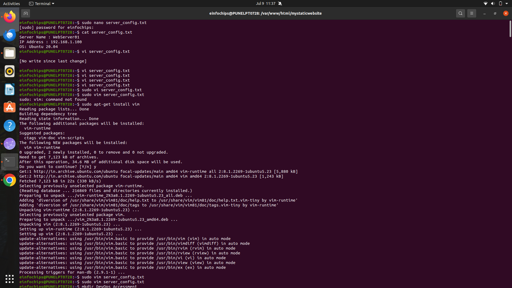
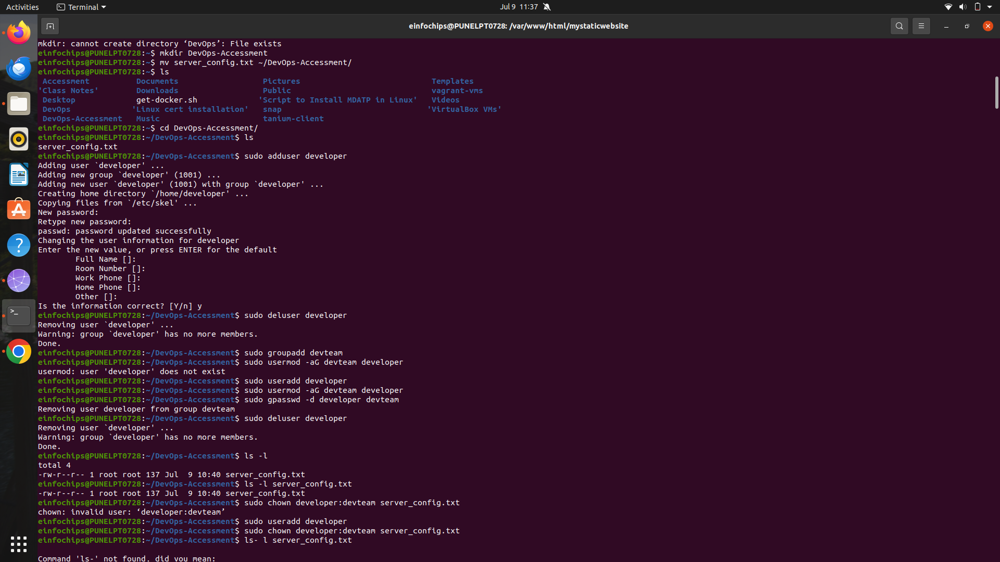
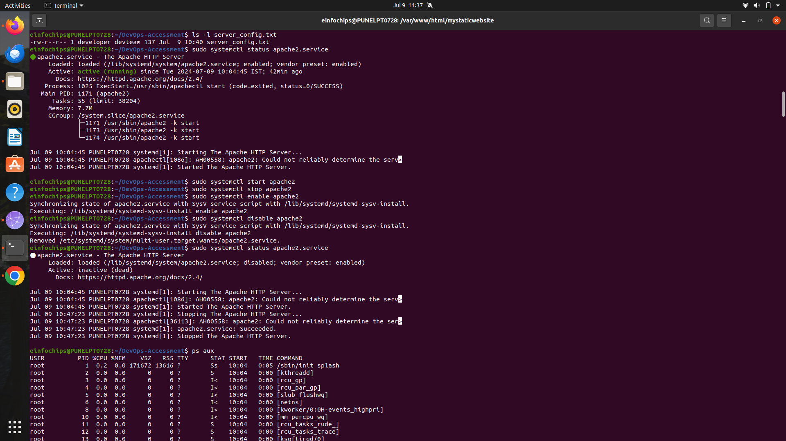
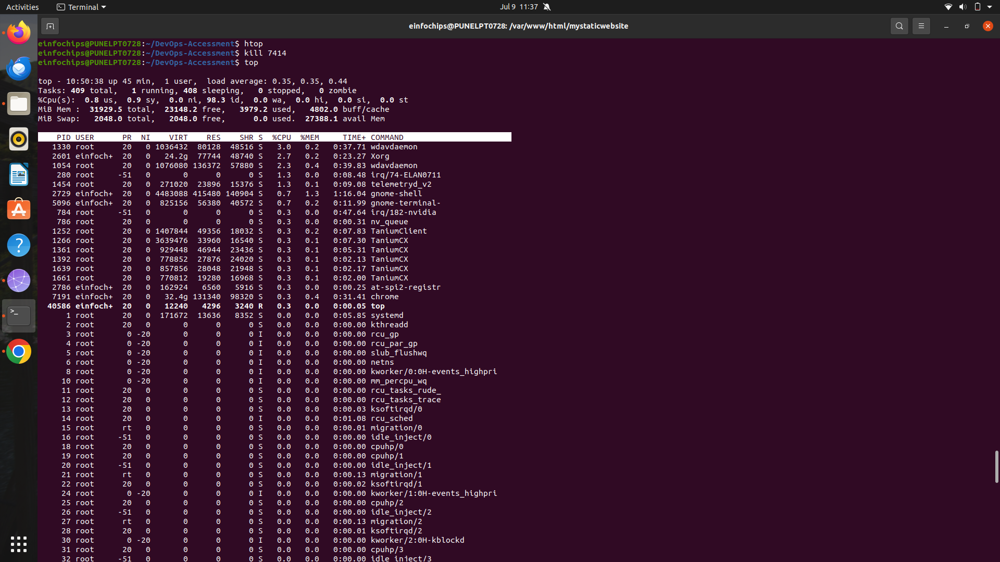
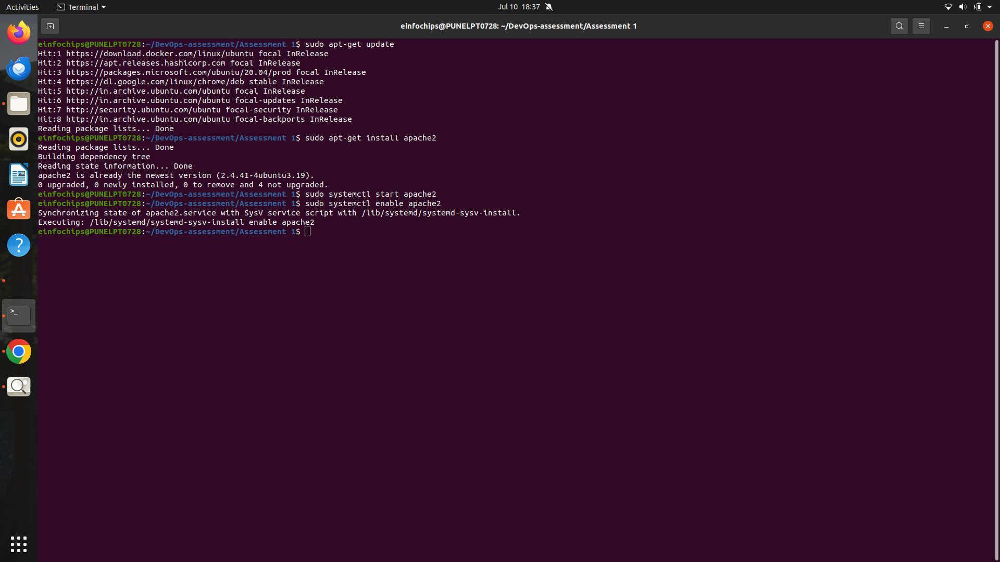
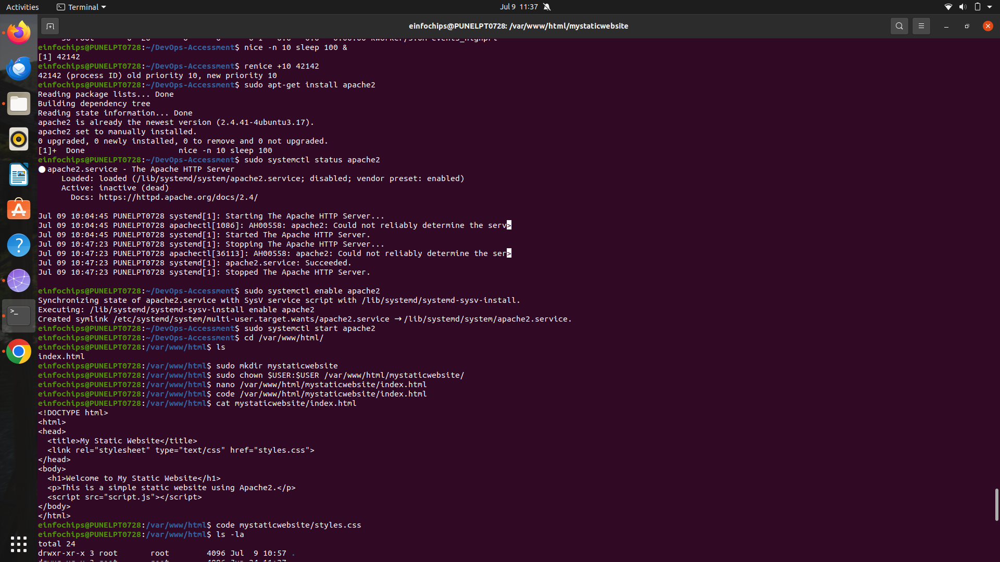
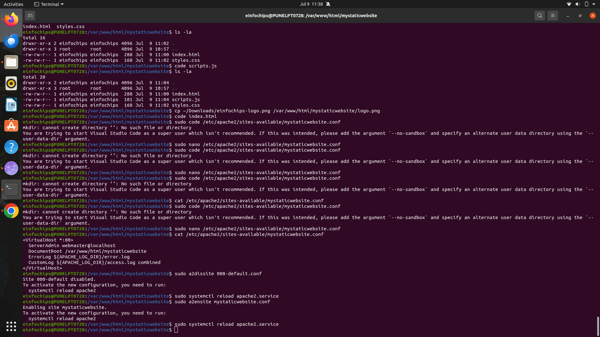

Comprehensive Linux Operations

Project Overview

This project spans various aspects of Linux system administration, including file management, user and group management, service control, process handling, and more. You will be completing tasks that simulate real-world scenarios, providing hands-on experience with Linux commands and configurations.

Project Breakdown

Part 1: Creating and Editing Text Files (20 minutes)
Scenario: You are tasked with documenting the configurations and settings for a new server. You'll use different text editors to create and update these documents.

Part 2: User & Group Management (20 minutes)
Scenario: You need to set up user accounts and groups for a new team joining the project.

Part 3: File Permissions Management (20 minutes)
Scenario: Ensure that only the appropriate users have access to specific files and directories.

Part 4: Controlling Services and Daemons (20 minutes)
Scenario: Manage the web server service to ensure it is running correctly and starts on boot.

Part 5: Process Handling (20 minutes)
Scenario: Monitor and manage processes to ensure the server is performing optimally.

Creating and Deploying a Static Website with Apache2
Preparation (5 minutes)
    • Ensure you have access to a Linux environment (e.g., virtual machines, EC2 instances, or local installations) with sudo privileges.
Activity Breakdown
Part 1: Installing Apache2 (5 minutes)

Part 2: Creating the Website (10 minutes)

Part 3: Configuring Apache2 to Serve the Website (10 minutes)

