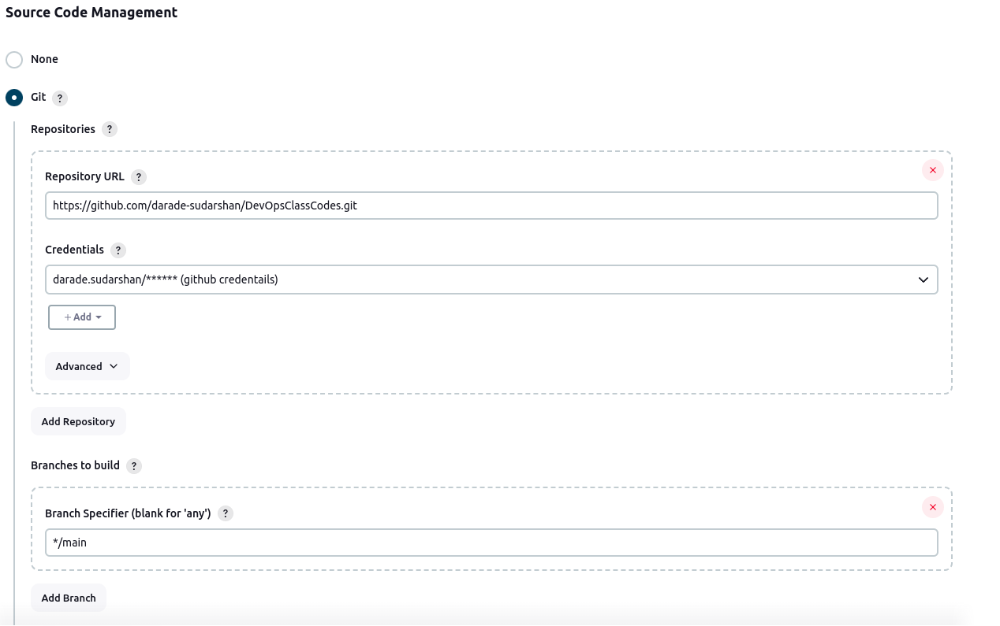
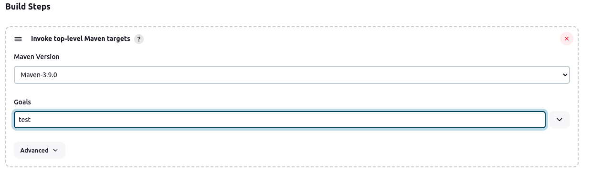

                                                                                    Jenkin Project
Project Overview.

1. Perform installation of Jenkins Locally and configure it.

before installing jenkins we must install latest openJDK available for your Distro.

then add apt repository and perform installation using following commands.

post installation jenkin will run on port 8080 on your localhost.
to access Jenkins open Browser and enter URL. http://localhost:8080/

The command: sudo cat /var/lib/jenkins/secrets/initialAdminPassword will print the password at console.

post unlocking jenkin create a user account to use jenkin or you can use admin account as well.

2. Run a sample java build using free style project.

    a. create a simple free stype project 

    b. add description for Project pipeline.

    c. enter SCM details for fetching and building code.
    Note: choose correct branch name to be fetched and build from SCM.

    d. we have to trigger the build after every 5 minutes

    e. provide Build command in excute shell in build steps to build Java code.

    
    
    f. building is scheduled to buid after every 5 minutes.

