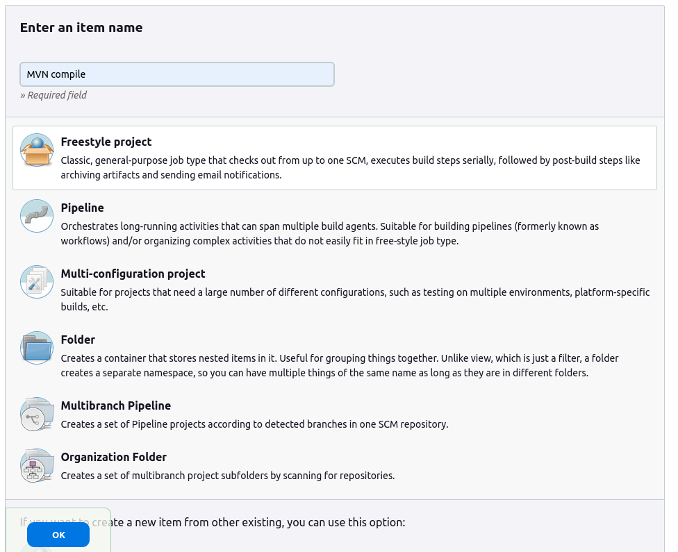
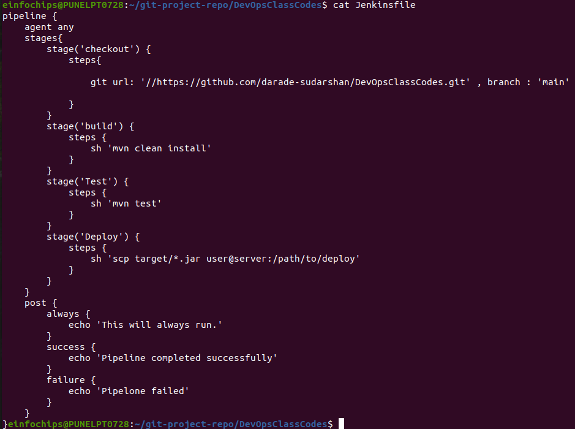
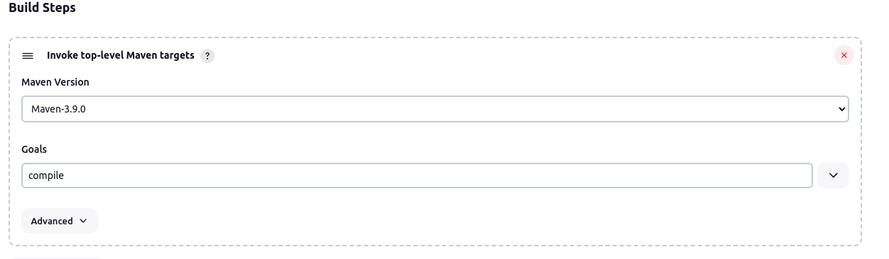
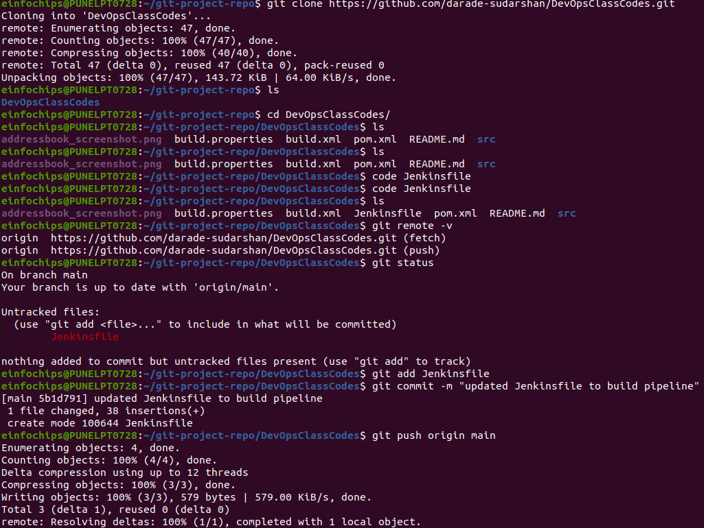
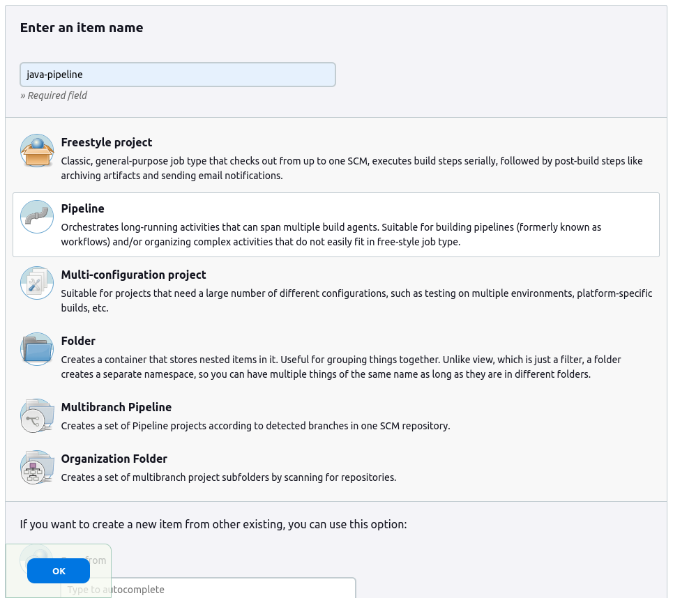
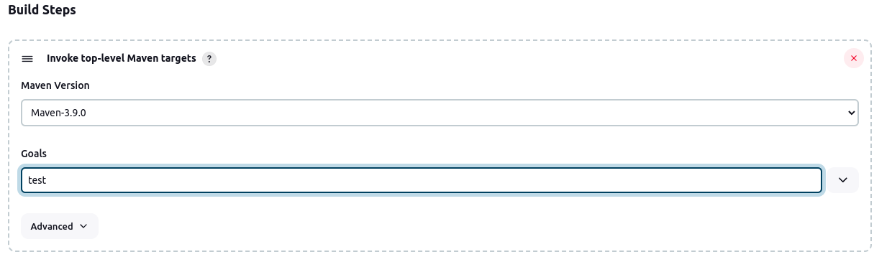
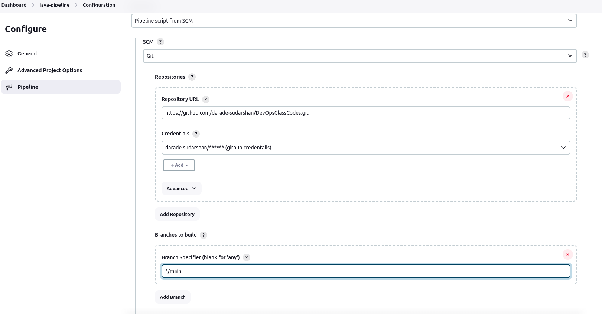

                                                                                                         Project Overview

1. create a pipeline to fetch code from private repository and configure secret for git repository.
2. setup a freestyle pipeline to compile and test the java code using maven.

    a. setup pileline for compilation of java build.

    b. configure private Repo along with github credentials

    c. add build step for compilation of java project from POM file.

    
    
    d.setup a pipeline for testing of java build.

    e. configure private Repo along with github credentials

    f. add post build trigger for initiating testing of java project

    g. add test step for compilation of java project from POM file.

    h. Manually started the build and it succedded along with testing pipeline.

    
