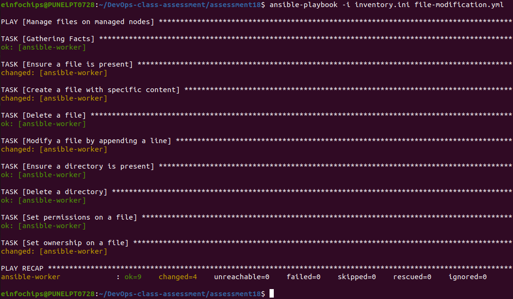
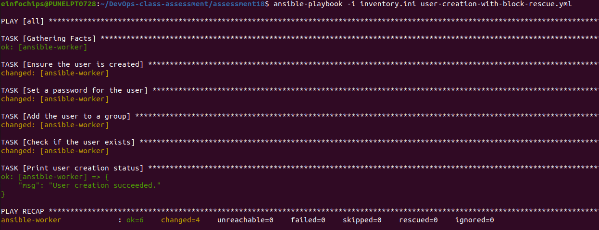

                                                Project Problem Statement

A development team needs to establish a basic CI/CD pipeline for a web application. The goal is to automate version control, containerization, building, testing, and deployment processes.
Deliverables

Git Repository:

Create a Git repository: Initialize a new repository for the web application.

Branching Strategy:

Set up main and develop branches.

Create a feature branch for a new feature or bug fix.

Add Configuration Files:
Create a .gitignore file to exclude files like logs, temporary files, etc.

Create a README.md file with a project description, setup instructions, and contribution guidelines.

Docker Configuration:
Dockerfile:

Write a Dockerfile to define how to build the Docker image for the web application.

Docker Ignore File:

Create a .dockerignore file to exclude files and directories from the Docker build context.

Image Management:

Build a Docker image using the Dockerfile.

Push the built Docker image to a container registry (e.g., Docker Hub).

Jenkins Configuration:

Jenkins Job Setup:

Create a Jenkins job to pull code from the Git repository.

Configure Jenkins to build the Docker image using the Dockerfile.

Set up Jenkins to run tests on the Docker image.

Configure Jenkins to push the Docker image to the container registry after a successful build.

Jenkins Pipeline:

Create a Jenkinsfile to define the CI/CD pipeline stages, including build, test, and deploy.

Ansible Playbook:

Basic Playbook Creation:

Develop an Ansible playbook to automate the deployment of the Docker container.

Playbook Tasks:
Install Docker on the target server (if Docker is not already installed).

Pull the Docker image from the container registry.
Run the Docker container with the required configurations.

Inventory File:
Create an inventory file specifying the target server(s) for deployment.
