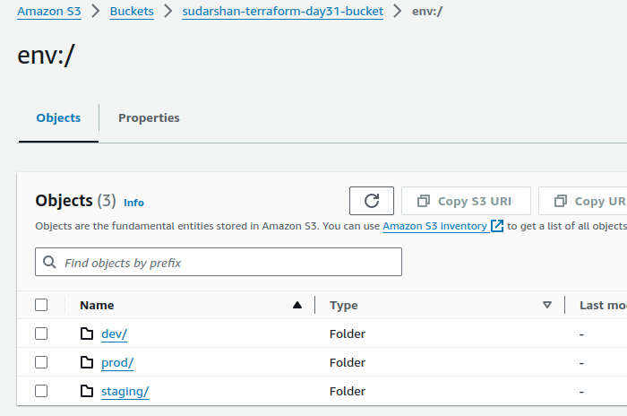
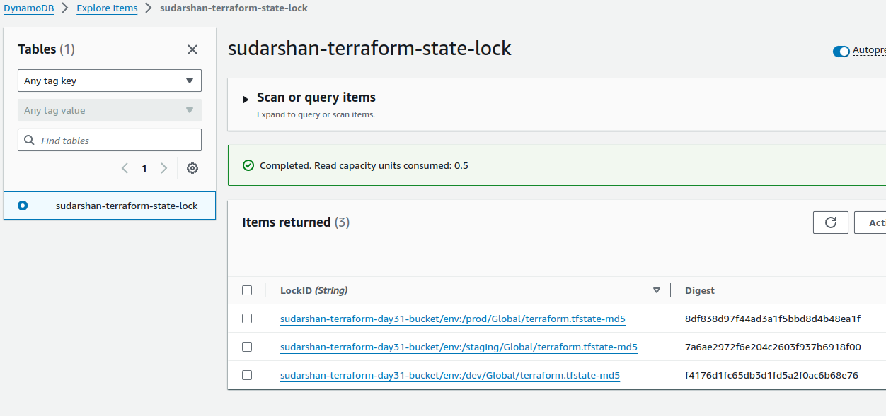
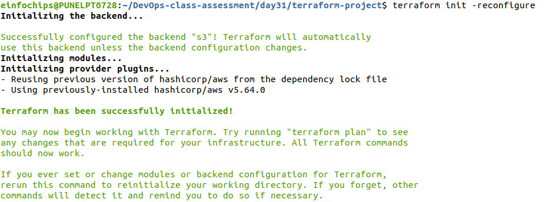
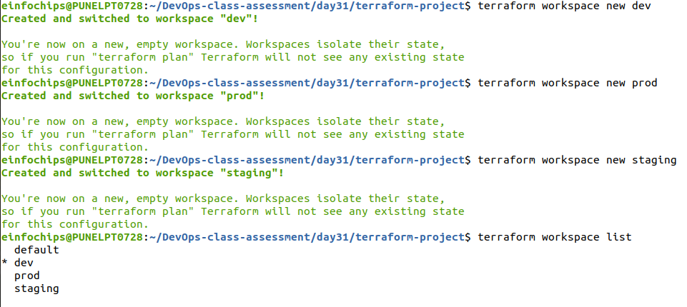
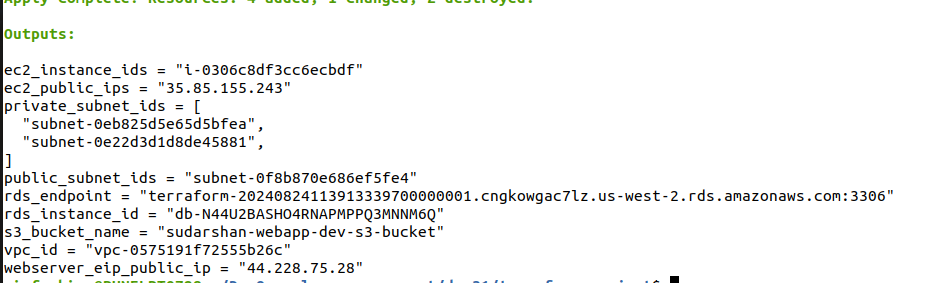
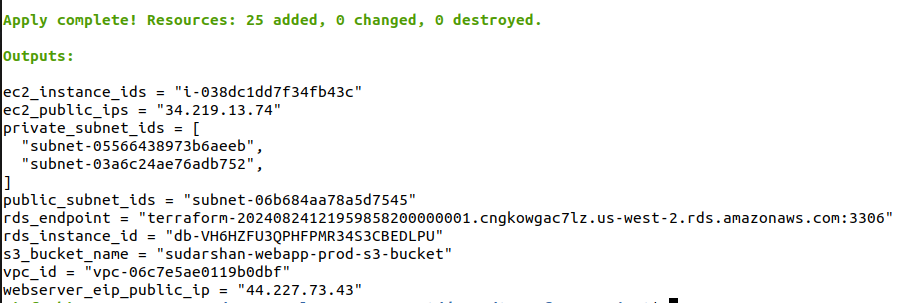
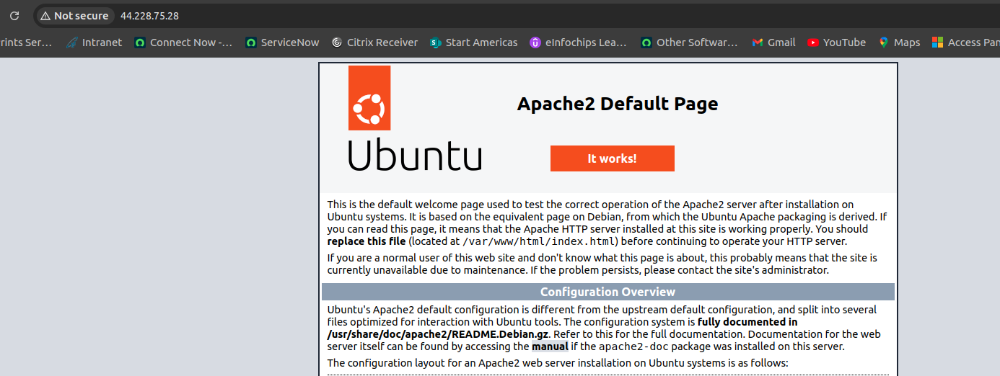
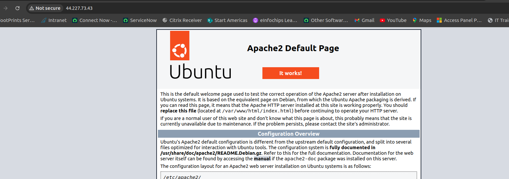
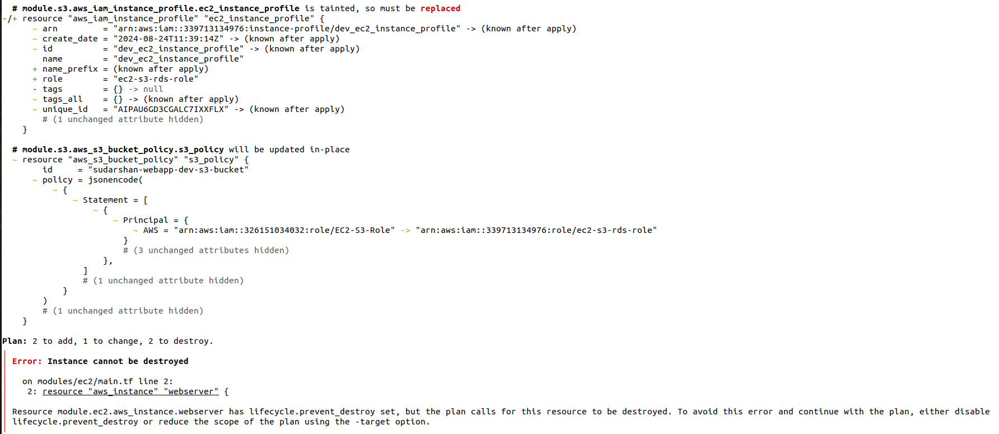

#   Automation (IaaC) Terraform on AWS Assessment Project


## Project Overview

This capstone project assesses practical skills with Terraform, focusing on deploying a complete AWS infrastructure. The project emphasizes state management, variables, `.tfvars` files, modules, functions, workspaces, and lifecycle rules. Deployment will be restricted to AWS Free Tier resources to avoid unnecessary costs.

## Project Objectives

- Deploy a multi-tier architecture on AWS using Terraform.
- Implement state locking to manage concurrent changes.
- Use variables and `.tfvars` files to parameterize configurations.
- Create and use Terraform modules to promote reusability and organization.
- Utilize functions to dynamically configure resources.
- Manage multiple environments using Terraform workspaces.
- Implement lifecycle rules to control resource creation, updates, and deletion.

## Project Requirements

### 1. Infrastructure Design

Deploy a basic 3-tier web application architecture, including:

- **VPC**: Virtual Private Cloud (VPC) with public and private subnets across two availability zones.
- **Security Groups**: Define security groups to control traffic for application and database tiers.
- **EC2 Instances**: Deploy EC2 instances in public subnets for the web servers (Application Tier).
- **RDS Instance**: Deploy an RDS MySQL instance in a private subnet for the database (Database Tier).
- **S3 Bucket**: Create an S3 bucket to store static files with versioning enabled.
- **Elastic IPs**: Assign Elastic IPs to EC2 instances.
- **IAM Role**: Create an IAM role with necessary permissions and attach it to EC2 instances.

### 2. Terraform State Management

- Implement remote state storage using an S3 bucket.
- Use DynamoDB for state locking to prevent concurrent modifications.

### 3. Variables and `.tfvars`

- Define input variables for resources such as VPC CIDR, instance types, database credentials, and S3 bucket names.
- Use `.tfvars` files to pass different configurations for environments (e.g., `dev.tfvars`, `prod.tfvars`).

### 4. Modules

Break down the infrastructure into reusable modules:

- **VPC Module**: Manage VPC, subnets, and routing tables.
- **EC2 Module**: Configure and launch EC2 instances.
- **RDS Module**: Set up the RDS MySQL database.
- **S3 Module**: Handle S3 bucket creation with versioning.
- **IAM Module**: Create and manage IAM roles and policies.

### 5. Functions

Use Terraform functions to dynamically configure:

- Resource names using `format` and `join` functions.
- Subnet CIDRs using `cidrsubnet`.
- AMI IDs using the `lookup` function.

### 6. Workspaces

- Create workspaces for different environments (e.g., development, staging, production).
- Deploy infrastructure in each environment using the appropriate workspace.

### 7. Lifecycle Rules

Implement lifecycle rules to:

- Prevent resource deletion: Ensure certain resources, like the RDS database, are not accidentally deleted (`prevent_destroy`).
- Ignore changes to specific resource attributes (e.g., S3 bucket tags) using `ignore_changes`.

## Project Steps

### Step 1: Setup Remote State and Locking

1. Create an S3 bucket for storing Terraform state.
```bash
aws s3 mb s3://sudarshan-terraform-day31-bucket --region us-west-2
```


2. Create a DynamoDB table for state locking.
```bash
aws dynamodb create-table \
    --table-name sudarshan-terraform-state-lock \
    --attribute-definitions AttributeName=LockID,AttributeType=S \
    --key-schema AttributeName=LockID,KeyType=HASH \
    --provisioned-throughput ReadCapacityUnits=5,WriteCapacityUnits=5 \
    --region us-west-2
```



3. Configure the Terraform backend to use the S3 bucket and DynamoDB table.
```yaml
# Configure the Terraform backend for state management
terraform {
  backend "s3" {
    bucket         = "sudarshan-terraform-day31-bucket"
    key            = "Global/terraform.tfstate"
    region         = "us-west-2"
    encrypt        = true
    dynamodb_table = "sudarshan-terraform-state-lock"
  }
}
```

### Step 2: Develop and Organize Modules

1. Develop separate modules for VPC, EC2, RDS, S3, and IAM.
2. Place each module in a separate directory with `main.tf`, `variables.tf`, and `outputs.tf`.
```bash

modules/
|-- ec2
|   |-- main.tf
|   |-- outputs.tf
|   `-- variables.tf
|-- iam
|   |-- main.tf
|   |-- outputs.tf
|   `-- variables.tf
|-- rds
|   |-- main.tf
|   |-- outputs.tf
|   `-- variables.tf
|-- s3
|   |-- main.tf
|   |-- outputs.tf
|   `-- variables.tf
`-- vpc
    |-- main.tf
    |-- outputs.tf
    `-- variables.tf

5 directories, 15 files
```
### Step 3: Define Variables and `.tfvars` Files

1. Define variables in `variables.tf` files within each module.

2. Create a `terraform.tfvars` file with default values.

[terraform.tfvars](terraform-project/terraform.tfvars)

3. Create environment-specific `.tfvars` files (e.g., `dev.tfvars`, `prod.tfvars`).

[dev.tfvars](terraform-project/dev/dev.tfvars)

[prod.tfvars](terraform-project/prod/prod.tfvars)

### Step 4: Implement Workspaces

1. Initialize Terraform and create workspaces (development, staging, production).





2. Deploy infrastructure in each workspace using the appropriate `.tfvars` file.

Dev environment Deployment :
```bash
terraform plan -var-file=dev/dev.tfvars | tee plan-dev.log
```
[plan-dev.log](terraform-project/dev/plan-dev.log)

```bash
terraform apply -var-file=dev/dev.tfvars | tee apply-dev.log
```
[apply-dev.log](terraform-project/dev/apply-dev.log)

```bash
terraform destroy -var-file=dev/dev.tfvars | tee destroy-dev.log
```
[destroy-dev.log](terraform-project/dev/destroy-dev.log)

prod environment Deployment :

```bash
terraform plan -var-file=prod/prod.tfvars | tee plan-prod.log
```
[plan-prod.log](terraform-project/prod/plan-prod.log)

```bash
terraform apply --var-file=prod/prod.tfvars | tee apply-prod.log
```
[apply-prod.log](terraform-project/prod/apply-prod.log)

```bash
terraform destroy -var-file=prod/prod.tfvars | tee destroy-prod.log
```
[destroy-prod.log](terraform-project/prod/destroy-prod.log)

### Step 5: Deploy the Infrastructure

1. Use the `terraform apply` command to deploy the infrastructure in each workspace.






2. Verify the deployment by accessing the EC2 instances and ensuring the application is running.





### Step 6: Implement Lifecycle Rules

1. Modify Terraform code to add lifecycle rules for critical resources.
2. Apply changes and verify that the lifecycle rules are in effect.



### Step 7: Cleanup

1. Destroy the infrastructure in each workspace using `terraform destroy`.
2. Ensure that resources marked with `prevent_destroy` are not deleted.


## Deliverables

- Terraform configuration files (`main.tf`, `variables.tf`, `outputs.tf`, `*.tfvars`, and module files).
- A written report explaining the design, use of Terraform features (state locking, workspaces, modules, etc.), and challenges faced.
- Screenshots or logs demonstrating the deployment, state locking, use of workspaces, and lifecycle rules in action.
