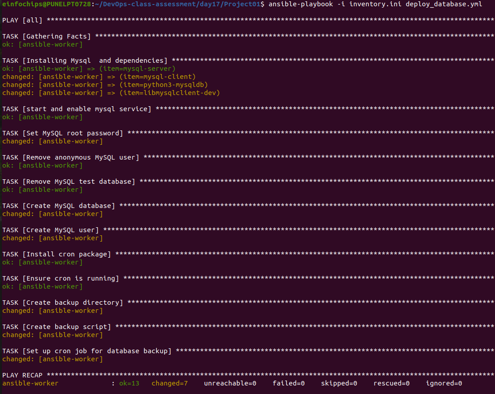
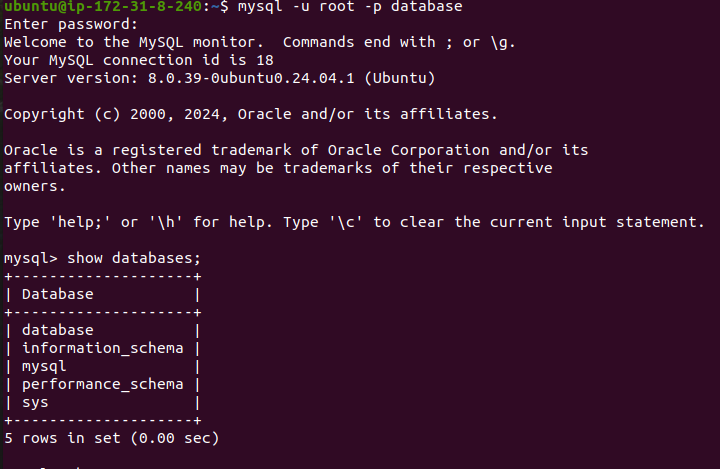
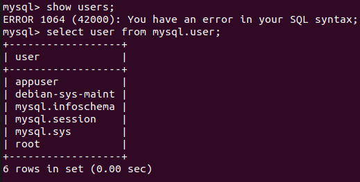

                        Project 01

Deploy a Database Server with Backup Automation

Objective: Automate the deployment and configuration of a MySQL database server on an Ubuntu instance hosted on AWS, and set up regular backups.

Problem Statement

Objective: Automate the deployment, configuration, and backup of a MySQL database server on an Ubuntu instance using Ansible.

Requirements:
AWS Ubuntu Instance: You have an Ubuntu server instance running on AWS.

Database Server Deployment: Deploy and configure MySQL on the Ubuntu instance.

Database Initialization: Create a database and a user with specific permissions.

Backup Automation: Set up a cron job for regular database backups and ensure that backups are stored in a specified directory.

Configuration Management: Use Ansible to handle the deployment and configuration, including managing sensitive data like database passwords.

Deliverables

Ansible Inventory File
Filename: [inventory.ini](inventory.ini)

Content: Defines the AWS Ubuntu instance and connection details for Ansible.

Ansible Playbook
Filename: [deploy_database.yml](deploy_database.yml)

Content: Automates the installation of MySQL, sets up the database, creates a user, and configures a cron job for backups. It also includes variables for database configuration and backup settings.

Backup Script
Filename: scripts/[backup.sh](scripts/backup.sh)

Content: A script to perform the backup of the MySQL database. This script should be referenced in the cron job defined in the playbook.

verify if database is created

verified database user

verified backup script and cronjob schedule

