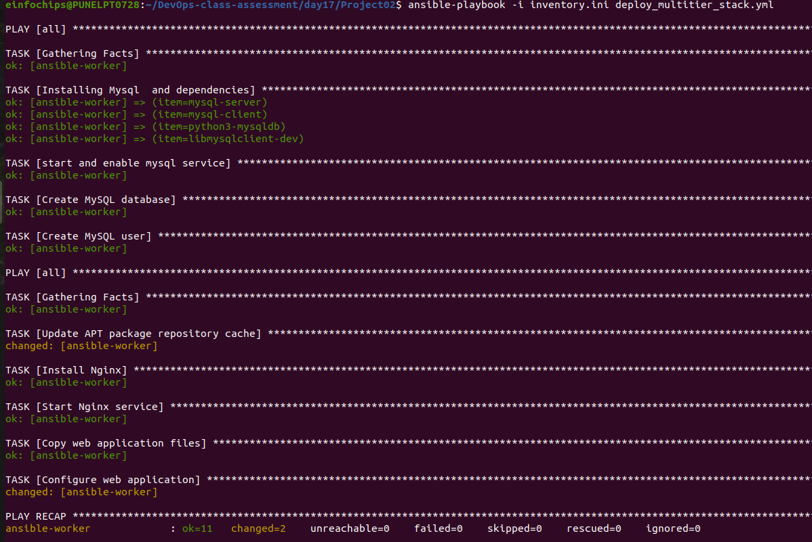
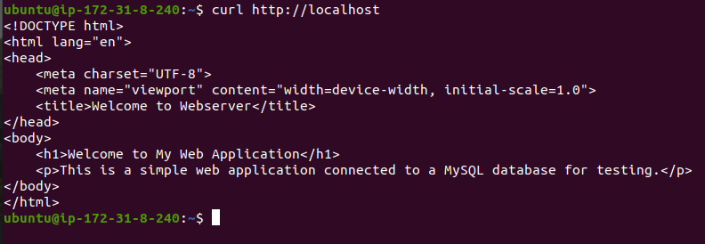

                                Project 02

Objective: Automate the setup of a multi-tier web application stack with separate database and application servers using Ansible.

Problem Statement

Objective: Automate the deployment and configuration of a multi-tier web application stack consisting of:

Database Server: Set up a MySQL database server on one Ubuntu instance.

Application Server: Set up a web server (e.g., Apache or Nginx) on another Ubuntu instance to host a web application.

Application Deployment: Ensure the web application is deployed on the application server and is configured to connect to the MySQL database on the database server.

Configuration Management: Use Ansible to automate the configuration of both servers, including the initialization of the database and the deployment of the web application.

Deliverables

Ansible Inventory File
Filename: [inventory.ini](inventory.ini)

Content: Defines the database server and application server instances, including their IP addresses and connection details.

Ansible Playbook
Filename: [deploy_multitier_stack.yml](deploy_multitier_stack.yml)

Content: Automates:
The deployment and configuration of the MySQL database server.
The setup and configuration of the web server.
The deployment of the web application and its configuration to connect to the database.

Jinja2 Template
Filename: templates/[app_config.php.j2](templates/app_config.php.j2)

Content: Defines a configuration file for the web application that includes placeholders for dynamic values such as database connection details.

Application Files
Filename: files/[index.html](files/index.html) (or equivalent application files)
Content: Static or basic dynamic content served by the web application.

assessing Website from localhost

