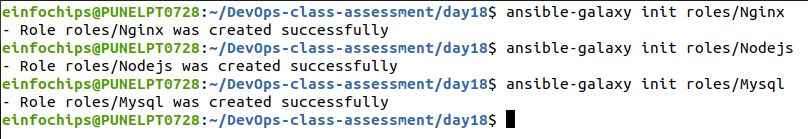
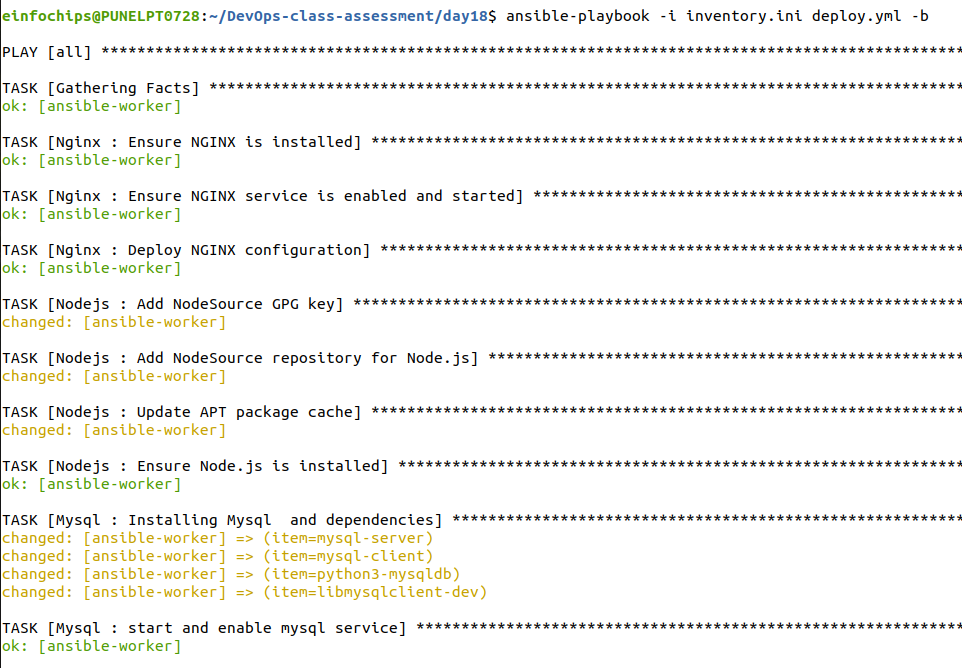
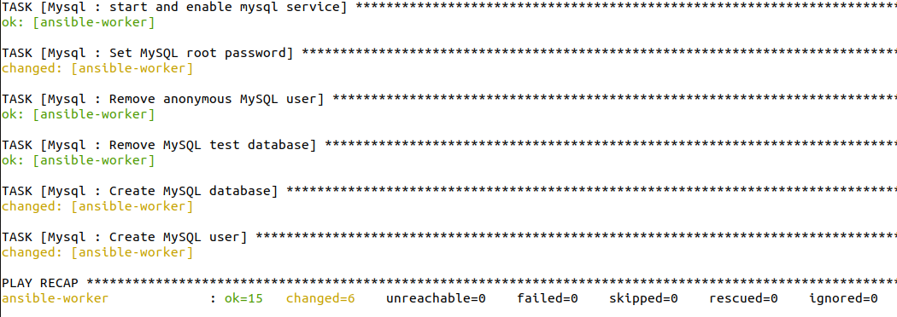
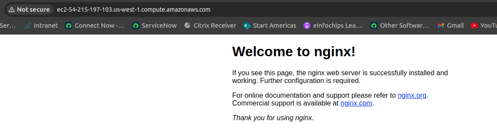
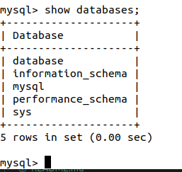

                                    Project 01  
                                Problem Statement
You are tasked with deploying a three-tier web application (frontend, backend, and database) using Ansible roles. The frontend is an Nginx web server, the backend is a Node.js application, and the database is a MySQL server. Your solution should use Ansible Galaxy roles where applicable and define appropriate role dependencies. The deployment should be automated to ensure that all components are configured correctly and can communicate with each other.

Steps and Deliverables

Define Project Structure

Create a new Ansible project with a suitable directory structure to organize roles, playbooks, and inventory files.

Role Selection and Creation

Select appropriate roles from Ansible Galaxy for each tier of the application:

Nginx role for the frontend.
```sql
|-- Nginx
|   |-- README.md
|   |-- defaults
|   |   `-- main.yml
|   |-- files
|   |-- handlers
|   |   `-- main.yml
|   |-- meta
|   |   `-- main.yml
|   |-- tasks
|   |   `-- main.yml
|   |-- templates
|   |   `-- default.conf.j2
|   |-- tests
|   |   |-- inventory
|   |   `-- test.yml
|   `-- vars
|       `-- main.yml
```

Node.js role for the backend.
```sql
|-- Nginx
|   |-- README.md
|   |-- defaults
|   |   `-- main.yml
|   |-- files
|   |-- handlers
|   |   `-- main.yml
|   |-- meta
|   |   `-- main.yml
|   |-- tasks
|   |   `-- main.yml
|   |-- templates
|   |   `-- default.conf.j2
|   |-- tests
|   |   |-- inventory
|   |   `-- test.yml
|   `-- vars
|       `-- main.yml
```

MySQL role for the database.
```sql 
|-- Mysql
|   |-- README.md
|   |-- defaults
|   |   `-- main.yml
|   |-- files
|   |-- handlers
|   |   `-- main.yml
|   |-- meta
|   |   `-- main.yml
|   |-- tasks
|   |   `-- main.yml
|   |-- templates
|   |-- tests
|   |   |-- inventory
|   |   `-- test.yml
|   `-- vars
|       `-- main.yml
```


Create any custom roles needed for specific configurations that are not covered by the Galaxy roles.

Dependencies Management

Define dependencies for each role in the meta/main.yml file.

Ensure that the roles have appropriate dependencies, such as ensuring the database is set up before deploying the backend.

Inventory Configuration

Create an inventory file that defines the groups of hosts for each tier (frontend, backend, database).

[inventory.ini](inventory.ini)

Ensure proper group definitions and host variables as needed.

Playbook Creation

Create a playbook  that includes and orchestrates the roles for deploying the application.

[deploy.yml](deploy.yml)

Ensure the playbook handles the deployment order and variable passing between roles.

Role Customization and Variable Definition

Customize the roles by defining the necessary variables in group_vars or host_vars as needed for the environment.

Ensure sensitive data like database credentials are managed securely.

Testing and Validation

Create a separate playbook for testing the deployment (test.yml) that verifies each tier is functioning correctly and can communicate with the other tiers.

Use Ansible modules and tasks to check the status of services and applications.




Documentation
Document the setup process, including any prerequisites, role dependencies, and how to run the playbooks.





Include a README.md file that provides an overview of the project and instructions for use.

Deliverables

Ansible Project Directory Structure

Organized directory structure with roles, playbooks, inventory, and configuration files.

Role Definitions and Dependencies

meta/main.yml files for each role defining dependencies.

Customized roles with necessary configurations.

Inventory File

Inventory file defining groups and hosts for frontend, backend, and database tiers.

Playbook for Deployment (deploy.yml)

Playbook that orchestrates the deployment of the three-tier application.

Playbook for Testing (test.yml)

Playbook that verifies the deployment and functionality of each tier.
