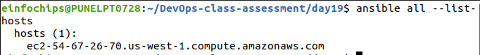

                                    Project 01
                                Project Overview

In this capstone project, you will create a comprehensive automated deployment pipeline for a web application on an AWS EC2 instance running Ubuntu using Ansible. You will follow best practices for playbooks and roles, implement version control, document and maintain your code, break down tasks into roles, write reusable and maintainable code, and use dynamic inventory scripts. This project will culminate in a fully functional deployment, demonstrating your mastery of Ansible for infrastructure automation.

Project Objectives

Set up an AWS EC2 instance as a worker node.
Implement Ansible playbooks and roles following best practices.
Use version control to manage Ansible codebase.
Document Ansible roles and playbooks.
Break down deployment tasks into reusable roles.
Write reusable and maintainable Ansible code.
Use dynamic inventory scripts to manage AWS EC2 instances.
Deploy a web application on the EC2 instance.

Project Components and Milestones

#Milestone 1: Environment Setup

Objective: Configure your development environment and AWS infrastructure.

Tasks:
Launch an AWS EC2 instance running Ubuntu.
Install Ansible and Git on your local machine or control node.


Deliverables:

AWS EC2 instance running Ubuntu.
Local or remote control node with Ansible and Git installed.

#Milestone 2: Create Ansible Role Structure

Objective: Organize your Ansible project using best practices for playbooks and roles.

Tasks:
Use Ansible Galaxy to create roles for web server, database, and application deployment.


Define the directory structure and initialize each role.

Deliverables:
Ansible role directories for webserver, database, and application.

#Milestone 3: Version Control with Git

Objective: Implement version control for your Ansible project.

Tasks:

Initialize a Git repository in your project directory.

Create a .gitignore file to exclude unnecessary files.

Commit and push initial codebase to a remote repository.


Deliverables:

Git repository with initial Ansible codebase.

Remote repository link (e.g., GitHub).

#Milestone 4: Develop Ansible Roles

Objective: Write Ansible roles for web server, database, and application deployment.

Tasks:
Define tasks, handlers, files, templates, and variables within each role.
Ensure each role is modular and reusable.


Nginx role for the web server.
```sql
|-- Nginx
|   |-- README.md
|   |-- defaults
|   |   `-- main.yml
|   |-- files
|   |-- handlers
|   |   `-- main.yml
|   |-- meta
|   |   `-- main.yml
|   |-- tasks
|   |   `-- main.yml
|   |-- templates
|   |   `-- default.conf.j2
|   |-- tests
|   |   |-- inventory
|   |   `-- test.yml
|   `-- vars
|       `-- main.yml
```

Node.js role for the application deployment.
```sql
|-- Nginx
|   |-- README.md
|   |-- defaults
|   |   `-- main.yml
|   |-- files
|   |-- handlers
|   |   `-- main.yml
|   |-- meta
|   |   `-- main.yml
|   |-- tasks
|   |   `-- main.yml
|   |-- templates
|   |   `-- default.conf.j2
|   |-- tests
|   |   |-- inventory
|   |   `-- test.yml
|   `-- vars
|       `-- main.yml
```

MySQL role for the database.
```sql 
|-- Mysql
|   |-- README.md
|   |-- defaults
|   |   `-- main.yml
|   |-- files
|   |-- handlers
|   |   `-- main.yml
|   |-- meta
|   |   `-- main.yml
|   |-- tasks
|   |   `-- main.yml
|   |-- templates
|   |-- tests
|   |   |-- inventory
|   |   `-- test.yml
|   `-- vars
|       `-- main.yml
```

Deliverables:
Completed Ansible roles for webserver, database, and application.

#Milestone 5: Documentation and Maintenance

Objective: Document your Ansible roles and playbooks for future maintenance.

Tasks:
Create README.md files for each role explaining purpose, variables, tasks, and handlers.
Add comments within your playbooks and roles to explain complex logic.

Deliverables:
[README.md ](README.md)     files for webserver, database, and application roles.
Well-documented playbooks and roles.

#Milestone 6: Dynamic Inventory Script

Objective: Use dynamic inventory scripts to manage AWS EC2 instances.

Tasks:
Write a Python script that queries AWS to get the list of EC2 instances.

[ec2-inventory.py](ec2-inventory.py)

[inventory.json](inventory.json)

Format the output as an Ansible inventory.




Deliverables:
Dynamic inventory script to fetch EC2 instance details.

#Milestone 7: Playbook Development and Deployment

Objective: Create and execute an Ansible playbook to deploy the web application.

Tasks:

Develop a master playbook that includes all roles.

[deploy.yml](deploy.yml)

Define inventory and variable files for different environments.
Execute the playbook to deploy the web application on the EC2 instance.


Deliverables:

Ansible playbook for web application deployment.

Successfully deployed web application on the EC2 instance.


