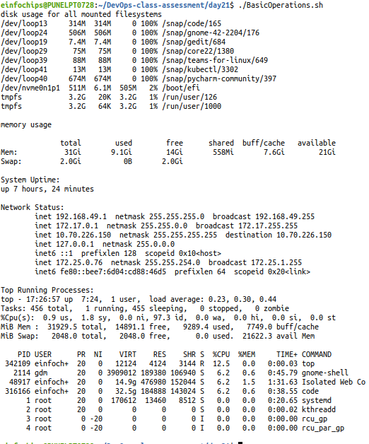
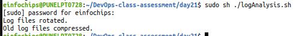
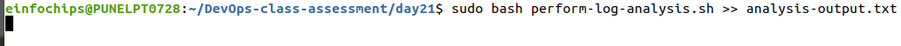
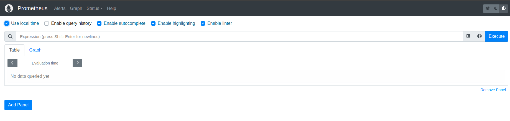
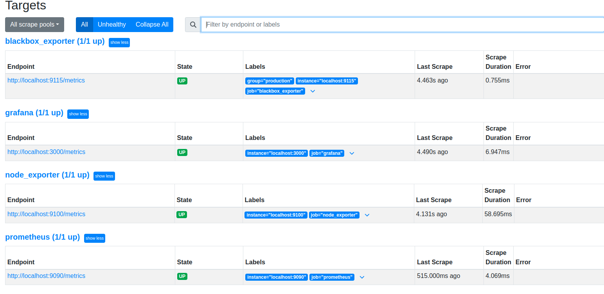
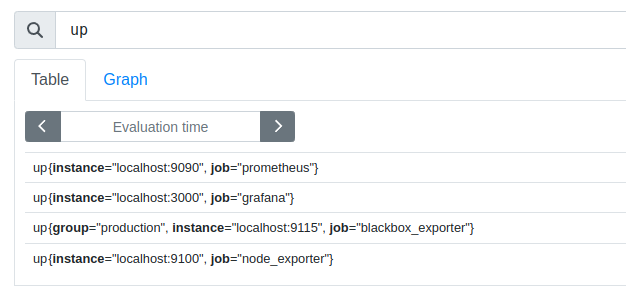

                                  Project 01 
                                Project Overview
The goal of this capstone project is to combine shell scripting with system monitoring and log management practices. You will create a set of automated tools using shell scripts to manage logs, monitor system performance using Prometheus and Node Exporter, and generate insights using PromQL queries. The project will require a systematic approach, covering scripting fundamentals, log management, and monitoring setup.

Project Deliverables:

1. Shell Scripts for Basic Operations:

Task: Write shell scripts to perform basic system operations, such as checking disk usage, memory usage, and CPU load.

```bash
        chmod +x BasicOeprations.sh
        sudo sh BasicOperations.sh
```


Deliverable:

A collection of scripts that output system performance metrics.

[BasicOperations.sh](BasicOperations.sh)

Generated Log File :

[Logfile for Basic Operation script](Logfile_20240808_223543.log)

Scripts should include error handling and logging.

2. Log Management Script:

Task: Develop a script to automate log management tasks such as log rotation and archiving. This script should include the ability to compress old logs and delete logs older than a specified number of days.


```bash
        chmod +x log-analysis.sh
        sudo sh log-analysis.sh
```


Deliverable:

A shell script that performs log rotation based on predefined conditions (e.g., log size, log age).

[log-analysis.sh](log-analysis.sh)

A report generated by the script detailing which logs were rotated, compressed, or deleted.

3. Advanced Shell Scripting - Loops, Conditions, Functions, and Error Handling:

Task: Refactor the previous scripts to include loops, conditionals, and functions for modularity. Implement error handling to manage potential issues during script execution.

Deliverable:
Modular shell scripts that use functions for repeatable tasks.

```bash
        chmod +x refractored-log-analysis.sh
        sudo bash refractored-log-analysis.sh
```

[refractored-log-analysis.sh](refractored-log-analysis.sh)

Error-handling mechanisms in place for scenarios like missing files, insufficient permissions, etc.

Logs that track script execution and any errors encountered.

4. Log Checking and Troubleshooting:

Task: Write a script that reads through system and application logs, identifies common issues (e.g., out of memory, failed service starts), and provides troubleshooting steps based on log analysis.

```bash
        chmod +x perform-log-analysis.sh
        sudo bash perform-log-analysis.sh
```
Deliverable:

A script that parses logs for errors or warnings and outputs possible root causes.

[perform-log-analysis.sh](perform-log-analysis.sh)

Documentation on the types of logs checked and the issues identified.
A troubleshooting guide based on common errors found in the logs.



Generated Output file after error analysis :

[analysis-output.txt](analysis-output.txt)

5. Installation and Setup of Prometheus and Node Exporter:

Task: Install and configure Prometheus and Node Exporter on the system. Ensure that Node Exporter is properly configured to collect system metrics.

[installation script for Prometheus](prometheus-install-master/full_installation.sh)
```bash
        sudo chmod +x prometheus-install-master/*.sh
        sudo bash prometheus-install-master/full_installation.sh

```




Deliverable:
A documented installation and configuration process for Prometheus and Node Exporter.
A running instance of Prometheus scraping metrics from Node Exporter.

6. Prometheus Query Language (PromQL) Basic Queries:

Task: Create a series of PromQL queries to monitor system performance, such as CPU usage, memory usage, and disk I/O.

Deliverable:
A set of PromQL queries that can be used to monitor key system metrics.



A dashboard setup guide or configuration that visualizes these metrics in Prometheus or Grafana.

7. Final Report and Presentation:

Task: Prepare a final report documenting all scripts, the installation and configuration of monitoring tools, and the output of your PromQL queries.

[README.md](README.md)

Deliverable:
A comprehensive project report covering all steps, scripts, and results.

