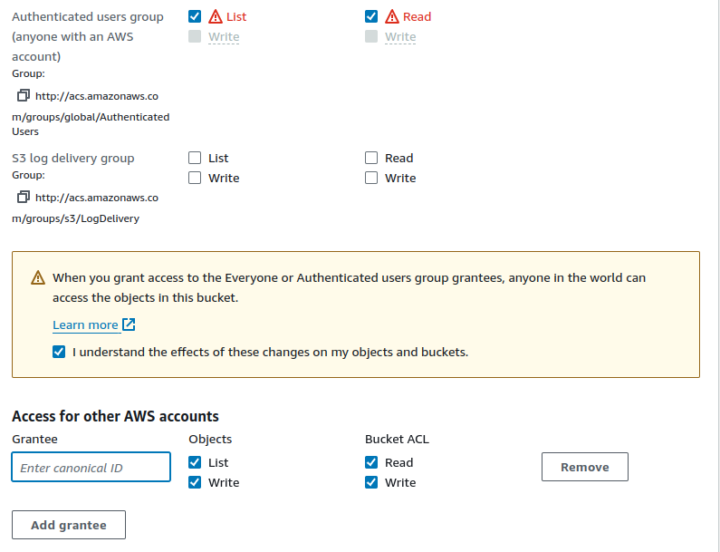

                                            Project
# Comprehensive AWS S3 Management and Static Website Hosting
## Objective:
To test your knowledge and skills in managing AWS S3 storage classes, lifecycle management, bucket policies, access control lists (ACLs), and hosting a static website on S3. You will apply their understanding in a practical scenario, ensuring you have mastered the critical aspects of AWS S3.

## Project Scenario:

You are tasked with creating and managing an S3 bucket for a fictional company, "TechVista Inc.," that hosts a static website for displaying their product portfolio. The website will have different types of content, including high-resolution images, which require careful storage management to optimize costs. Additionally, the company has strict security requirements for accessing the content.

## Project Steps and Deliverables:

### 1. Create and Configure an S3 Bucket:
Create an S3 bucket named techvista-portfolio-[sudarshan].


Enable versioning on the bucket.


Set up the bucket for static website hosting.


Upload the provided static website files (HTML, CSS, images).

[index.html](index.html)

Ensure the website is accessible via the S3 website URL.


### 2. Implement S3 Storage Classes:

Classify the uploaded content into different S3 storage classes (e.g., Standard, Intelligent-Tiering, Glacier).


Justify your choice of storage class for each type of content (e.g., HTML/CSS files vs. images).

```
1) index.html - Standard tier - static website will be accessed all   the time 

2) wallpaper1.jpg - Standard-IA - image must be always available all the time

3) wallpaper2.jpg - Glacier Instant Retrieval - image is rarely accessed on website

3) wallpaper3.jpg - One Zone - IA - image is kept for temp backup and losing it won't impact availibility
```

### 3. Lifecycle Management:

Create a lifecycle policy that transitions older versions of objects to a more cost-effective storage class (e.g., Standard to Glacier).


Set up a policy to delete non-current versions of objects after 90 days.


Verify that the lifecycle rules are correctly applied.


### 4. Configure Bucket Policies and ACLs:


Create and attach a bucket policy that allows read access to everyone for the static website content.
```json
{
    "Version": "2012-10-17",
    "Statement": [
        {
            "Sid": "Statement1",
            "Effect": "Allow",
            "Principal": "*",
            "Action": "s3:GetObject",
            "Resource": "arn:aws:s3:::techvista-portfolio-sudarshan/*"
        }
    ]
}
```
Restrict access to the S3 management console for specific IAM users using the bucket policy.
```json
{
    "Version": "2012-10-17",
    "Statement": [
        {
            "Effect": "Deny",
            "Action": [
                "s3:ListAllMyBuckets",
                "s3:GetBucketLocation",
                "s3:ListBucket",
                "s3:GetObject",
                "s3:PutObject"
            ],
            "Resource": "*",
            "Condition": {
                "StringEquals": {
                    "aws:RequestedRegion": "ap-south-1"
                },
                "StringLike": {
                    "aws:Referer": "https://console.aws.amazon.com/s3/*"
                }
            }
        },
        {
            "Effect": "Allow",
            "Action": [
                "s3:*"
            ],
            "Resource": "*"
        }
    ]
}

```
Set up an ACL to allow a specific external user access to only a particular folder within the bucket.



### 5. Test and Validate the Configuration:

Test the static website URL to ensure it is accessible.
Validate the storage class transitions based on the lifecycle policy.


Check the effectiveness of the bucket policy and ACLs by simulating different access scenarios (e.g., accessing the content with an external user, denying access from unauthorized users).

### 6. Documentation and Report:

Document each step you performed, including the reasoning behind your choices for storage classes, lifecycle policies, bucket policies, and ACLs.
Provide screenshots of key configurations and test results.
Summarize the project in a brief report, highlighting any challenges faced and how they were resolved.
