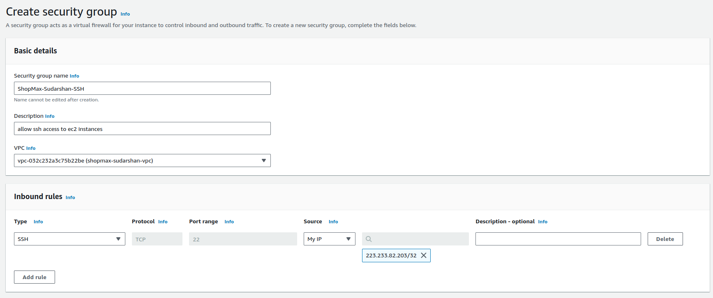
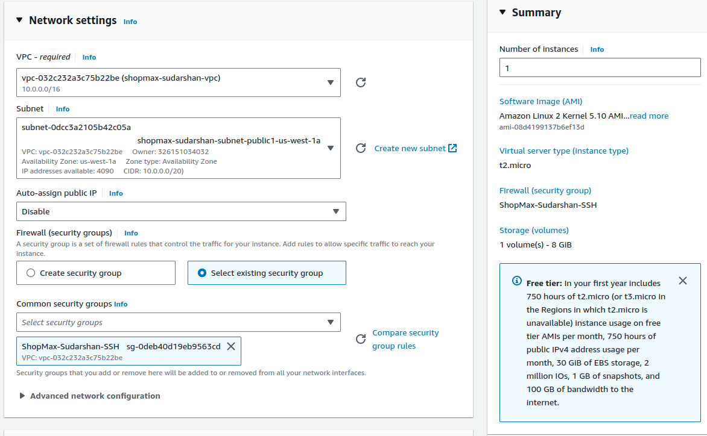

                    Assessment Project: End-to-End Deployment and Management of a Scalable E-Commerce Platform on AWS - 8 Hours


Regions Allowed:
us-east-1, us-east-2, us-west-1, us-west-2, ca-central-1

# Objective:

To evaluate your proficiency in designing, deploying, and managing a comprehensive and scalable e-commerce platform on AWS. The project will integrate multiple AWS services, including S3, EC2, Auto Scaling, Load Balancer, VPC (without NAT Gateway), and RDS. The platform must be highly available, secure, and optimized for performance.
# Project Scenario:
You are tasked with deploying a scalable e-commerce platform for "ShopMax," an online retailer preparing for a major sales event. The platform needs to handle fluctuating web traffic, securely manage user and product data, and serve both dynamic and static content efficiently. The infrastructure should be cost-effective and secure, with high availability and fault tolerance.

# Project Steps and Deliverables:
## VPC Design and Implementation (90 minutes):
○      Design a Custom VPC:


■      Create a VPC with four subnets: two public subnets (for EC2 instances and Load Balancers) and two private subnets (for RDS and backend services).


■      Set up an Internet Gateway to allow internet access for the public subnets.


■      Configure routing tables to enable communication between the subnets, ensuring that the private subnets can only communicate with the public subnets.


○      Security Configuration:

■      Create security groups to control inbound and outbound traffic for EC2 instances, Load Balancer, and RDS.





■      Implement network ACLs to add an additional layer of security at the subnet level.

### S3 Bucket Configuration for Static Content (45 minutes):

○      Create and Configure S3 Buckets:

■      Create an S3 bucket named shopmax-static-content-[your-initials] for hosting static assets (e.g., images, CSS, JavaScript).


■      Set appropriate bucket policies to allow public read access to the static content.


■      Enable versioning and logging on the bucket for better management and auditability.


○      Optimize Content Delivery:


■      (Optional) Set up an S3 bucket for backups or archival purposes, using lifecycle rules to transition older files to cheaper storage classes like Glacier.

### EC2 Instance Setup and Web Server Configuration (60 minutes):

○      Launch EC2 Instances:

■      Launch a pair of EC2 instances (t2.micro ONLY) in the public subnets using an Amazon Linux 2 AMI.





■      SSH into the instances and install a web server (Apache or Nginx) along with necessary application dependencies.

```bash 
ssh -i ansible-new.pem ec2-user@13.57.200.221
ssh -i ansible-new.pem ec2-user@52.53.236.143
```
○      Deploy the Application:

■      Deploy the dynamic e-commerce application on both instances.
```bash
#1. A command to change to root user and update ec2 instance
sudo su
sudo yum update -y


#2. This command will install the apache web server
sudo yum install -y httpd httpd-tools mod_ssl
sudo systemctl enable httpd 
sudo systemctl start httpd


#3. This command will install php version 7.4. 
sudo amazon-linux-extras enable php7.4
sudo yum clean metadata
sudo yum install php php-common php-pear -y
sudo yum install php-{cgi,curl,mbstring,gd,mysqlnd,gettext,json,xml,fpm,intl,zip} -y


#4. This command will install mysql 5.7
sudo rpm -Uvh https://dev.mysql.com/get/mysql57-community-release-el7-11.noarch.rpm
sudo rpm --import https://repo.mysql.com/RPM-GPG-KEY-mysql-2022
sudo yum install mysql-community-server -y
sudo systemctl enable mysqld
sudo systemctl start mysqld


#5. set permissions. The next command will set some permissions on the files on our EC2 instance
sudo usermod -a -G apache ec2-user
sudo chown -R ec2-user:apache /var/www
sudo chmod 2775 /var/www && find /var/www -type d -exec sudo chmod 2775 {} \;
sudo find /var/www -type f -exec sudo chmod 0664 {} \;


#6. download the FleetCart zip from s3 to the html derectory on the ec2 instance
sudo aws s3 sync s3://chidex1-dynamic-web-files /var/www/html


#7. change to the html directory and unzip the FleetCart zip folder
cd /var/www/html
sudo unzip FleetCart.zip


#8. move all the files and folder from the FleetCart directory to the html directory
sudo mv FleetCart/* /var/www/html


#9. move all the hidden files from the FleetCart diretory to the html directory
sudo mv FleetCart/.DS_Store /var/www/html
sudo mv FleetCart/.editorconfig /var/www/html
sudo mv FleetCart/.env /var/www/html
sudo mv FleetCart/.env.example /var/www/html
sudo mv FleetCart/.eslintignore /var/www/html
sudo mv FleetCart/.eslintrc /var/www/html
sudo mv FleetCart/.gitignore /var/www/html
sudo mv FleetCart/.htaccess /var/www/html
sudo mv FleetCart/.npmrc /var/www/html
sudo mv FleetCart/.php_cs /var/www/html
sudo mv FleetCart/.rtlcssrc /var/www/html


#10. delete the FleetCart and FleetCart.zip folder
sudo rm -rf FleetCart FleetCart.zip


#11. enable mod_rewrite on ec2 linux, add apache to group, and restart server
sudo sed -i '/<Directory "\/var\/www\/html">/,/<\/Directory>/ s/AllowOverride None/AllowOverride All/' /etc/httpd/conf/httpd.conf
chown apache:apache -R /var/www/html 
sudo service httpd restart
```
■      Configure the web server to serve dynamic content and integrate with the static content hosted on S3.

## RDS Setup and Database Configuration (60 minutes):

○      Provision an RDS MySQL Instance:

■      Launch an RDS instance (Free Tier Template Type, t3.micro ONLY) in the private subnets, ensuring that it is not publicly accessible.


■      Configure the database schema to support the e-commerce application (e.g., tables for users, orders, products).


■      Set up automated backups to ensure high availability.


○      Database Security:

■      Implement security measures such as encryption at rest and in transit.


■      Restrict database access to only the EC2 instances in the public subnets via security groups.


## Load Balancer and Auto Scaling Configuration (90 minutes):

### Set Up an Application Load Balancer (ALB):

■      Deploy an ALB in the public subnets to distribute traffic 
across the EC2 instances.


■      Create a target group and register the EC2 instances, ensuring health checks are configured properly.


○      Configure Auto Scaling:

■      Create an Auto Scaling group that launches additional EC2 instances based on traffic patterns (e.g., CPU utilization). (Desired: 2, minimum:1 and maximum: 2 instances)

■      Define scaling policies to automatically add or remove instances based on demand.

○      Testing the Setup:

■      Simulate traffic to test the scalability and fault tolerance of the infrastructure.

■      Verify that the ALB is evenly distributing traffic and that the Auto Scaling group is working as expected.

### Testing, Validation, and Optimization (60 minutes):

○      Full Application Test:

■      Access the e-commerce application via the ALB DNS name and ensure that both static and dynamic content is being served correctly.

■      Validate database connections and transactions (e.g., creating orders, adding products).


■      Test the security configurations by attempting to access restricted resources and ensuring proper logging of unauthorized access attempts.

○      Optimization:

■      Review the architecture and suggest any potential optimizations, such as improving response time, reducing costs, or enhancing security.
Documentation and Report (30 minutes):

### Detailed Documentation:

■      Document each step taken during the project, including VPC design, EC2 and RDS configurations, S3 setup, Load Balancer and Auto Scaling implementation, and security measures.

■      Provide screenshots and logs as evidence of configuration and testing.

○      Final Report:

■      Summarize the project, highlighting any challenges faced and how they were resolved.

■      Provide recommendations for future improvements or scaling strategies.
Terminate your resources once done. Screenshot for termination of all resources also needs to be uploaded
Time Allocation Summary:

●      VPC Design and Implementation: 90 minutes

●      S3 Bucket Configuration: 45 minutes

●      EC2 Instance Setup and Web Server Configuration: 60 minutes

●      RDS Setup and Database Configuration: 60 minutes

●      Load Balancer and Auto Scaling Configuration: 90 minutes

●      Testing, Validation, and Optimization: 60 minutes

●      Documentation and Report: 30 minutes
 
