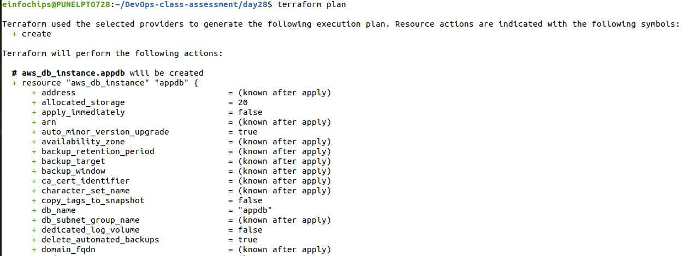
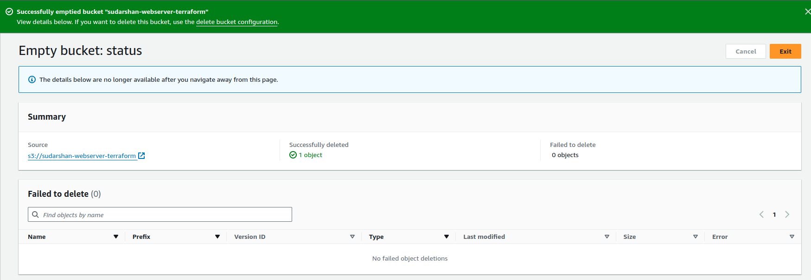

## Project: Deploying a Multi-Tier Architecture Application on AWS using Terraform

### Project Objective:

This project will assess your ability to deploy a multi-tier architecture application on AWS using Terraform. The deployment will involve using Terraform variables, outputs, and change sets. The multi-tier architecture will include an EC2 instance, an RDS MySQL DB instance, and an S3 bucket.

### Project Overview:

You are required to write Terraform configuration files to automate the deployment of a multi-tier application on AWS. The architecture should consist of:

1. EC2 Instance: A t2.micro instance serving as the application server.

2. RDS MySQL DB Instance: A t3.micro instance for the database backend.

3. S3 Bucket: For storing static assets or configuration files.

### Specifications:

1. EC2 Instance: Use the t2.micro instance type with a public IP, allowing HTTP and SSH access.

2. RDS MySQL DB Instance: Use the t3.micro instance type with a publicly accessible endpoint.

3. S3 Bucket: Use for storing static assets, configuration files, or backups.

Terraform Configuration:

Utilize Terraform variables to parameterize the deployment (e.g., instance type, database name).

[Variables.tf](variables.tf)

Use Terraform outputs to display important information (e.g., EC2 public IP, RDS endpoint).

[outputs.tf](outputs.tf)

Implement change sets to demonstrate how Terraform manages infrastructure changes.

No Terraform Modules: Focus solely on the core Terraform 
configurations without custom or external modules.

[main.tf](main.tf)

Key Tasks:
### 1. Setup Terraform Configuration:

Provider Configuration:
 
Configure the AWS provider to specify the region for deployment.

Ensure the region is parameterized using a Terraform variable.
```yaml
# Configure AWS provider
provider "aws" {
  region = var.aws_region
}
variable "aws_region" {
  description = "The AWS region to deploy resources in"
  default     = "us-west-1"
}
```
VPC and Security Groups:

Create a VPC with a public subnet for the EC2 instance.
```yaml
# Create a public subnet
resource "aws_subnet" "Project_public_subnet" {
  vpc_id                  = aws_vpc.ProjectVPC.id
  cidr_block              = "10.0.1.0/24"
  map_public_ip_on_launch = true
}
# Create a private subnet
resource "aws_subnet" "Project_private_subnet1" {
  vpc_id     = aws_vpc.ProjectVPC.id
  cidr_block = "10.0.2.0/24"
  availability_zone = "us-west-1a"
}
# Create a private subnet
resource "aws_subnet" "Project_private_subnet2" {
  vpc_id     = aws_vpc.ProjectVPC.id
  cidr_block = "10.0.3.0/24"
  availability_zone = "us-west-1b"
}
# Create an internet gateway
resource "aws_internet_gateway" "Project_igw" {
  vpc_id = aws_vpc.ProjectVPC.id
}
# Create a route table for the public subnet
resource "aws_route_table" "Project_public_rt" {
  vpc_id = aws_vpc.ProjectVPC.id

  route {
    cidr_block = "0.0.0.0/0"
    gateway_id = aws_internet_gateway.Project_igw.id
  }
}
# Associate the route table with the public subnet
resource "aws_route_table_association" "Project_public_rt_assoc" {
  subnet_id      = aws_subnet.Project_public_subnet.id
  route_table_id = aws_route_table.Project_public_rt.id
}
```
Define security groups allowing HTTP and SSH access to the EC2 instance, and MySQL access to the RDS instance.
```yaml
# Create EC2 Security Group
resource "aws_security_group" "ec2_sg_ssh" {
  vpc_id = aws_vpc.ProjectVPC.id

  ingress {
    from_port   = 22
    to_port     = 22
    protocol    = "tcp"
    cidr_blocks = ["0.0.0.0/0"]
  }
  ingress {
    from_port   = 80
    to_port     = 80
    protocol    = "tcp"
    cidr_blocks = ["0.0.0.0/0"]
  }

  egress {
    from_port   = 0
    to_port     = 0
    protocol    = "-1"
    cidr_blocks = ["0.0.0.0/0"]
  }
}
# Create RDS Security Group
resource "aws_security_group" "ec2_rds_ssh" {
  vpc_id = aws_vpc.ProjectVPC.id

  ingress {
    from_port       = 3306
    to_port         = 3306
    protocol        = "tcp"
    security_groups = [aws_security_group.ec2_sg_ssh.id]
  }

  ingress {
    from_port   = 22
    to_port     = 22
    protocol    = "tcp"
    cidr_blocks = ["0.0.0.0/0"]
  }
}
```
EC2 Instance:

Define the EC2 instance using a t2.micro instance type.
```yaml
# Create EC2 instance
resource "aws_instance" "webserver" {
  ami           = var.ec2_ami_id # Ubuntu 22.04 lts
  instance_type = var.ec2_instance_type

  associate_public_ip_address = true
  subnet_id                   = aws_subnet.Project_public_subnet.id
  vpc_security_group_ids      = [aws_security_group.ec2_sg_ssh.id]
  key_name                    = "ansible-new"
  tags = {
    Name = "WebServer-Sudarshan"
  }
  user_data = <<-EOF
    #!/bin/bash
    yum update -y
    yum install -y httpd
    systemctl start httpd
    systemctl enable httpd
  EOF
}
```
Configure the instance to allow SSH and HTTP access.
```yaml
# Create EC2 Security Group
resource "aws_security_group" "ec2_sg_ssh" {
  vpc_id = aws_vpc.ProjectVPC.id

  ingress {
    from_port   = 22
    to_port     = 22
    protocol    = "tcp"
    cidr_blocks = ["0.0.0.0/0"]
  }
  ingress {
    from_port   = 80
    to_port     = 80
    protocol    = "tcp"
    cidr_blocks = ["0.0.0.0/0"]
  }

  egress {
    from_port   = 0
    to_port     = 0
    protocol    = "-1"
    cidr_blocks = ["0.0.0.0/0"]
  }
}
```
Use Terraform variables to define instance parameters like AMI ID and instance type.
```yaml
variable "ec2_ami_id" {
  default = "ami-0ecaad63ed3668fca"

}
variable "ec2_instance_type" {
  default = "t2.micro"
}
```
RDS MySQL DB Instance:

Create a t3.micro MySQL DB instance within the same VPC.
```yaml
resource "aws_db_subnet_group" "rds_subnet_group" {
  name       = "rds_subnet_group"
  subnet_ids = [aws_subnet.Project_private_subnet1.id , aws_subnet.Project_private_subnet2.id]

  tags = {
    Name = "RDS Subnet Group"
  }
}
# Create RDS MySQL instance
resource "aws_db_instance" "appdb" {
  engine                 = "mysql"
  instance_class         = var.db_instance_type
  db_name                = var.db_name
  username               = var.db_username
  password               = var.db_password
  allocated_storage      = 20
  publicly_accessible    = true # DB is allowed to access on public network
  db_subnet_group_name   = aws_db_subnet_group.rds_subnet_group.name
  vpc_security_group_ids = [aws_security_group.ec2_rds_ssh.id]
  tags = {
    Name = "App-Database-Sudarshan"
    Project = "Sudarshan-Project"
  }
  skip_final_snapshot    = true

}
```
Use Terraform variables to define DB parameters like DB name, username, and password.
```yaml
variable "db_instance_type" {
  default = "db.t3.micro"
}

variable "db_name" {
  default = "appdb"
}
variable "db_username" {
  default = "DB_user"  # Enter DB User Name
}
variable "db_password" {
  default = "DB_password" # Enter DB password
}
```
Ensure the DB instance is publicly accessible, and configure security groups to allow access from the EC2 instance.
```yaml

# Create RDS Security Group
resource "aws_security_group" "ec2_rds_ssh" {
  vpc_id = aws_vpc.ProjectVPC.id

  ingress {
    from_port       = 3306
    to_port         = 3306
    protocol        = "tcp"
    security_groups = [aws_security_group.ec2_sg_ssh.id]
  }
  ingress {
    from_port       = 3306
    to_port         = 3306
    protocol        = "tcp"
    cidr_blocks = ["0.0.0.0/0"]
  }

  ingress {
    from_port   = 22
    to_port     = 22
    protocol    = "tcp"
    cidr_blocks = ["0.0.0.0/0"]
  }
}
```
S3 Bucket:

Create an S3 bucket for storing static files or configurations.
```yaml
# Create S3 bucket
resource "aws_s3_bucket" "app_bucket" {
  bucket = var.bucket_name
  tags = {
    Name = "Sudarshan-App-Bucket"
  }
}
```
Allow the EC2 instance to access the S3 bucket by assigning the appropriate IAM role and policy.
```yaml
resource "aws_iam_role" "ec2_role" {
  name = "ec2_role"

  assume_role_policy = jsonencode({
    Version = "2012-10-17",
    Statement = [{
      Action = "sts:AssumeRole"
      Effect = "Allow"
      Principal = {
        Service = "ec2.amazonaws.com"
      }
    }]
  })
}
# associate iam role with ec2 instance
resource "aws_iam_instance_profile" "ec2_profile" {
  name = "ec2_profile"
  role = aws_iam_role.ec2_role.name
}
resource "aws_iam_role_policy" "s3_policy" {
  role = aws_iam_role.ec2_role.id

  policy = jsonencode({
    Version = "2012-10-17",
    Statement = [{
      Action   = ["s3:GetObject", "s3:PutObject"]
      Effect   = "Allow"
      Resource = "${aws_s3_bucket.app_bucket.arn}/*"
    }]
  })
}
```
Outputs:

Define Terraform outputs to display the EC2 instance’s public IP address, the RDS instance’s endpoint, and the S3 bucket name.
```yaml
# Output important information
output "ec2_public_ip" {
  value = aws_instance.webserver.public_ip
}

output "rds_endpoint" {
  value = aws_db_instance.appdb.endpoint
}
output "s3_bucket_name" {
  value = aws_s3_bucket.app_bucket.bucket
}
```
### 2. Apply and Manage Infrastructure:

Initial Deployment:

Run terraform init to initialize the configuration.


Use terraform plan to review the infrastructure changes before applying.





Deploy the infrastructure using terraform apply, and ensure that the application server, database, and S3 bucket are set up correctly.


Change Sets:

Make a minor change in the Terraform configuration, such as modifying an EC2 instance tag or changing an S3 bucket policy.


Use terraform plan to generate a change set, showing what will be modified.


Apply the change set using terraform apply and observe how Terraform updates the infrastructure without disrupting existing resources.


### 3. Testing and Validation:

Validate the setup by:

Accessing the EC2 instance via SSH and HTTP.


Connecting to the MySQL DB instance from the EC2 instance.


Verifying that the EC2 instance can read and write to the S3 bucket.


Check the Terraform outputs to ensure they correctly display the relevant information.

### 4. Resource Termination:

Once the deployment is complete and validated, run terraform destroy to tear down all the resources created by Terraform.

Confirm that all AWS resources (EC2 instance, RDS DB, S3 bucket, VPC) are properly deleted.




