# Project: Advanced Terraform with Modules, Functions, State Locks, Remote State Management, and Variable Configuration

## Project Objective:
This project will test your skills in using Terraform modules, functions, variables, state locks, and remote state management. The project requires deploying infrastructure on AWS using a custom Terraform module and managing the state remotely in an S3 bucket while testing the locking mechanism with DynamoDB. Participants will also configure variables and outputs using functions.

## Project Overview:
You will create a Terraform configuration that uses a custom module to deploy a multi-component infrastructure on AWS. The state files will be stored remotely in an S3 bucket, and DynamoDB will handle state locking. Additionally, the project will involve creating a flexible and reusable Terraform module, using input variables (`tfvars`) and Terraform functions to parameterize configurations.

## Specifications:

### Terraform Modules:
- **Create a reusable module** that can deploy both an EC2 instance and an S3 bucket.
```
.
|-- README.md
|-- backend.tf
|-- create_modules.sh
|-- ec2
|   |-- main.tf
|   |-- outputs.tf
|   `-- variables.tf
|-- main.tf
|-- outputs.tf
|-- s3
|   |-- main.tf
|   |-- outputs.tf
|   `-- variables.tf
|-- terraform.tfstate
|-- terraform.tfstate.backup
|-- terraform.tfvars
`-- variables.tf

```
## Key Tasks:

### 1. Remote State Management:

#### S3 Bucket for State:
- **Create an S3 bucket** using Terraform (this can be separate from the custom module).

```yaml

resource "aws_s3_bucket" "app_bucket" {
  bucket = var.bucket_name
 

  tags = {
    Name = join("-", ["s3bucket", var.environment, "AppBucket"])
  }
}

```
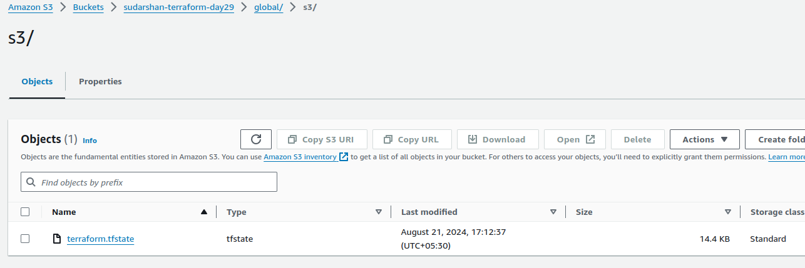

- **Configure Terraform** to store the state file in the S3 bucket.
```yaml
provider "aws" {
  region = "us-west-2"
}

resource "aws_s3_bucket" "terraform_state" {
  bucket = "sudarshan-terraform-day29"

  tags = {
    Name        = "sudarshan-TerraformStateBucket"
    Environment = "Dev"
  }
}
resource "aws_dynamodb_table" "terraform_locks" {
  name         = "sudarshan-terraform-state-locks"
  billing_mode = "PAY_PER_REQUEST"
  hash_key     = "LockID"

  attribute {
    name = "LockID"
    type = "S"
  }

  tags = {
    Name        = "sudarshan-TerraformStateLocks"
    Environment = "Dev"
  }
}
```

#### State Locking with DynamoDB:
- **Create a DynamoDB table** using Terraform (or manually if required) to store the state lock information.

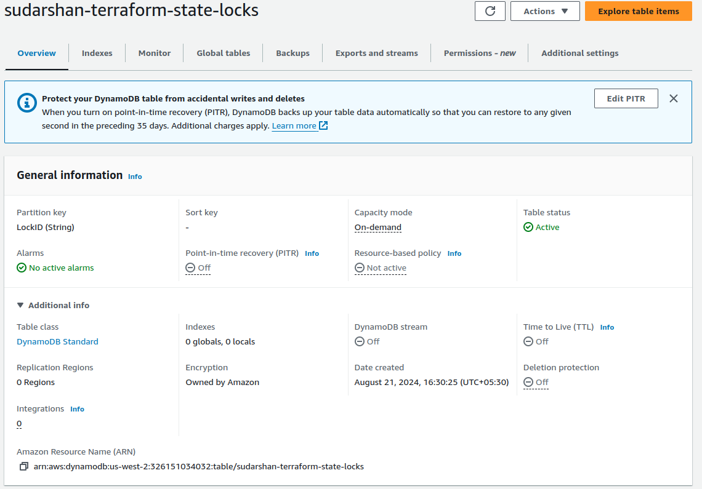


- **Configure Terraform** to use this DynamoDB table for state locking.

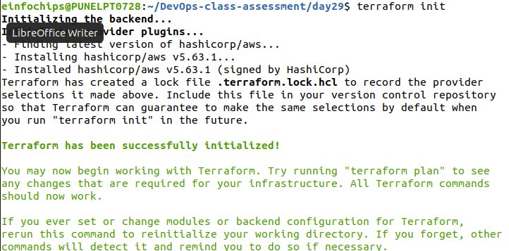

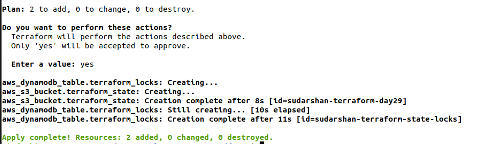

### 2. Terraform Module Creation:

#### Custom Module:
- **Create a Terraform module** to deploy the following AWS resources:
  - **EC2 instance**: Use an AMI for the region and allow SSH access using a security group.
```bash
  ec2
|-- main.tf
|-- outputs.tf
`-- variables.tf

0 directories, 3 files
```
  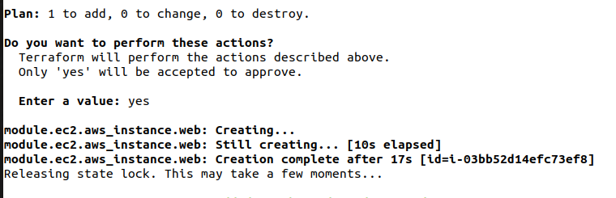

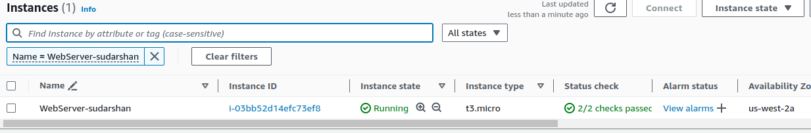

  - **S3 bucket**: Create an S3 bucket for application data.
```bash
  s3
|-- main.tf
|-- outputs.tf
`-- variables.tf

0 directories, 3 files
```
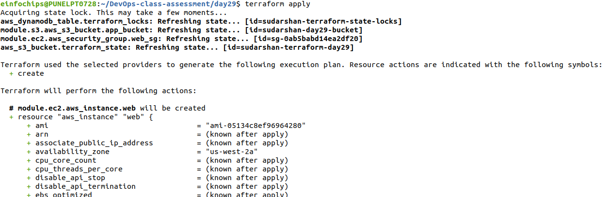

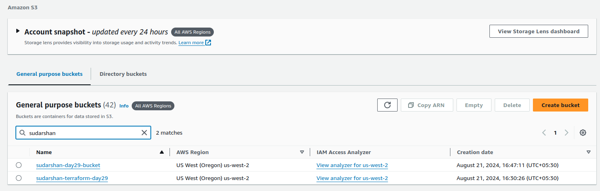


- **Use Terraform variables (`tfvars`)** to parameterize important aspects such as:
  - **Instance Type**: Allow the instance type to be configurable (e.g., `t2.micro`).

  - **Region**: Parameterize the AWS region so that the module can be reused across regions.

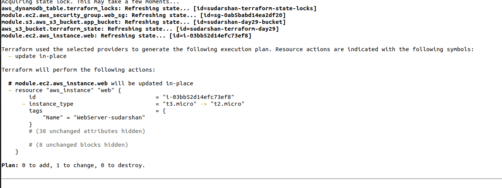

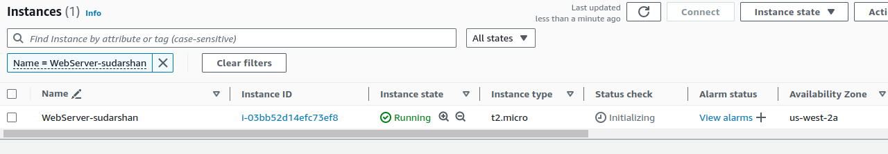

### Terraform Functions:
- **Use Terraform functions** in your module to manipulate and process the variables. For example:
  - Use `join` to combine strings for resource names.
  - Use `lookup` to set default values if a variable is not provided.
  - Use `length` to count the number of instances or resources.

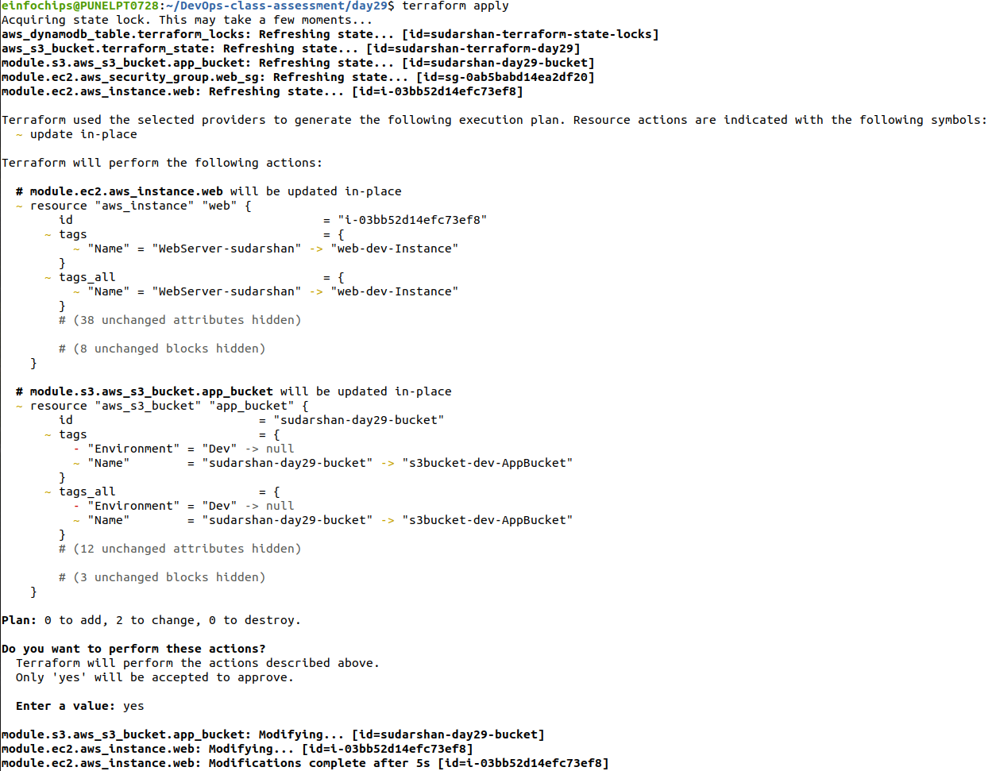

### Input Variables and Configuration (`tfvars`):
- **Define input variables** to make the infrastructure flexible:
  - EC2 instance type.
  - S3 bucket name.
  - AWS region.
  - Any other variable relevant to the infrastructure.
- Use the `default` argument for variables where appropriate.

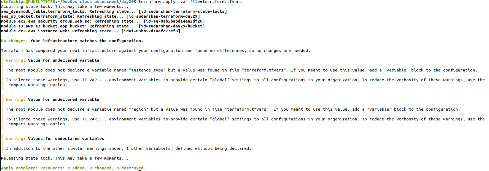

### Output Configuration:
- **Set up Terraform outputs** to display key information after the infrastructure is created:
  - **EC2 Public IP**: Output the public IP of the EC2 instance.
  - **S3 Bucket Name**: Output the name of the S3 bucket created.
  - **Region**: Output the region where the resources were deployed.

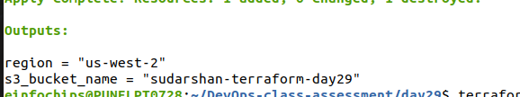

### Testing State Locking and Remote State:

#### State Locking:
- **Attempt to run `terraform apply` from two different terminals simultaneously** to test state locking.
- **Confirm that DynamoDB** properly handles the state lock, preventing concurrent updates.

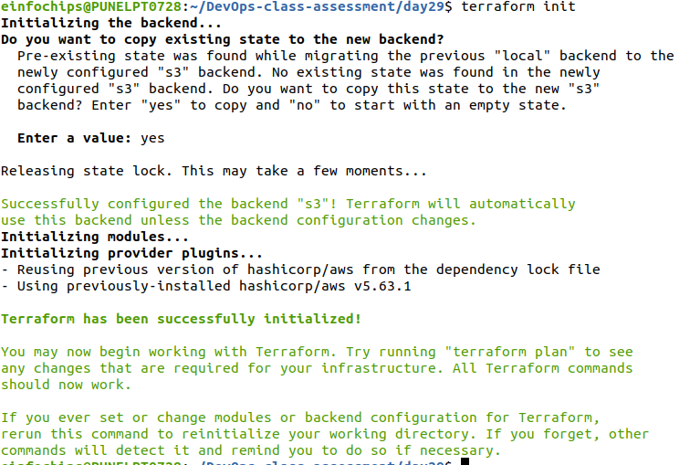

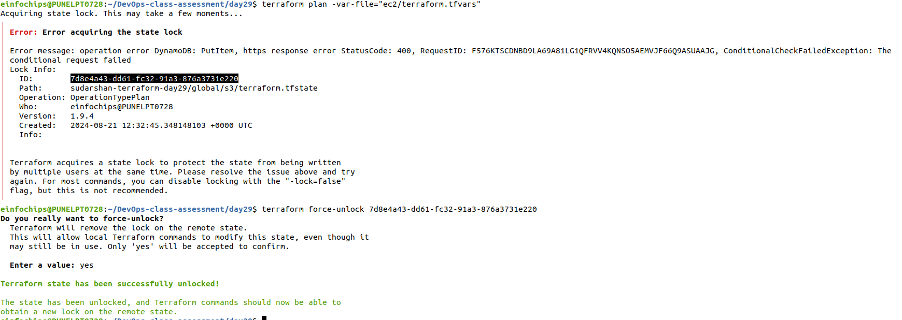

#### Remote State Management:
- **Verify that Terraform state** is being stored in the S3 bucket and that updates are reflected in the remote state file.

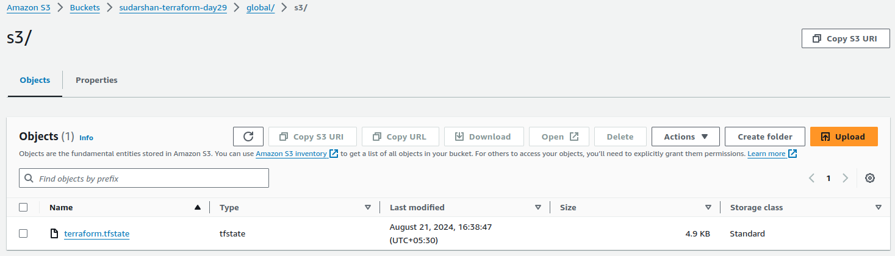

### Apply and Modify Infrastructure:

#### Initial Deployment:
- Use `terraform plan` and `terraform apply` to deploy the infrastructure.
- **Verify** that the EC2 instance, S3 bucket, and all configurations are properly set up.


#### Infrastructure Changes:
- **Modify one of the variables** (e.g., change the instance type or add tags) and re-run `terraform apply`.

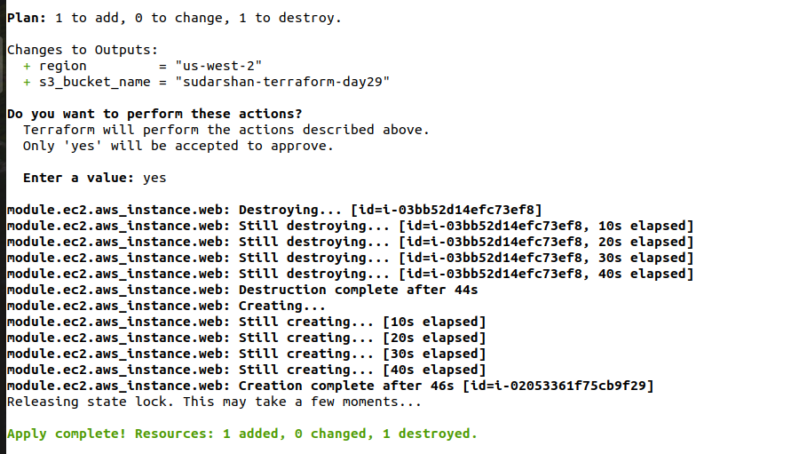

- **Observe how Terraform plans** and applies only the necessary changes, with state locking in effect.

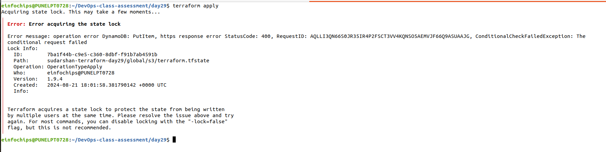

### Resource Termination:
- **Once the deployment is complete and tested**, use `terraform destroy` to tear down all the resources created by Terraform.
- Ensure that the S3 bucket, EC2 instance, and DynamoDB table (if not reused) are deleted.

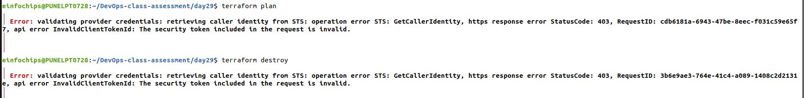

Note : unable to destroy resources due to access revoked from AWS.

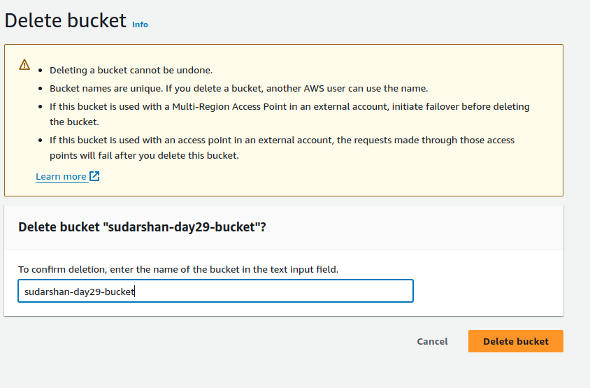
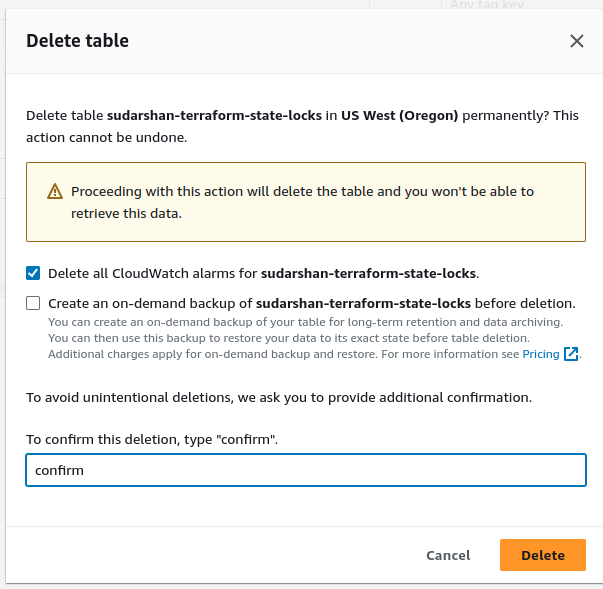
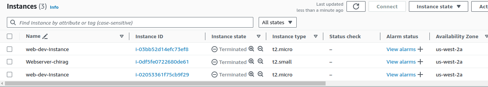
