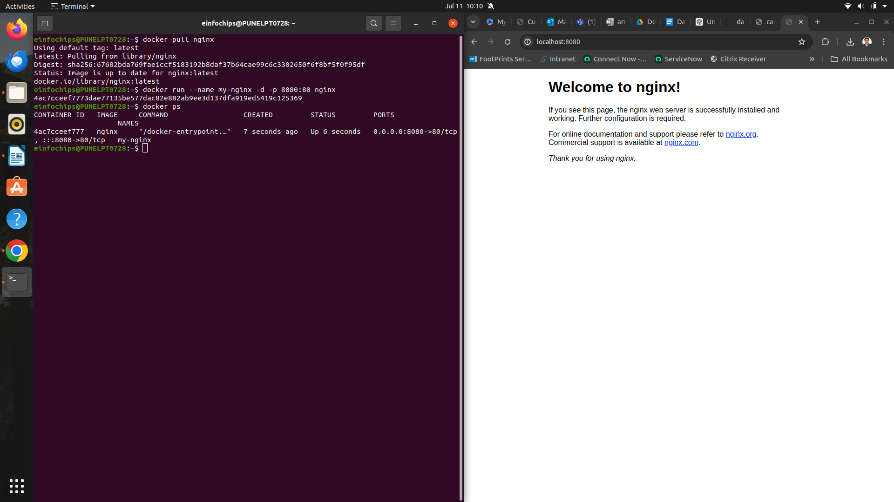
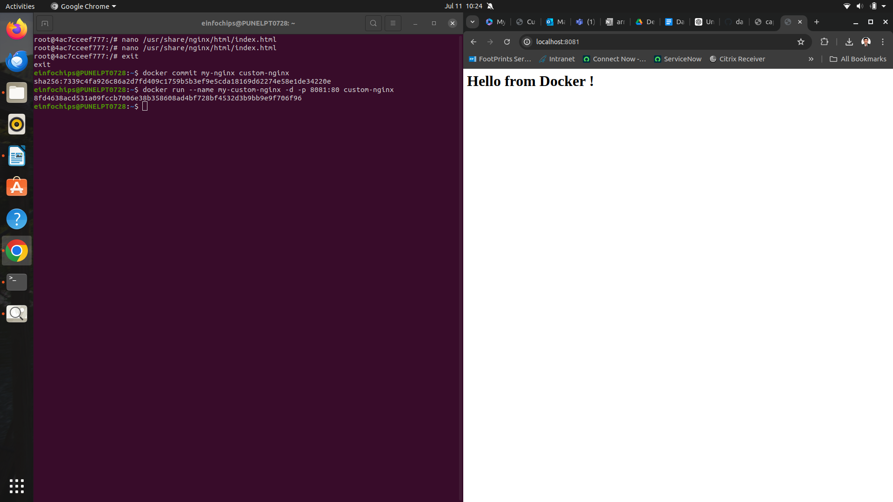
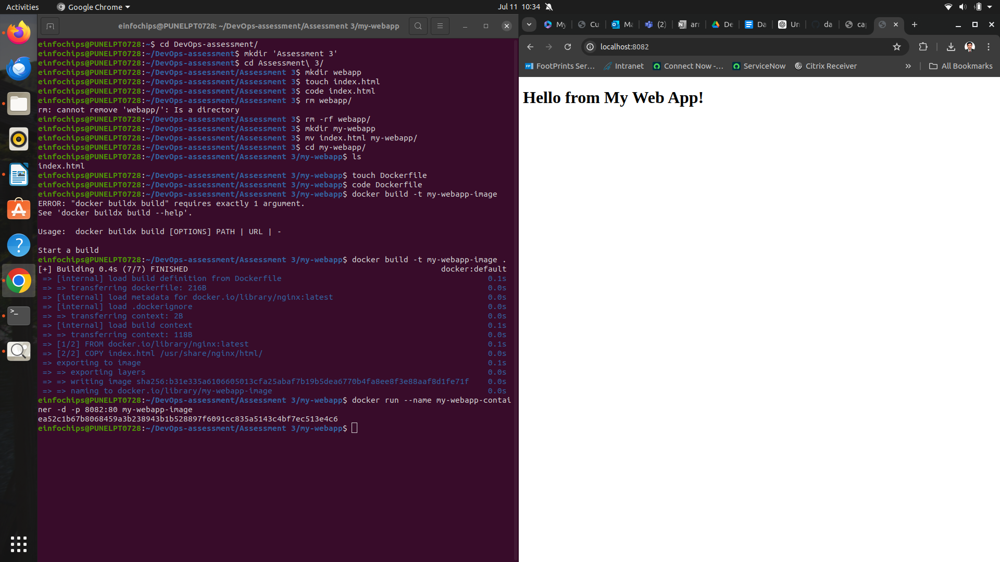
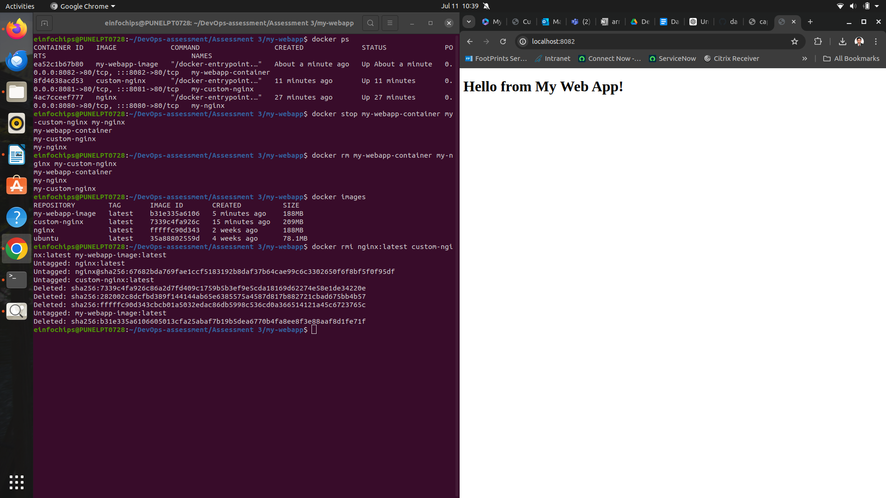

                                Docker Project 01

Project Overview

In this project, you'll go through all three lifecycles of Docker: pulling an image and creating a container, modifying the container and creating a new image, and finally, creating a Dockerfile to build and deploy a web application.

Part 1: Creating a Container from a Pulled Image

Objective: Pull the official Nginx image from Docker Hub and run it as a container.

Steps:

Pull the Nginx Image:

    docker pull nginx

1.Run the Nginx Container:

    docker run --name my-nginx -d -p 8080:80 nginx

2. --name my-nginx: Assigns a name to the container.
   -d: Runs the container in detached mode.
   -p 8080:80: Maps port 8080 on your host to port 80 in the container.
Verify the Container is Running:

    docker ps

3. Visit http://localhost:8080 in your browser. You should see the Nginx welcome page.

Part 2: Modifying the Container and Creating a New Image

Objective: Modify the running Nginx container to serve a custom HTML page and create a new image from this modified container.

Steps:

Access the Running Container:

    docker exec -it my-nginx /bin/bash

1.Create a Custom HTML Page:

    echo "<html><body><h1>Hello from Docker!</h1></body></html>" > /usr/share/nginx/html/index.html

2.Exit the Container:

    exit

3.Commit the Changes to Create a New Image:

    docker commit my-nginx custom-nginx

4.Run a Container from the New Image:

    docker run --name my-custom-nginx -d -p 8081:80 custom-nginx 

5. Verify the New Container:

Visit http://localhost:8081 in your browser. You should see your custom HTML page.

Part 3: Creating a Dockerfile to Build and Deploy a Web Application

Objective: Write a Dockerfile to create an image for a simple web application and run it as a container.

Steps:
Create a Project Directory:

    mkdir my-webapp
    cd my-webapp

1.Create a Simple Web Application:

Create an index.html file:

    <!DOCTYPE html>
    <html>
    <body>
       <h1>Hello from My Web App!</h1>
    </body>
    </html>

Save this file in the my-webapp directory.

3. Write the Dockerfile:

Create a Dockerfile in the my-webapp directory with the following content:

Use the official Nginx base image
    
    FROM nginx:latest

Copy the custom HTML file to the appropriate location

    COPY index.html /usr/share/nginx/html/

Expose port 80
    
    EXPOSE 80
        ◦ 
Build the Docker Image:

    docker build -t my-webapp-image .

4.Run a Container from the Built Image:

    docker run --name my-webapp-container -d -p 8082:80 my-webapp-image

5. Verify the Web Application:

Visit http://localhost:8082 in your browser. You should see your custom web application.

Part 4: Cleaning Up

Objective: Remove all created containers and images to clean up your environment.

Steps:
Stop and Remove the Containers:

    docker stop my-nginx my-custom-nginx my-webapp-container
    docker rm my-nginx my-custom-nginx my-webapp-container

1. Remove the Images:

docker rmi nginx custom-nginx my-webapp-image

