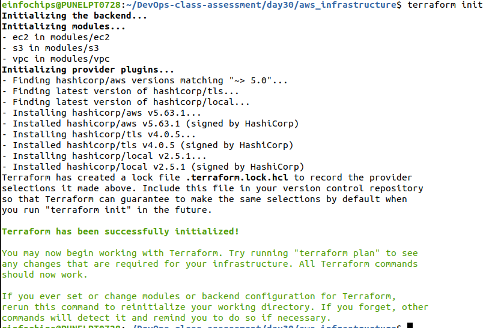
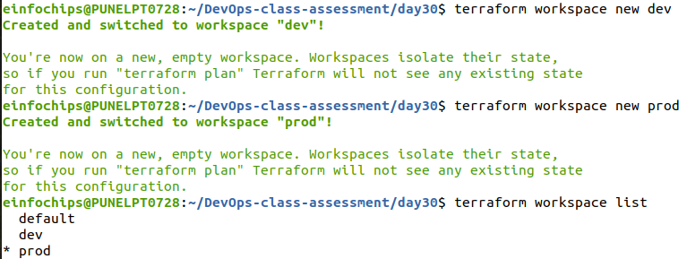
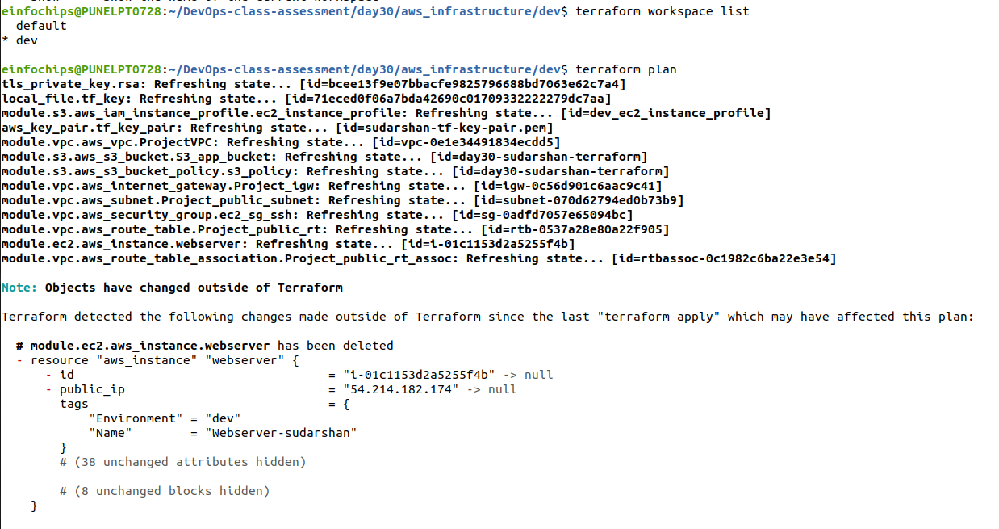
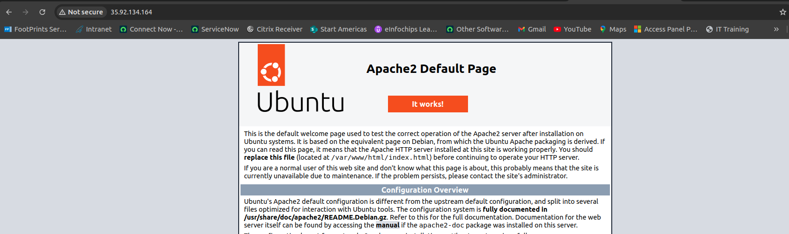
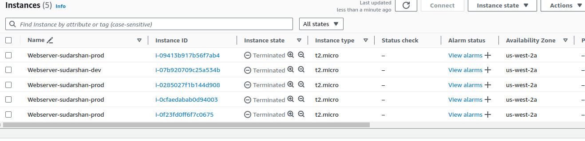

# Advanced Terraform with Provisioners, Modules, and Workspaces

## Project Objective

This project aims to evaluate participants' understanding of Terraform provisioners, modules, and workspaces. It involves deploying a basic infrastructure on AWS using Terraform modules, executing remote commands on the provisioned resources using provisioners, and managing multiple environments using Terraform workspaces. All resources should remain within the AWS Free Tier limits.

## Project Overview

Participants will create a Terraform configuration to deploy:
- An EC2 instance
- An S3 bucket

using a custom Terraform module. Provisioners will be employed to execute scripts on the EC2 instance, and Terraform workspaces will manage separate environments such as development (dev) and production (prod).

## Specifications

### Terraform Modules

- **Module Setup**: Create a directory `modules/aws_infrastructure`.

- **Resource Definitions**: Define resources for an EC2 instance and an S3 bucket within the module.
  - EC2 instance type: `t2.micro`

  - S3 bucket: Standard storage

- **Input Variables**: Accept variables for instance type, AMI ID, key pair name, and bucket name.

- **Outputs**: Provide outputs for the EC2 instance’s public IP and S3 bucket’s ARN.

### Terraform Provisioners

- **Remote-Exec Provisioner**: SSH into the EC2 instance to run a script installing Apache HTTP Server.

- **Local-Exec Provisioner**: Print a deployment status message locally indicating "EC2 instance successfully provisioned with Apache."

### Terraform Workspaces

- **Workspace Creation**: Implement workspaces for `dev` and `prod`.

- **Environment-Specific Configurations**: Use different tags or bucket names for each workspace.

- **State Management**: Ensure separate state files for each workspace to prevent conflicts.

## Key Tasks

### Module Development

1. **Module Setup**: 
   - Create the directory `modules/aws_infrastructure`.
   

```bash
.
|-- .gitignore
|-- .terraform
|   |-- environment
|   |-- modules
|   |   `-- modules.json
|   |-- providers
|   |   `-- registry.terraform.io
|   |       `-- hashicorp
|   |           |-- aws
|   |           |   `-- 5.64.0
|   |           |       `-- linux_amd64
|   |           |           |-- LICENSE.txt
|   |           |           `-- terraform-provider-aws_v5.64.0_x5
|   |           |-- local
|   |           |   `-- 2.5.1
|   |           |       `-- linux_amd64
|   |           |           `-- terraform-provider-local_v2.5.1_x5
|   |           `-- tls
|   |               `-- 4.0.5
|   |                   `-- linux_amd64
|   |                       `-- terraform-provider-tls_v4.0.5_x5
|   `-- terraform.tfstate
|-- .terraform.lock.hcl
|-- dev
|   |-- apply-dev.log
|   |-- destroy-dev.log
|   |-- dev.tfvars
|   `-- plan-dev.log
|-- main.tf
|-- modules
|   |-- ec2
|   |   |-- main.tf
|   |   |-- outputs.tf
|   |   `-- variables.tf
|   |-- s3
|   |   |-- main.tf
|   |   |-- outputs.tf
|   |   `-- variables.tf
|   `-- vpc
|       |-- main.tf
|       |-- outputs.tf
|       `-- variables.tf
|-- outputs.tf
|-- prod
|   |-- apply-prod.log
|   |-- destroy-prod.log
|   |-- plan-prod.log
|   `-- prod.tfvars
|-- terraform.tfstate.d
|   |-- dev
|   |   |-- terraform.tfstate
|   |   `-- terraform.tfstate.backup
|   `-- prod
|       |-- terraform.tfstate
|       `-- terraform.tfstate.backup
|-- terrform.tfstate.d
`-- variables.tf

24 directories, 33 files
```

2. **Resource Definitions**: 
   - Define EC2 and S3 resources.

EC2 Resource configuration :

```bash
resource "aws_instance" "webserver" {
  ami                         = var.ami
  instance_type               = var.instance_type
  iam_instance_profile        = var.iam_ec2_profile_name
  associate_public_ip_address = true
  subnet_id                   = var.public_subnet_id
  vpc_security_group_ids      = [var.security_group_id]
  key_name                    = var.tf_key_pair
  availability_zone           = "us-west-2a"
  tags = {
    Name = var.instance_name
    Environment= var.environment
  }
  connection {
     type        = "ssh"
    user        = "ubuntu"
    private_key = file("/home/einfochips/DevOps-class-assessment/day30/aws_infrastructure/sudarshan-tf-key-pair.pem")
    host        = self.public_ip

  }
  provisioner "remote-exec" {
    inline = [
      "sudo apt-get update",
      "sudo apt-get install -y apache2",
      "sudo systemctl start apache2",
      "sudo systemctl enable apache2"
    ]
  }
  provisioner "local-exec" {
    command = "echo 'Apache installation initiated on ${aws_instance.webserver.public_ip}'"
  }
}
```

S3 Resource configuration :
```bash
resource "aws_s3_bucket" "S3_app_bucket" {
  bucket = var.bucket_name
  tags = {
    Name = var.bucket_name
    Environment= var.environment
  }
}

# associate iam role with ec2 instance
resource "aws_iam_instance_profile" "ec2_instance_profile" {
  name = "${terraform.workspace}_ec2_instance_profile"
  role = basename(var.ec2_iam_role_arn)
}

resource "aws_s3_bucket_policy" "s3_policy" {
  bucket = aws_s3_bucket.S3_app_bucket.id

  policy = jsonencode({
    Version = "2012-10-17"
    Statement = [
      {
        Effect = "Allow"
        Principal = {
          AWS = var.ec2_iam_role_arn
        }
        Action = [
          "s3:GetObject",
          "s3:PutObject",
          "s3:ListBucket"
        ]
        Resource = [
          aws_s3_bucket.S3_app_bucket.arn,
          "${aws_s3_bucket.S3_app_bucket.arn}/*"
        ]
      }
    ]
  })
}
```
3. **Variable Inputs**: 
   - Define variables for instance type, AMI ID, key pair name, and bucket name.
```bash
variable "region" {
  type    = string
}
variable "ami" {
  description = "AMI ID for the EC2 instance"
  type        = string
}

variable "instance_type" {
  description = "Instance type for the EC2 instance"
  type        = string
}

variable "instance_name" {
  description = "Name tag for the EC2 instance"
  type        = string
}

variable "tf_key_pair" {
  description = "Name of your private key pair"
  type        = string
}

variable "iam_ec2_profile_name" {
  description = "iam profile name for ec2"
  type        = string
}

variable "public_subnet_id" {
  description = "public subnit id for ec2"
  type        = string
}

variable "security_group_id" {
  description = "security group id for ec2"
  type        = string
}
variable "bucket_name" {
  description = "The name of the S3 bucket"
  type        = string
}

# EC2 IAM Role ARN
variable "ec2_iam_role_arn" {
  description = "The ARN of the IAM role attached to the EC2 instance."
  type        = string
}
variable "VPC_cidr_ip" {
  description = "enter value of VPC CIDR IP range"
  type        = string
}
variable "subnet_cidr_ip" {
  description = "enter value of subnet CIDR IP range"
  type        = string
}

variable "environment" {
  description = "enter value of workspace environment"
  type        = string
}

```
4. **Outputs**: 
   - Define outputs for the EC2 instance’s public IP and the S3 bucket’s ARN.
```bash

output "instance_id" {
  description = "The ID of the EC2 instance"
  value       = aws_instance.webserver.id
}

output "instance_public_ip" {
  description = "The public IP address of the EC2 instance"
  value       = aws_instance.webserver.public_ip
}
output "bucket_arn" {
  description = "The ARN of the S3 bucket"
  value       = aws_s3_bucket.S3_app_bucket.arn
}

output "bucket_name" {
  description = "The name of the S3 bucket"
  value       = aws_s3_bucket.S3_app_bucket.bucket
}

output "iam_ec2_profile_name" {
  description = "name of the ec2 instance profle name"
  value       = aws_iam_instance_profile.ec2_instance_profile.name
}
output "private_key_pem" {
  value       = tls_private_key.tf-key.private_key_pem
  description = "Private key in PEM format"
  sensitive   = true
}

```
### Main Terraform Configuration

1. **Main Config Setup**:
   - In the root directory, create Terraform configuration files that call the custom module.

[main.tf](aws_infrastructure/main.tf)
[outputs.tf](aws_infrastructure/outputs.tf)
[variables.tf](aws_infrastructure/variables.tf)

2. **Backend Configuration**:
   - Configure local state storage for simplicity (optional).



### Provisioner Implementation

1. **Remote Execution**:
   - Use `remote-exec` to install Apache on the EC2 instance.

```bash

provisioner "remote-exec" {
    inline = [
      "sudo apt-get update",
      "sudo apt-get install -y apache2",
      "sudo systemctl start apache2",
      "sudo systemctl enable apache2"
    ]
  }
```
2. **Local Execution**:
   - Use `local-exec` to print a confirmation message locally.

```bash
 provisioner "local-exec" {
    command = "echo 'Apache installation initiated on ${aws_instance.webserver.public_ip}'"
  }
```
### Workspace Management

1. **Workspace Creation**:
   - Create `dev` and `prod` workspaces



2. **Environment-Specific Configurations**:
   - Customize tags and bucket names per workspace.

3. **Workspace Deployment**:
   - Deploy infrastructure in both workspaces.




### Validation and Testing

1. **Apache Installation Verification**:
   - Verify Apache is running on the EC2 instance by accessing its public IP.



2. **Workspace Separation**:
   - Ensure each workspace has isolated infrastructure and state files.

## Dev workspace environment:
```bash
dev/
|-- apply-dev.log
|-- destroy-dev.log
|-- main.tf
|-- plan-dev.log
|-- sudarshan-tf-key-pair.pem
|-- terraform.tfstate.d
|   `-- dev
|       |-- terraform.tfstate
|       `-- terraform.tfstate.backup
|-- terraform.tfvars
`-- variables.tf

2 directories, 9 files
```

3. **Provisioner Logs**:
   - Review `local-exec` logs to confirm deployment status.

[plan-dev.log](aws_infrastructure/dev/plan-dev.log)
[apply-dev.log](aws_infrastructure/dev/apply-dev.log)
[plan-prod.log](aws_infrastructure/prod/plan-prod.log)
[apply-prod.log](aws_infrastructure/prod/apply-prod.log)
### Resource Cleanup

1. **Destroy Resources**:
   - Use `terraform destroy` to remove resources in all workspaces.

[destroy-dev.log](aws_infrastructure/dev/destroy-dev.log)
[destroy-prod.log](aws_infrastructure/prod/destroy-prod.log)
2. **Workspace Management**:
   - Confirm resources are destroyed and state files updated accordingly.

