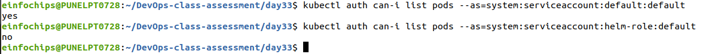

# Deploying a Multi-Tier Application Using Helm on Kubernetes and AWS Free Tier Services

## Overview

This guide outlines a 2-hour activity focused on deploying a multi-tier application on Minikube using Helm, while integrating free-tier AWS services. You'll learn to manage Helm charts, secrets, and RBAC, and integrate AWS services like S3 for storage and RDS (MySQL) for the database. The project emphasizes versioning, packaging, rollback, and cloud resource management.

## Estimated Duration

2 Hours

## Project Objectives

- Deploy a multi-tier application using Helm on Minikube.
- Integrate AWS free-tier services (S3 and RDS).
- Manage Helm charts, including versioning, packaging, and rollbacks.
- Implement Helm secrets management and RBAC.
- Handle dependencies between different components of the application.

## Project Deliverables

### 1. Setup Helm and Minikube

- Ensure Minikube is running.
```bash

curl -LO https://storage.googleapis.com/minikube/releases/latest/minikube-linux-amd64
sudo install minikube-linux-amd64 /usr/local/bin/minikube

minikube start

```


- Install and configure Helm on your local machine.
```bash
curl https://raw.githubusercontent.com/helm/helm/main/scripts/get-helm-3 | bash

helm repo add stable https://charts.helm.sh/stable

helm repo update

```


### 2. AWS Services Setup

- **S3 Bucket**: Create an S3 bucket for storing application assets (e.g., static files for the frontend).
```bash
aws s3 mb s3://sudarshan-day33-webapp-bucket --region us-west-2
```


- **RDS Instance**: Set up an Amazon RDS MySQL instance within the free tier.


Build Docker images for Backend :


Build Docker images for Frontend :


### 3. Create Helm Charts

- **Frontend Chart**: Create a Helm chart for a frontend service (e.g., NGINX) that pulls static files from the S3 bucket.

```bash
helm create frontend
```

```bash
frontend
|-- Chart.yaml
|-- charts
|-- templates
|   |-- _helpers.tpl
|   |-- deployment.yaml
|   |-- service.yaml
|   `-- tests
|       `-- test-connection.yaml
`-- values.yaml

3 directories, 6 files
```
- **Backend Chart**: Create a Helm chart for a backend service (e.g., a Python Flask API) that connects to the RDS MySQL database.

```bash
helm create backend
```
```bash
backend
|-- Chart.yaml
|-- charts
|-- templates
|   |-- _helpers.tpl
|   |-- deployment.yaml
|   |-- secret.yaml
|   |-- service.yaml
|   `-- tests
|       `-- test-connection.yaml
`-- values.yaml

3 directories, 7 files
```
- **Database Chart**: Include configurations for connecting to the RDS MySQL instance in the backend chart.


### 4. Package Helm Charts

- Package each Helm chart into a `.tgz` file.
```bash
helm package frontend
helm package backend
```


- Ensure charts are properly versioned.

### 5. Deploy Multi-Tier Application Using Helm

- Deploy the database chart (connected to the RDS instance).
- Deploy the backend chart with a dependency on the database chart.
```bash
helm install backend ./backend-0.1.0.tgz
```
- Deploy the frontend chart with a dependency on the backend service, ensuring it pulls assets from the S3 bucket.
```bash
helm install frontend ./frontend-0.1.0.tgz
```


### 6. Manage Helm Secrets

- Implement Helm secrets for managing sensitive data such as database credentials and S3 access keys.
```bash
helm plugin install https://github.com/jkroepke/helm-secrets
```
- Update the backend chart to use these secrets for connecting to the RDS instance and S3.

install SOPS : 
```bash
# Download the binary
curl -LO https://github.com/getsops/sops/releases/download/v3.9.0/sops-v3.9.0.linux.amd64

# Move the binary in to your PATH
mv sops-v3.9.0.linux.amd64 /usr/local/bin/sops

# Make the binary executable
chmod +x /usr/local/bin/sops
```

To encrypt this file with sops, run:
```bash
sops -e -i backend/templates/secrets.yaml
```
Before deploying, decrypt the secrets file:
```bash
sops -d backend/templates/secrets.yaml > backend/templates/secrets.dec.yaml
```
Install the Helm chart:
```bash
helm secrets upgrade/ --install backend ./backend
```
Optionally, remove decrypted files to avoid leaving sensitive information in plaintext:
```bash
rm backend/secrets.dec.yaml
```


### 7. Implement RBAC

- Define RBAC roles and role bindings to manage permissions for Helm deployments.
```bash
kubectl apply -f helm-role.yaml
kubectl apply -f helm-clusterrole.yaml
kubectl apply -f helm-rolebinding.yaml
kubectl apply -f helm-clusterrolebinding.yaml
```


- Ensure that only authorized users can deploy or modify the Helm releases.
```bash
helm upgrade --install frontend frontend/ --namespace default --service-account helm-role
```
```bash
kubectl auth can-i list pods --as=system:serviceaccount:default:default

```


### 8. Versioning and Rollback

- Update the version of one of the Helm charts (e.g., update the frontend service).
```bash
Release "frontend" has been upgraded. Happy Helming!
NAME: frontend
LAST DEPLOYED: Wed Aug 28 15:12:15 2024
NAMESPACE: default
STATUS: deployed
REVISION: 2
```
- Perform a rollback if necessary and validate the application functionality.
```bash
helm rollback frontend -1
```

### 9. Validate Deployment

- Ensure the frontend service is serving files from the S3 bucket.
```bash
kubectl port-forward svc/frontend 8080:80
```


- Validate that the backend service is successfully communicating with the RDS MySQL database.
```bash
kubectl get services
kubectl get deployments
```


- Test the overall functionality of the deployed application.

### 10. Cleanup

- Delete all Helm releases and Kubernetes resources created during the project.
```bash
helm uninstall backend
helm uninstall frontend
````
- Terminate the RDS instance and delete the S3 bucket.


- Stop Minikube if no longer needed.
```bash
minikube stop
```


## Key Evaluation Criteria

- Proper setup and usage of Helm charts, including versioning, packaging, and integrating AWS services.
- Effective management of secrets and implementation of RBAC in the Kubernetes environment.
- Successful deployment and integration of the application with AWS services (S3 and RDS).
- Correct handling of application rollbacks and version updates.
- Proper cleanup of all resources, both in Kubernetes and AWS, after the activity.
