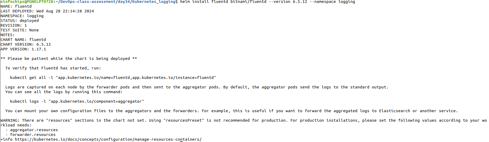

# Kubernetes Logging Setup Guide

This guide provides instructions for setting up a logging stack in Kubernetes using Fluentd, Elasticsearch, and Kibana (EFK stack).

## Prerequisites

- A Kubernetes cluster (e.g., Minikube, EKS, GKE, AKS)
- Helm installed on your local machine
- `kubectl` configured to access your Kubernetes cluster

## Steps

### 1. Add Helm Repositories

Add the Helm repositories for Fluentd, Elasticsearch, and Kibana:

```sh
helm repo add elastic https://helm.elastic.co
helm repo update
```
### 2. Create a Namespace

Create a namespace for logging components:

```bash
kubectl create namespace logging
```
### 3. Install Elasticsearch

Deploy Elasticsearch using Helm:

```bash
helm install elasticsearch elastic/elasticsearch --namespace logging
```


### 4. Install Kibana

Deploy Kibana using Helm:
```bash
helm install kibana elastic/kibana --namespace logging
```
### 5. Install Fluentd

Fluentd is used to collect and forward logs. Deploy Fluentd using Helm:

```bash
helm install my-fluentd bitnami/fluentd --version 6.5.12 --namespace logging
```


### 6. Configure Fluentd

Create a ConfigMap for Fluentd configuration. Save the following configuration as fluentd-configmap.yaml:
```yaml
apiVersion: v1
kind: ConfigMap
metadata:
  name: fluentd-config
  namespace: logging
data:
  fluentd.conf: |
    <source>
      @type tail
      path /var/log/containers/*.log
      pos_file /fluentd/log/container.pos
      tag kubernetes.*
      format json
    </source>

    <match kubernetes.**>
      @type elasticsearch
      @id elasticsearch
      host elasticsearch-master.logging.svc.cluster.local
      port 9200
      logstash_format true
      include_tag_key true
      tag_key @log_name
    </match>
```
Apply the ConfigMap:

```bash
kubectl apply -f fluentd-configmap.yaml
```
Update Fluentd deployment to use the new configuration. You may need to edit the existing Fluentd deployment to mount the ConfigMap:

```bash
kubectl edit deployment fluentd -n logging
```
Add a volume and volume mount to the deployment:

```yaml
spec
  template:
    spec:
      volumes:
        - name: fluentd-config
          configMap:
            name: fluentd-config
      containers:
        - name: fluentd
          volumeMounts:
            - name: fluentd-config
              mountPath: /fluentd/etc
```
### 7. Verify the Deployment

Check the status of the deployed services:

```bash
kubectl get all -n logging
```
### 8. Access Kibana Dashboard
To access the Kibana dashboard, set up port forwarding:

```bash
kubectl port-forward service/kibana-kibana 5601:5601 --namespace logging
```
Open your browser and navigate to http://localhost:5601.

### 9. Verify Logs in Kibana
1. Log in to Kibana.
2. Go to Discover in the left sidebar.
3. Select the index pattern (e.g., logstash-*) to view logs.