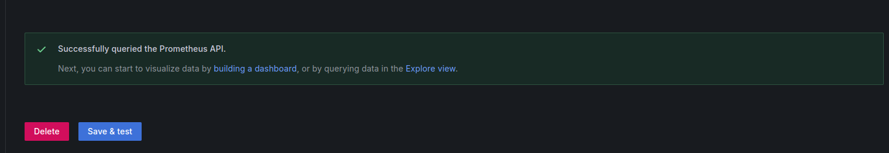

# Deploy Prometheus and Grafana on Kubernetes using Helm Charts

This guide will walk you through deploying Prometheus and Grafana on a Kubernetes cluster using Helm charts.

## Prerequisites

- A Kubernetes cluster (Minikube, EKS, GKE, AKS, etc.)
- Helm installed on your local machine
- kubectl configured to access your Kubernetes cluster

## 1. Add Helm Repositories

First, you need to add the Helm repositories that contain the charts for Prometheus and Grafana.

```bash
helm repo add prometheus-community https://prometheus-community.github.io/helm-charts
helm repo add grafana https://grafana.github.io/helm-charts
```
Optional Steps to search for helm packages :
```bash
helm search hub Prometheus
```
Or else you can go to the Artifact Hub repository and search for the Prometheus helm chart.


- Update your Helm repositories to ensure you have the latest charts.
```bash
helm repo update
```


## 2. Install Prometheus

Create a namespace for Prometheus (optional but recommended).
```bash
kubectl create namespace monitoring
```
Install Prometheus using Helm.
```bash
helm install prometheus prometheus-community/prometheus --namespace monitoring
```


## output:

```bash
NOTES:
The Prometheus server can be accessed via port 80 on the following DNS name from within your cluster:
prometheus-server.monitoring.svc.cluster.local


Get the Prometheus server URL by running these commands in the same shell:
  export POD_NAME=$(kubectl get pods --namespace monitoring -l "app.kubernetes.io/name=prometheus,app.kubernetes.io/instance=prometheus" -o jsonpath="{.items[0].metadata.name}")
  kubectl --namespace monitoring port-forward $POD_NAME 9090


The Prometheus alertmanager can be accessed via port 9093 on the following DNS name from within your cluster:
prometheus-alertmanager.monitoring.svc.cluster.local


Get the Alertmanager URL by running these commands in the same shell:
  export POD_NAME=$(kubectl get pods --namespace monitoring -l "app.kubernetes.io/name=alertmanager,app.kubernetes.io/instance=prometheus" -o jsonpath="{.items[0].metadata.name}")
  kubectl --namespace monitoring port-forward $POD_NAME 9093
#################################################################################
######   WARNING: Pod Security Policy has been disabled by default since    #####
######            it deprecated after k8s 1.25+. use                        #####
######            (index .Values "prometheus-node-exporter" "rbac"          #####
###### .          "pspEnabled") with (index .Values                         #####
######            "prometheus-node-exporter" "rbac" "pspAnnotations")       #####
######            in case you still need it.                                #####
#################################################################################


The Prometheus PushGateway can be accessed via port 9091 on the following DNS name from within your cluster:
prometheus-prometheus-pushgateway.monitoring.svc.cluster.local


Get the PushGateway URL by running these commands in the same shell:
  export POD_NAME=$(kubectl get pods --namespace monitoring -l "app=prometheus-pushgateway,component=pushgateway" -o jsonpath="{.items[0].metadata.name}")
  kubectl --namespace monitoring port-forward $POD_NAME 9091
```

## 3. Install Grafana

Install Grafana using Helm.
```bash
helm install grafana grafana/grafana --namespace monitoring
```


# Output:

```bash
NOTES:
1. Get your 'admin' user password by running:

   kubectl get secret --namespace monitoring grafana -o jsonpath="{.data.admin-password}" | base64 --decode ; echo


2. The Grafana server can be accessed via port 80 on the following DNS name from within your cluster:

   grafana.monitoring.svc.cluster.local

   Get the Grafana URL to visit by running these commands in the same shell:
     export POD_NAME=$(kubectl get pods --namespace monitoring -l "app.kubernetes.io/name=grafana,app.kubernetes.io/instance=grafana" -o jsonpath="{.items[0].metadata.name}")
     kubectl --namespace monitoring port-forward $POD_NAME 3000

3. Login with the password from step 1 and the username: admin
#################################################################################
######   WARNING: Persistence is disabled!!! You will lose your data when   #####
######            the Grafana pod is terminated.                            #####
#################################################################################
```

## 4. Access Grafana Dashboard

To access the Grafana dashboard, you need to set up port forwarding.
```bash
kubectl port-forward service/grafana 3000:80 --namespace monitoring
```


Open your browser and navigate to http://localhost:3000. The default username is admin, and the password can be retrieved with the following command:
```bash
kubectl get secret --namespace monitoring grafana -o jsonpath="{.data.admin-password}" | base64 --decode ; echo
```


## 5. Access Prometheus Dashboard (Optional)
You can also access the Prometheus dashboard by port-forwarding the Prometheus service.
```bash
kubectl port-forward service/prometheus-server 9090:80 --namespace monitoring
```


Open your browser and navigate to http://localhost:9090.


## 6.Configure Grafana to Use Prometheus as a Data Source
1. Log in to Grafana.
2. Click on the gear icon (⚙️) to go to Configuration and select Data Sources.
3. Click on Add data source.


4. Choose Prometheus from the list.

5. In the HTTP section, set the URL to http://prometheus-server.monitoring.svc.cluster.local.


6. Click Save & Test to verify the connection.



## 7. (Optional) Set Up Grafana Dashboards for Prometheus
Grafana provides a set of pre-configured dashboards for Prometheus. To import these dashboards:

1. Go to the + icon on the left sidebar and select Import.


2. Enter the dashboard ID (e.g., 1860 for the Node Exporter Full dashboard)  or upload a JSON file of the dashboard configuration.


3. Click Load.

4. Select the Prometheus data source you configured earlier.


5. Click Import.

# output :


# Conclusion
You have successfully deployed Prometheus and Grafana on your Kubernetes cluster using Helm charts. You can now monitor your cluster and applications using these tools. For further customization and configuration, refer to the Prometheus Helm chart documentation and the Grafana Helm chart documentation.