# Activity: Deploying a Kubeadm Cluster

## 1. Provision EC2 Instances

- **Control Node**: T2.medium

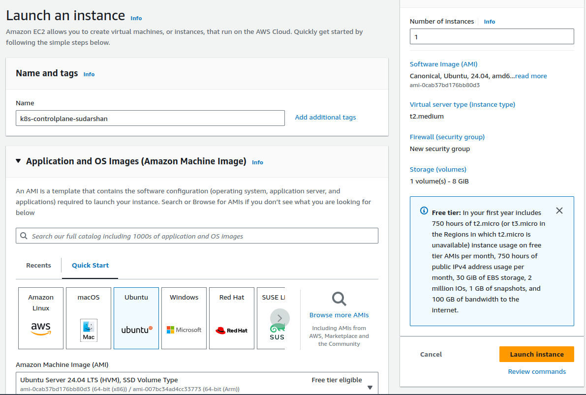

- **Worker Node**: T2.micro

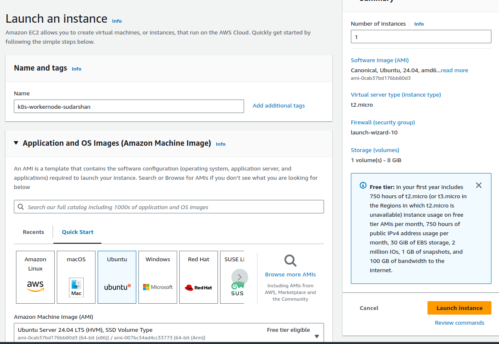

## 2. Log in to Control Node

### Install Packages

#### On All Nodes (Control Plane and Workers)

1. **Log in to the Control Plane Node.**

2. **Create the Configuration File for containerd:**

    ```bash
    cat <<EOF | sudo tee /etc/modules-load.d/containerd.conf
    overlay
    br_netfilter
    EOF
    ```

3. **Load the Modules:**

    ```bash
    sudo modprobe overlay
    sudo modprobe br_netfilter
    ```

4. **Set the System Configurations for Kubernetes Networking:**

    ```bash
    cat <<EOF | sudo tee /etc/sysctl.d/99-kubernetes-cri.conf
    net.bridge.bridge-nf-call-iptables = 1
    net.ipv4.ip_forward = 1
    net.bridge.bridge-nf-call-ip6tables = 1
    EOF
    ```

5. **Apply the New Settings:**

    ```bash
    sudo sysctl --system
    ```

6. **Install containerd:**

    ```bash
    sudo apt-get update && sudo apt-get install -y containerd.io
    ```

7. **Create the Default Configuration File for containerd:**

    ```bash
    sudo mkdir -p /etc/containerd
    ```

8. **Generate the Default containerd Configuration and Save It:**

    ```bash
    sudo containerd config default | sudo tee /etc/containerd/config.toml
    ```

9. **Restart containerd:**

    ```bash
    sudo systemctl restart containerd
    ```
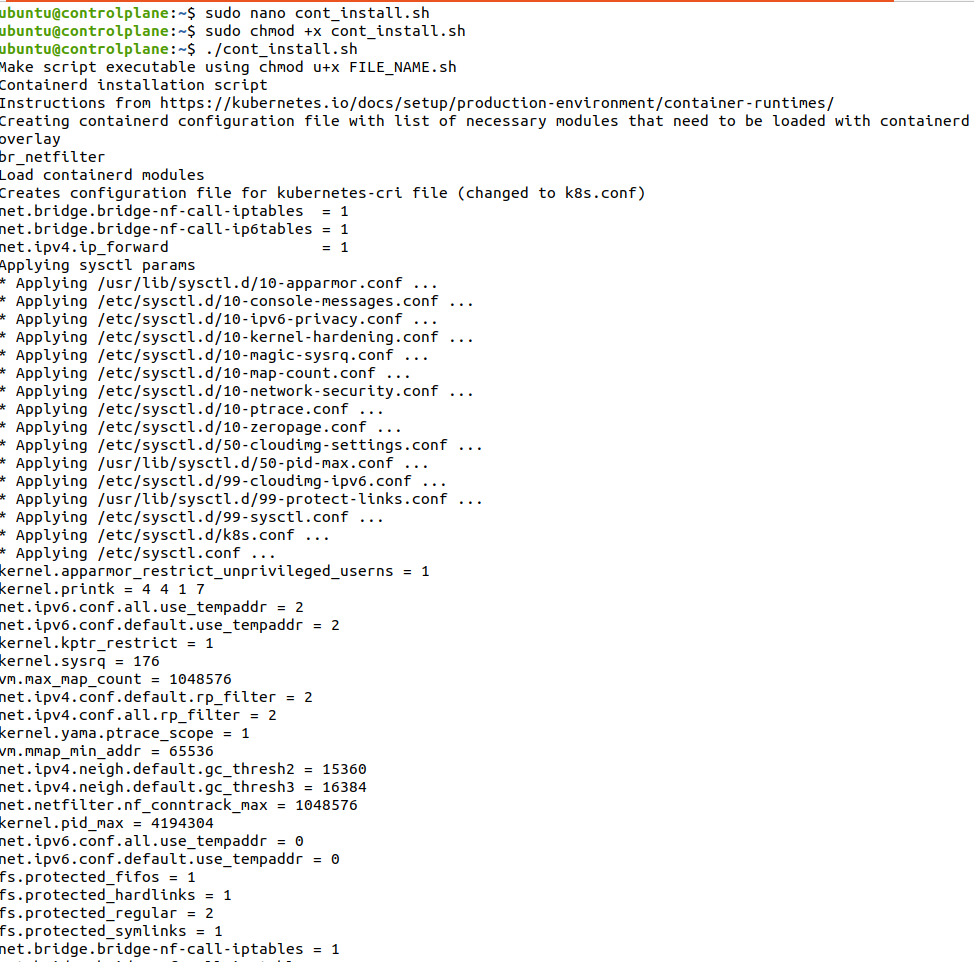

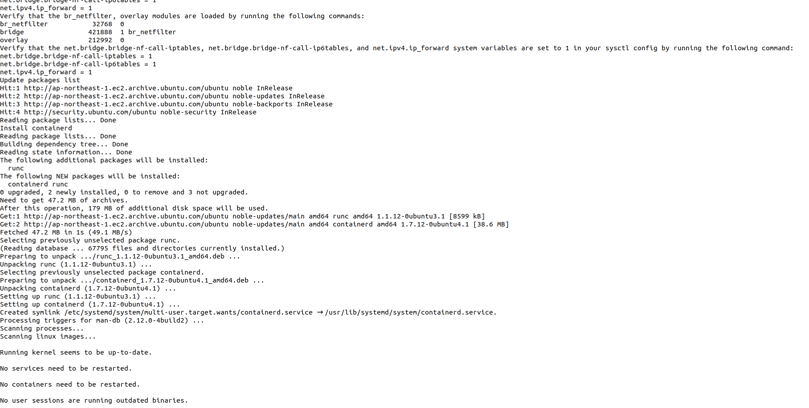

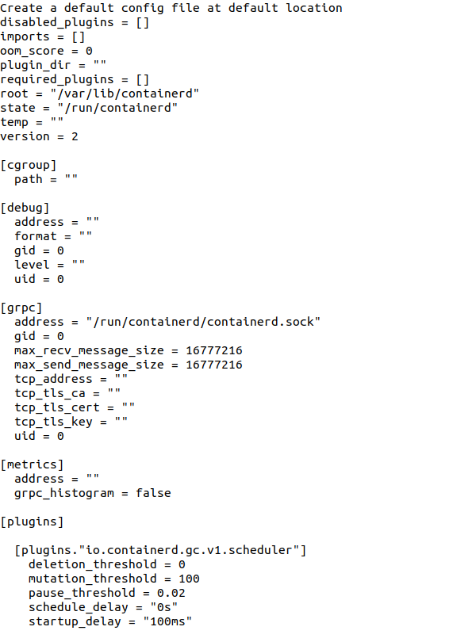

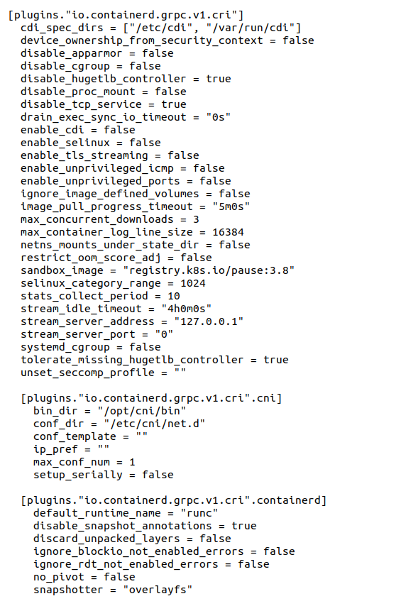

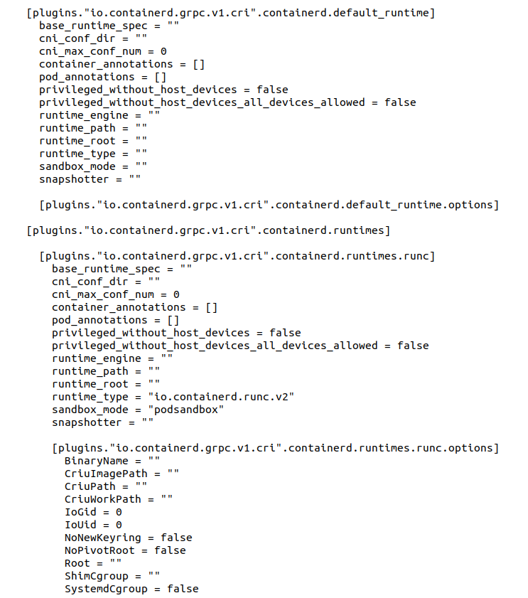

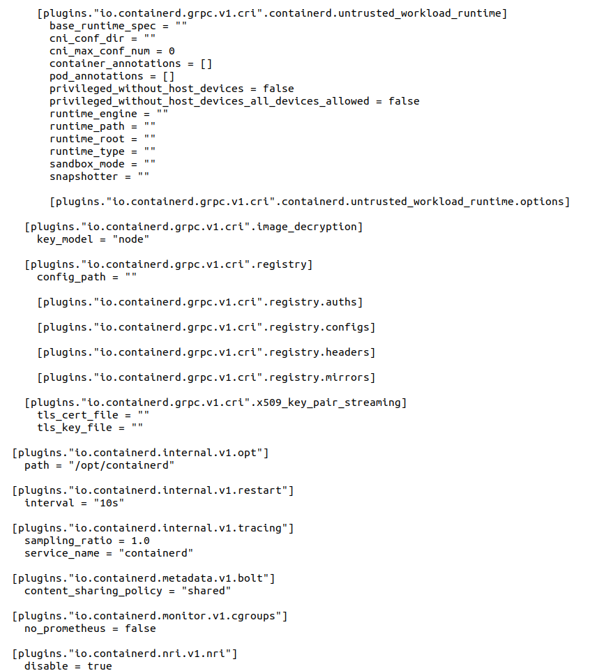

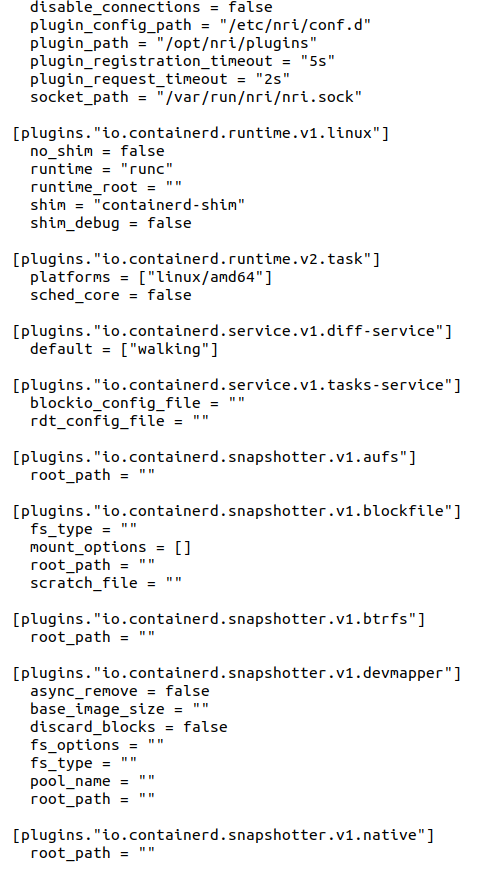

10. **Verify that containerd is Running:**

    ```bash
    sudo systemctl status containerd
    ```

11. **Disable Swap:**

    ```bash
    sudo swapoff -a
    ```

12. **Install Dependency Packages:**

    ```bash
    sudo apt-get update && sudo apt-get install -y apt-transport-https curl
    ```

13. **Download and Add the GPG Key:**

    ```bash
    curl -fsSL https://pkgs.k8s.io/core:/stable:/v1.27/deb/Release.key | sudo gpg --dearmor -o /etc/apt/keyrings/kubernetes-apt-keyring.gpg
    ```

14. **Add Kubernetes to the Repository List:**

    ```bash
    cat <<EOF | sudo tee /etc/apt/sources.list.d/kubernetes.list
    deb [signed-by=/etc/apt/keyrings/kubernetes-apt-keyring.gpg] https://pkgs.k8s.io/core:/stable:/v1.27/deb/ /
    EOF
    ```

15. **Update the Package Listings:**

    ```bash
    sudo apt-get update
    ```

16. **Install Kubernetes Packages:**

    ```bash
    sudo apt-get install -y kubelet kubeadm kubectl
    ```

    **Note**: If you encounter a `dpkg` lock message, wait a minute or two and try again.

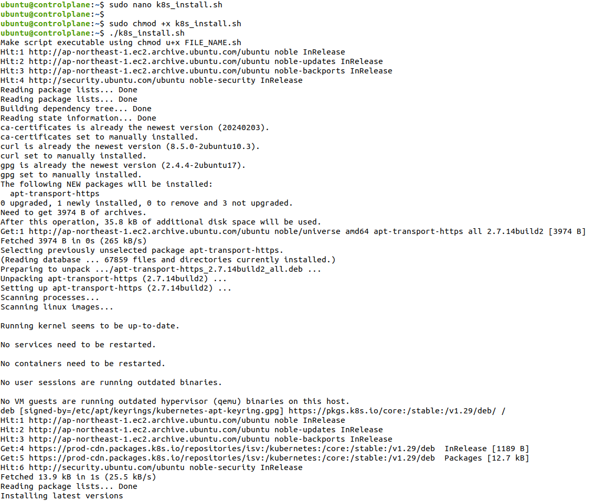

17. **Turn Off Automatic Updates:**

    ```bash
    sudo apt-mark hold kubelet kubeadm kubectl
    ```
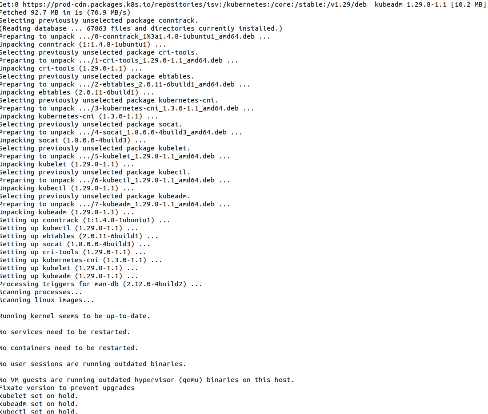

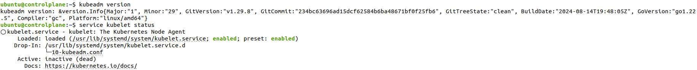

18. **Log in to Both Worker Nodes and Repeat the Above Steps.**

## 3. Initialize the Cluster

1. **On the Control Plane Node, Initialize the Kubernetes Cluster:**

    ```bash
    sudo kubeadm init --pod-network-cidr 192.168.0.0/16 --kubernetes-version 1.27.11
    ```
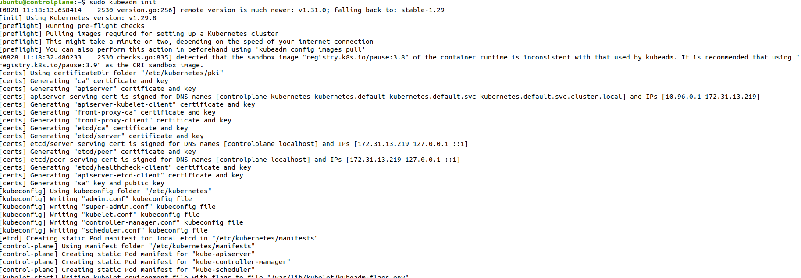

2. **Set kubectl Access:**

    ```bash
    mkdir -p $HOME/.kube
    sudo cp -i /etc/kubernetes/admin.conf $HOME/.kube/config
    sudo chown $(id -u):$(id -g) $HOME/.kube/config
    ```
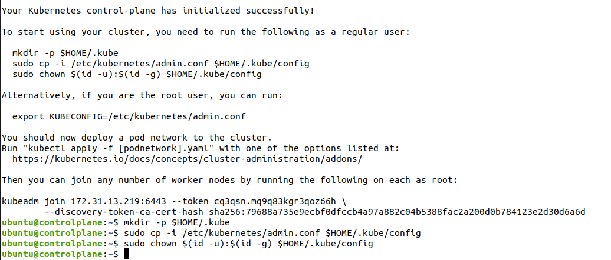

3. **Test Access to the Cluster:**

    ```bash
    kubectl get nodes
    ```

## 4. Install the Calico Network Add-On

1. **On the Control Plane Node, Install Calico Networking:**

    ```bash
    kubectl apply -f https://raw.githubusercontent.com/projectcalico/calico/v3.25.0/manifests/calico.yaml
    ```
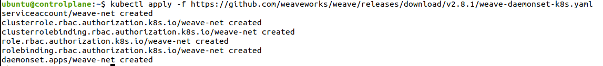

2. **Check the Status of the Control Plane Node:**

    ```bash
    kubectl get nodes
    ```
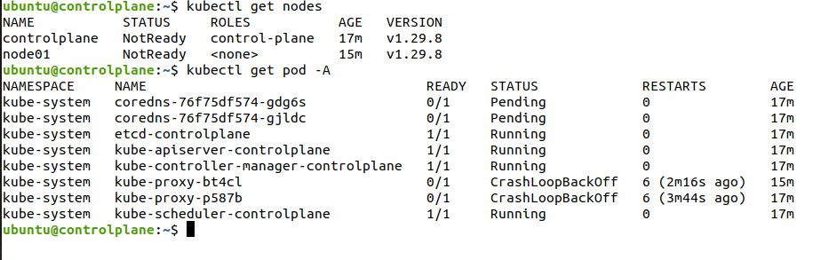

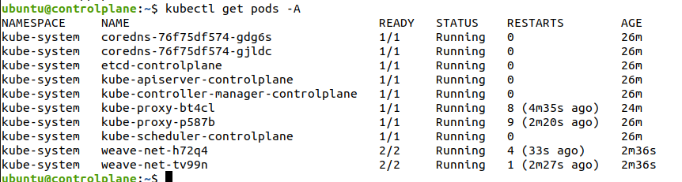

## 5. Join the Worker Nodes to the Cluster

1. **On the Control Plane Node, Create the Token and Copy the Join Command:**

    ```bash
    kubeadm token create --print-join-command
    ```
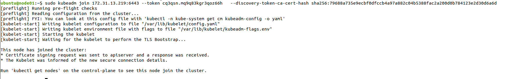

    **Note**: Copy the full output starting with `kubeadm join`.

2. **On Each Worker Node, Paste the Full Join Command:**

    ```bash
    sudo kubeadm join…
    ```

3. **On the Control Plane Node, View the Cluster Status:**

    ```bash
    kubectl get nodes
    ```
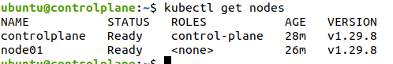

    **Note**: You may need to wait a few moments for all nodes to become ready.
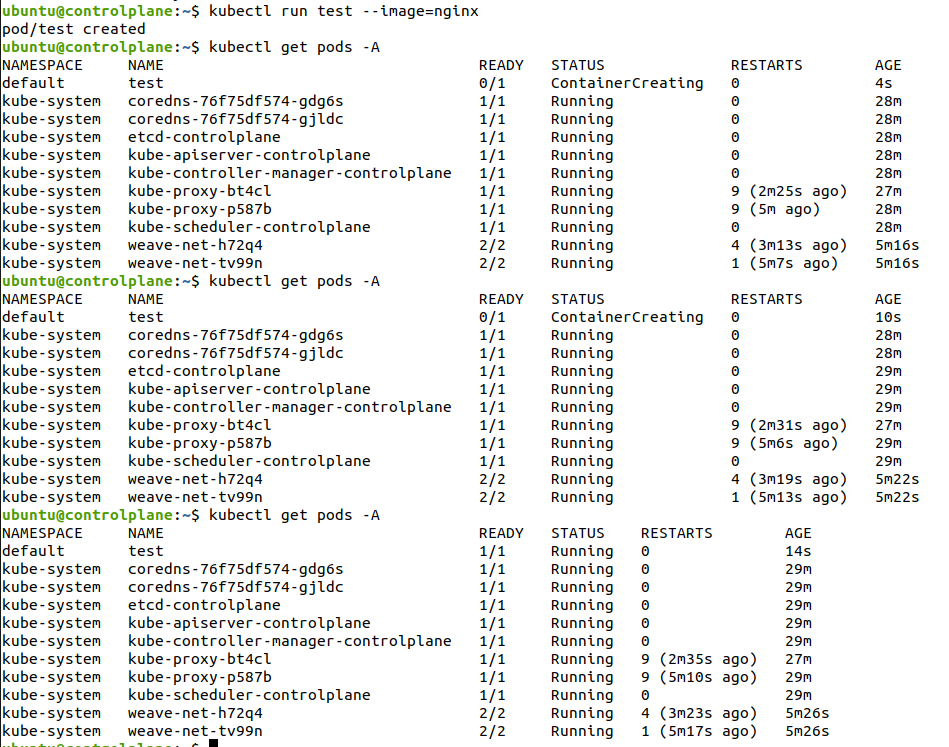


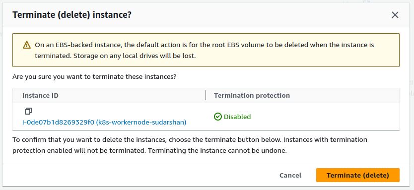

