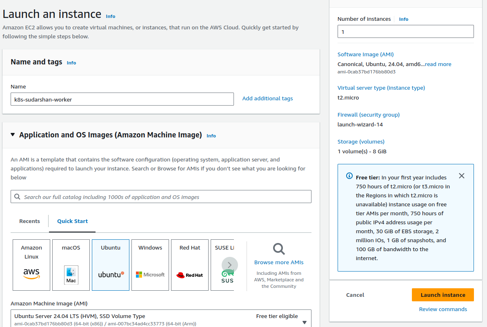
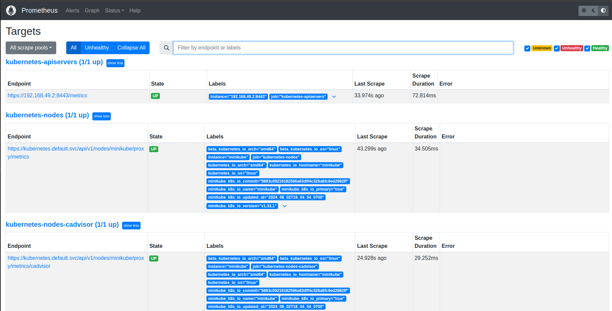
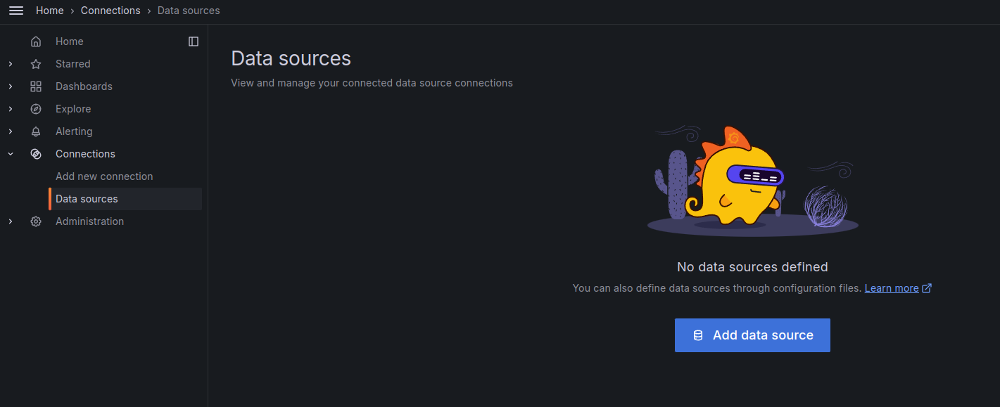

# Project Overview: Kubernetes Application Deployment and Monitoring

In this project, you will deploy a Kubernetes application on AWS EC2 instances and set up a monitoring stack using Prometheus and Grafana. The goal is to monitor the application's performance and visualize metrics using Grafana dashboards. This project is designed to test your knowledge of deploying and configuring monitoring solutions in a Kubernetes environment on AWS.

## Project Objectives

1. Deploy a Kubernetes cluster on EC2 instances.
2. Install Prometheus to monitor Kubernetes cluster metrics.
3. Install Grafana and configure it to visualize metrics from Prometheus.
4. Create custom Grafana dashboards to monitor specific application metrics.
5. Demonstrate how to set up alerts in Grafana based on specific thresholds.
6. Terminate all AWS resources after completing the project.

## Project Requirements

- **AWS EC2 Instances**: Launch a minimum of 3 t2.micro instances for the Kubernetes master and worker nodes.
- **Kubernetes Cluster**: Set up a Kubernetes cluster using Kubeadm on the EC2 instances.
- **Prometheus**: Deploy Prometheus on the Kubernetes cluster to collect metrics.
- **Grafana**: Deploy Grafana on the Kubernetes cluster and configure it to use Prometheus as a data source.
- **Custom Dashboards**: Create custom Grafana dashboards to monitor application metrics.
- **Alerting**: Set up basic alerts in Grafana for key metrics (e.g., CPU usage, memory usage).
- **Termination**: Ensure all AWS resources are terminated after the project is complete.

## Step-by-Step Project Tasks

### 1. Launch AWS EC2 Instances (20 Minutes)

- Launch three EC2 instances of type t2.micro in the same VPC and availability zone.




- Configure security groups to allow SSH access (port 22) and necessary ports for Kubernetes, Prometheus, and Grafana (e.g., ports 9090, 3000).


- SSH into the instances and update the package manager.


### 2. Set Up a Kubernetes Cluster (30 Minutes)

- On the master node, install Kubeadm, Kubelet, and Kubectl.
```bash
sudo swapoff -a
```
## create Shell script to install containerd with name as containerd.sh on Master and Worker Nodes:

```bash
echo "Make script executable using chmod u+x FILE_NAME.sh"

echo "Containerd installation script"
echo "Instructions from https://kubernetes.io/docs/setup/production-environment/container-runtimes/"

echo "Creating containerd configuration file with list of necessary modules that need to be loaded with containerd"
cat <<EOF | sudo tee /etc/modules-load.d/k8s.conf
overlay
br_netfilter
EOF

echo "Load containerd modules"
sudo modprobe overlay
sudo modprobe br_netfilter


echo "Creates configuration file for kubernetes-cri file (changed to k8s.conf)"
# sysctl params required by setup, params persist across reboots
cat <<EOF | sudo tee /etc/sysctl.d/k8s.conf
net.bridge.bridge-nf-call-iptables  = 1
net.bridge.bridge-nf-call-ip6tables = 1
net.ipv4.ip_forward                 = 1
EOF

echo "Applying sysctl params"
sudo sysctl --system


echo "Verify that the br_netfilter, overlay modules are loaded by running the following commands:"
lsmod | grep br_netfilter
lsmod | grep overlay

echo "Verify that the net.bridge.bridge-nf-call-iptables, net.bridge.bridge-nf-call-ip6tables, and net.ipv4.ip_forward system variables are set to 1 in your sysctl config by running the following command:"
sysctl net.bridge.bridge-nf-call-iptables net.bridge.bridge-nf-call-ip6tables net.ipv4.ip_forward

echo "Update packages list"
sudo apt-get update

echo "Install containerd"
sudo apt-get -y install containerd

echo "Create a default config file at default location"
sudo mkdir -p /etc/containerd
sudo containerd config default | sudo tee /etc/containerd/config.toml

echo "Restarting containerd"
sudo systemctl restart containerd
```
give executable permission and run the script.
```bash
sudo chmod +x containerd.sh
sudo ./containerd.sh
sudo service containerd status
```


## Install kubeadm, kubelet and kubectl :

- create Shell script to install  kubeadm, kubelet and kubectl with name kubeadm_install.sh on Master and Worker Nodes:
```bash
echo "Make script executable using chmod u+x FILE_NAME.sh"

sudo apt-get update

# apt-transport-https may be a dummy package; if so, you can skip that package
sudo apt-get install -y apt-transport-https ca-certificates curl gpg


curl -fsSL https://pkgs.k8s.io/core:/stable:/v1.29/deb/Release.key | sudo gpg --dearmor -o /etc/apt/keyrings/kubernetes-apt-keyring.gpg

echo 'deb [signed-by=/etc/apt/keyrings/kubernetes-apt-keyring.gpg] https://pkgs.k8s.io/core:/stable:/v1.29/deb/ /' | sudo tee /etc/apt/sources.list.d/kubernetes.list

sudo apt-get update

echo "Installing latest versions"
sudo apt-get install -y kubelet kubeadm kubectl

echo "Fixate version to prevent upgrades"
sudo apt-mark hold kubelet kubeadm kubectl
```
give executable permission and run the script.
```bash
sudo chmod +x kubeadm_install.sh
sudo ./kubeadm_install.sh
```


- Initialize the Kubernetes cluster using Kubeadm on controlplane.
```bash
sudo kubeadm init
```

### output:
```bash
To start using your cluster, you need to run the following as a regular user:

  mkdir -p $HOME/.kube
  sudo cp -i /etc/kubernetes/admin.conf $HOME/.kube/config
  sudo chown $(id -u):$(id -g) $HOME/.kube/config

Alternatively, if you are the root user, you can run:

  export KUBECONFIG=/etc/kubernetes/admin.conf

You should now deploy a pod network to the cluster
```

- Join the worker nodes to the master node to complete the cluster setup.


- Verify that the cluster is working by deploying a sample application (e.g., Nginx).


- install CNI plugin on master node:
```bash
kubectl apply -f https://github.com/weaveworks/weave/releases/download/v2.8.1/weave-daemonset-k8s.yaml
```


### 3. Deploy Prometheus on Kubernetes (20 Minutes)

- Create a Kubernetes namespace for monitoring tools.
```bash
    kubectl create namespace monitoring
```
- Use a Helm chart to deploy Prometheus or manually deploy Prometheus using Kubernetes manifests.
```bash
helm install prometheus prometheus-community/prometheus --namespace monitoring
```


## output:

```bash
NOTES:
The Prometheus server can be accessed via port 80 on the following DNS name from within your cluster:
prometheus-server.monitoring.svc.cluster.local


Get the Prometheus server URL by running these commands in the same shell:
  export POD_NAME=$(kubectl get pods --namespace monitoring -l "app.kubernetes.io/name=prometheus,app.kubernetes.io/instance=prometheus" -o jsonpath="{.items[0].metadata.name}")
  kubectl --namespace monitoring port-forward $POD_NAME 9090


The Prometheus alertmanager can be accessed via port 9093 on the following DNS name from within your cluster:
prometheus-alertmanager.monitoring.svc.cluster.local


Get the Alertmanager URL by running these commands in the same shell:
  export POD_NAME=$(kubectl get pods --namespace monitoring -l "app.kubernetes.io/name=alertmanager,app.kubernetes.io/instance=prometheus" -o jsonpath="{.items[0].metadata.name}")
  kubectl --namespace monitoring port-forward $POD_NAME 9093
#################################################################################
######   WARNING: Pod Security Policy has been disabled by default since    #####
######            it deprecated after k8s 1.25+. use                        #####
######            (index .Values "prometheus-node-exporter" "rbac"          #####
###### .          "pspEnabled") with (index .Values                         #####
######            "prometheus-node-exporter" "rbac" "pspAnnotations")       #####
######            in case you still need it.                                #####
#################################################################################


The Prometheus PushGateway can be accessed via port 9091 on the following DNS name from within your cluster:
prometheus-prometheus-pushgateway.monitoring.svc.cluster.local


Get the PushGateway URL by running these commands in the same shell:
  export POD_NAME=$(kubectl get pods --namespace monitoring -l "app=prometheus-pushgateway,component=pushgateway" -o jsonpath="{.items[0].metadata.name}")
  kubectl --namespace monitoring port-forward $POD_NAME 9091
```

- Expose Prometheus using a Kubernetes service.
You can also access the Prometheus dashboard by port-forwarding the Prometheus service.
```bash
kubectl port-forward service/prometheus-server 9090:80 --namespace monitoring
```
- Verify that Prometheus is collecting metrics from the Kubernetes cluster.



### 4. Deploy Grafana on Kubernetes (20 Minutes)

- Deploy Grafana in the monitoring namespace.
```bash
helm install grafana grafana/grafana --namespace monitoring
```


# Output:

```bash
NOTES:
1. Get your 'admin' user password by running:

   kubectl get secret --namespace monitoring grafana -o jsonpath="{.data.admin-password}" | base64 --decode ; echo


2. The Grafana server can be accessed via port 80 on the following DNS name from within your cluster:

   grafana.monitoring.svc.cluster.local

   Get the Grafana URL to visit by running these commands in the same shell:
     export POD_NAME=$(kubectl get pods --namespace monitoring -l "app.kubernetes.io/name=grafana,app.kubernetes.io/instance=grafana" -o jsonpath="{.items[0].metadata.name}")
     kubectl --namespace monitoring port-forward $POD_NAME 3000

3. Login with the password from step 1 and the username: admin
#################################################################################
######   WARNING: Persistence is disabled!!! You will lose your data when   #####
######            the Grafana pod is terminated.                            #####
#################################################################################
```

- Expose Grafana using a Kubernetes service and set up port forwarding or a LoadBalancer for external access.

To access the Grafana dashboard, you need to set up port forwarding.
```bash
kubectl port-forward service/grafana 3000:80 --namespace monitoring
```

Open your browser and navigate to http://localhost:3000. The default username is admin, and the password can be retrieved with the following command:
```bash
kubectl get secret --namespace monitoring grafana -o jsonpath="{.data.admin-password}" | base64 --decode ; echo
```


- Configure Grafana to use Prometheus as a data source.

1. Log in to Grafana.


2. Click on the gear icon (⚙️) to go to Configuration and select Data Sources.

3. Click on Add data source.



4. Choose Prometheus from the list.
5. In the HTTP section, set the URL to http://prometheus-server.monitoring.svc.cluster.local.


6. Click Save & Test to verify the connection.


- Verify that Grafana can visualize metrics from Prometheus.


### 5. Create and Configure Custom Dashboards (20 Minutes)

- Create custom dashboards in Grafana to monitor key metrics such as CPU usage, memory usage, pod status, and network traffic.
- Save the dashboards for future use.
- Share the dashboard URLs for easy access.

### 6. Clean Up Resources (10 Minutes)

- After completing the project, delete all Kubernetes resources (Prometheus, Grafana, and sample application).


- Terminate all EC2 instances used in the project to avoid unnecessary charges.


## Deliverables

- **Kubernetes Cluster**: A functioning Kubernetes cluster with at least one master node and two worker nodes.
- **Prometheus Deployment**: Prometheus deployed on the Kubernetes cluster, collecting metrics.
- **Grafana Deployment**: Grafana deployed on the Kubernetes cluster, configured with Prometheus as a data source.
- **Custom Dashboards**: Custom Grafana dashboards displaying relevant metrics.
- **Alerting Setup**: Basic alerting rules configured in Grafana.
