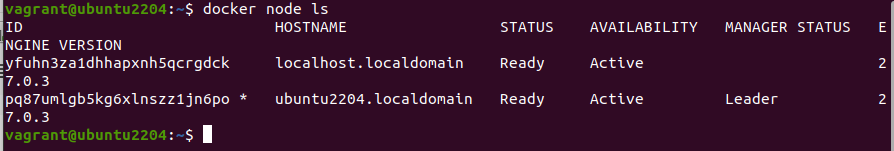
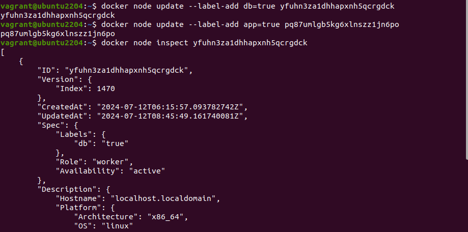
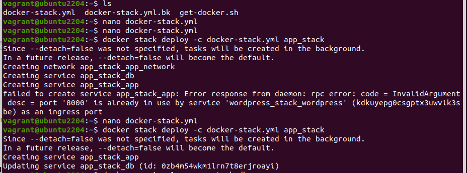
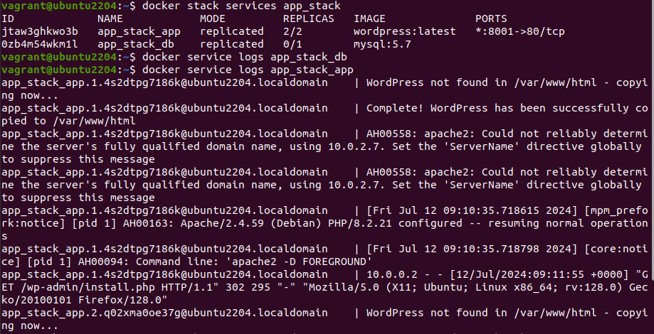
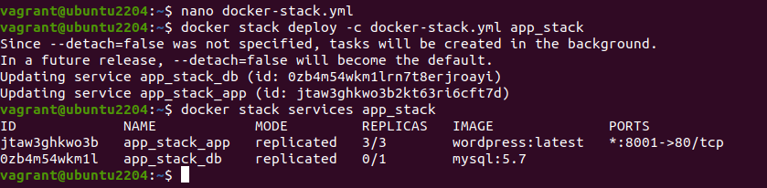

                                Project 02

Objectives:

• Deploy an application across multiple Docker Swarm worker nodes.
• Place specific components on designated nodes.
• Monitor and troubleshoot using Docker logs.
• Modify and redeploy the application.

Project Outline:

1. Initialize Docker Swarm and Join Worker Nodes
2. Label Nodes for Specific Component Placement
3. Create a Docker Stack File
4. Deploy the Application
5. Monitor and Troubleshoot Using Docker Logs
6. Modify and Redeploy the Application

Step-by-Step Guide

1. Initialize Docker Swarm and Join Worker Nodes
On the manager node, initialize Docker Swarm:

    docker swarm init --advertise-addr <MANAGER-IP>

Join the worker nodes to the swarm. On each worker node, run the command provided by the docker swarm init output:

    docker swarm join --token <SWARM-TOKEN> <MANAGER-IP>:2377

Verify the nodes have joined:
    
    docker node ls

2. Label Nodes for Specific Component Placement

Label nodes to specify where certain components should run. For example, label a node for the database service:

    docker node update --label-add db=true <NODE-ID>

Label another node for the application service:

    docker node update --label-add app=true <NODE-ID>

Verify the labels:
    
    docker node inspect <NODE-ID>

3. Create a Docker Stack File

Create a docker-stack.yml file to define the services and node placement constraints:

[docker-stack.yml](Project02/docker-stack.yml)

4. Deploy the Application

Deploy the stack using Docker Swarm:

    docker stack deploy -c docker-stack.yml app_stack

    docker stack services app_stack

5. Monitor and Troubleshoot Using Docker Logs

Check the logs for the services:

    docker service logs app_stack_db

    docker service logs app_stack_app

Follow the logs in real-time to monitor issues:
    
    docker service logs -f app_stack_app

6. Modify and Redeploy the Application
Make modifications to the application or the stack file as needed. 

For example, change the number of replicas:

            services:
            app:
                deploy:
                replicas: 3

Update the stack with the new configuration:

    docker stack deploy -c docker-stack.yml app_stack

Verify the changes:
    
    docker stack services app_stack

