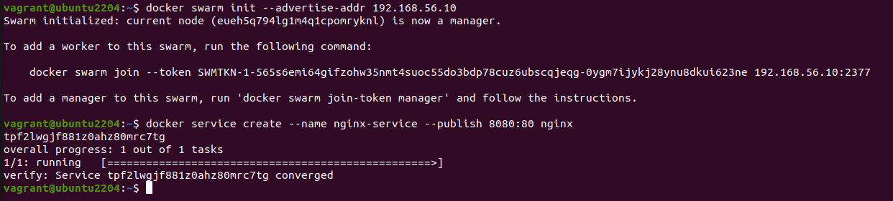
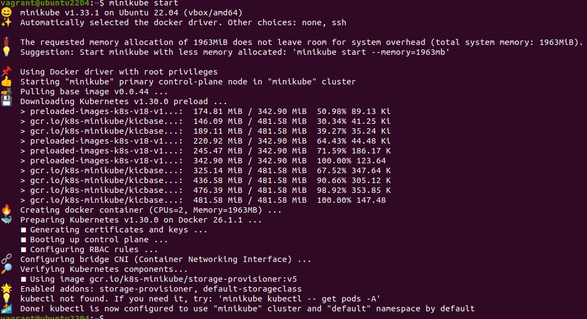
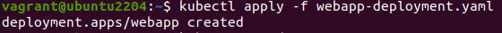
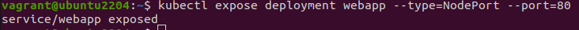
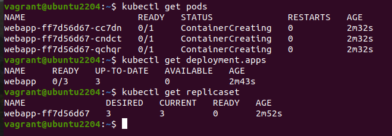
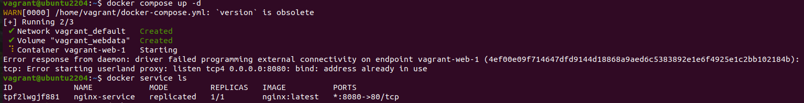
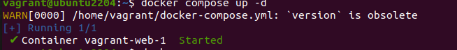
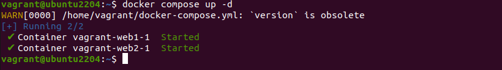
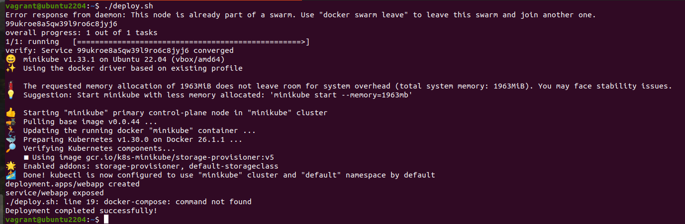
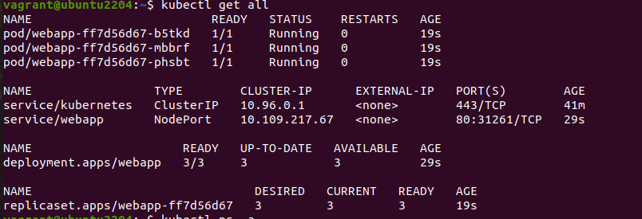

                          Project 01 - 1 Hour

Deploying a Scalable Web Application with Persistent Storage and 

Advanced Automation

Objective:

Deploy a scalable web application using Docker Swarm and Kubernetes, ensuring data persistence using a single shared volume, and automate the process using advanced shell scripting.

Overview:

1. Step 1: Set up Docker Swarm and create a service.
2. Step 2: Set up Kubernetes using Minikube.
3. Step 3: Deploy a web application using Docker Compose.
4. Step 4: Use a single shared volume across multiple containers.
5. Step 5: Automate the entire process using advanced shell scripting.

Step 1: Set up Docker Swarm and Create a Service

1.1 Initialize Docker Swarm

Initialize Docker Swarm
  
    docker swarm init

1.2 Create a Docker Swarm Service

create a simple Nginx service in Docker Swarm

  docker service create --name nginx-service --publish 8080:80 nginx

Step 2: Set up Kubernetes Using Minikube

2.1 Start Minikube

Start Minikube
  
    minikube start

2.2 Deploy a Web App on Kubernetes

Create a deployment file named webapp-deployment.yaml:

[webapp-deployment.yaml](Project01/webapp-deployment.yaml)

Apply the deployment:

    kubectl apply -f webapp-deployment.yaml

2.3 Expose the Deployment

    kubectl expose deployment webapp --type=NodePort --port=80

Step 3: Deploy a Web Application Using Docker Compose

3.1 Create a docker-compose.yml File

[docker-compose.yml](Project01/docker-compose.yaml)

3.2 Deploy the Web Application

Deploy using Docker Compose

    docker-compose up -d

Step 4: Use a Single Shared Volume Across Multiple Containers

4.1 Update docker-compose.yml to Use a Shared Volume

    version: '3'
    services:
      web1:
        image: nginx
        ports:
          - "8081:80"
        volumes:
          - shareddata:/usr/share/nginx/html
      web2:
        image: nginx
        ports:
          - "8082:80"
        volumes:
          - shareddata:/usr/share/nginx/html

    volumes:
      shareddata:

4.2 Deploy with Docker Compose

Deploy using Docker Compose

    docker-compose up -d

Step 5: Automate the Entire Process Using Advanced Shell Scripting

5.1 Create a Shell Script deploy.sh

[deploy.sh](Project01/deploy.sh)

