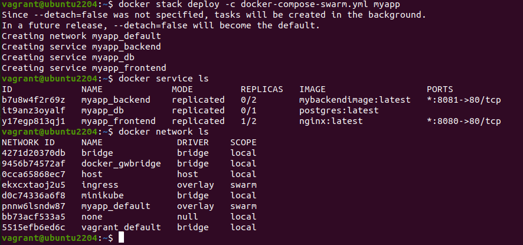
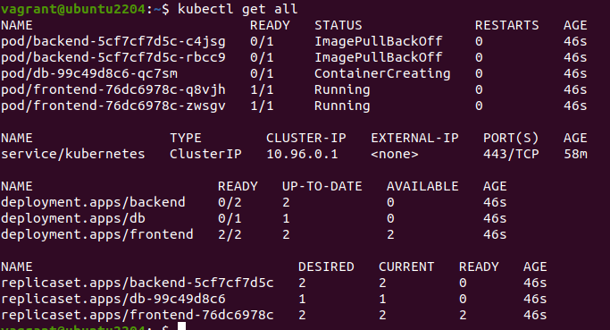
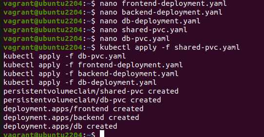
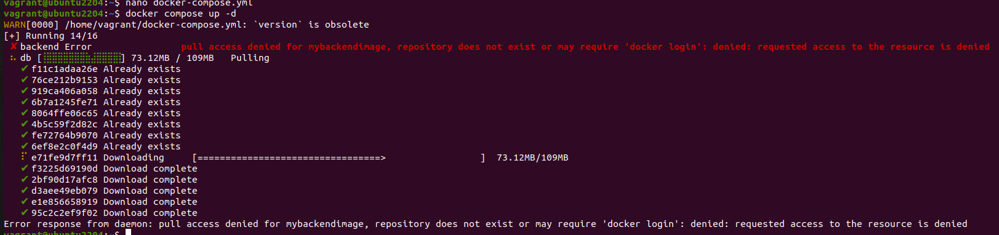

                            Project 02 - 1 Hour

Comprehensive Deployment of a Multi-Tier Application with CI/CD Pipeline-

Objective:
Deploy a multi-tier application (frontend, backend, and database) using Docker Swarm and Kubernetes, ensuring data persistence using a single shared volume across multiple containers, and automating the entire process using advanced shell scripting and CI/CD pipelines.

Overview:

1. Step 1: Set up Docker Swarm and create a multi-tier service.
2. Step 2: Set up Kubernetes using Minikube.
3. Step 3: Deploy a multi-tier application using Docker Compose.
4. Step 4: Use a single shared volume across multiple containers.
5. Step 5: Automate the deployment process using advanced shell scripting.

Step 1: Set up Docker Swarm and Create a Multi-Tier Service

1.1 Initialize Docker Swarm

Initialize Docker Swarm
    
    docker swarm init

1.2 Create a Multi-Tier Docker Swarm Service

Create a docker-compose-swarm.yml file:

[docker-compose-swarm.yml](Project02/docker-compose-swarm.yml)

Deploy the stack:

Deploy the stack using Docker Swarm

    docker stack deploy -c docker-compose-swarm.yml myapp

Step 2: Set up Kubernetes Using Minikube

2.1 Start Minikube

Start Minikube

    minikube start

2.2 Create Kubernetes Deployment Files

Create frontend-deployment.yaml:

[frontend-deployment.yaml](Project02/frontend-deployment.yaml)

Create backend-deployment.yaml:

[backend-deployment.yaml](Project02/backend-deployment.yaml)

Create db-deployment.yaml:

[db-deployment.yaml](Project02/db-deployment.yaml)

Create shared-pvc.yaml:

[shared-pvc.yaml](Project02/shared-pvc.yaml)

Create db-pvc.yaml:

[db-pvc.yaml](Project02/db-pvc.yaml)

Apply the deployments:

    kubectl apply -f shared-pvc.yaml
    kubectl apply -f db-pvc.yaml
    kubectl apply -f frontend-deployment.yaml
    kubectl apply -f backend-deployment.yaml
    kubectl apply -f db-deployment.yaml

Step 3: Deploy a Multi-Tier Application Using Docker Compose

3.1 Create a docker-compose.yml File

[docker-compose.yaml](Project02/docker-compose.yml)

3.2 Deploy the Application

Deploy using Docker Compose

    docker-compose up -d

