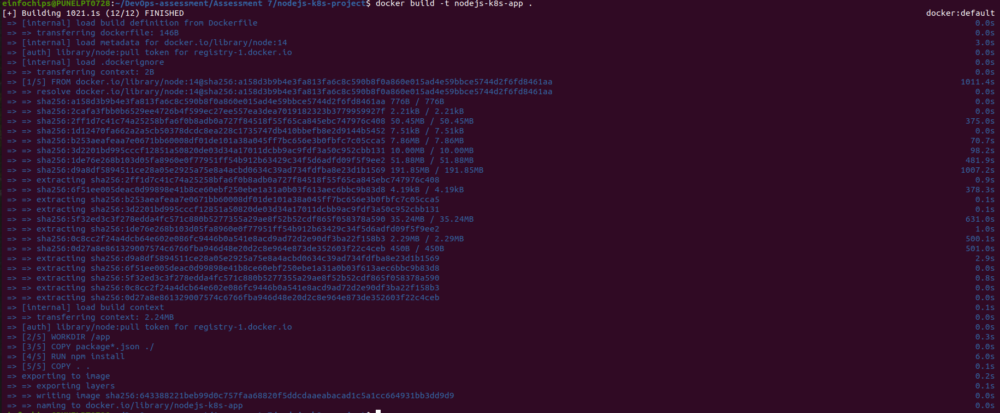

                        Project 01
Deploying a Node.js App Using Minikube Kubernetes

Overview

This project guides you through deploying a Node.js application using Minikube Kubernetes. You'll use Git for version control, explore branching and fast-forward merges, and set up Kubernetes services and deployment pods, including ClusterIP and NodePort service types.

Prerequisites

• Minikube installed
• kubectl installed
• Git installed
• Node.js installed (https://nodejs.org/en/download/package-manager/all#debian-and-ubuntu-based-linux-distributions)

Project Steps

1. Set Up Git Version Control

1.1. Initialize a Git Repository

Create a new directory for your project:

```bash
    mkdir nodejs-k8s-project
    cd nodejs-k8s-project
```
Initialize a Git repository:
```bash
       git init
```

1.2. Create a Node.js Application

Initialize a Node.js project:
```bash
    npm init -y
```


Install Express.js:

    npm install express


Create an index.js file with the following content:
```js
const express = require('express');
const app = express();
const port = 3000;

app.get('/', (req, res) => {
    res.send('Hello, Kubernetes!');
});

app.listen(port, () => {
    console.log(`App running at http://localhost:${port}`);
});
```

1.Create a .gitignore file to ignore node_modules:

    node_modules


1.3. Commit the Initial Code

Add files to Git:

    git add .

Commit the changes:

    git commit -m "Initial commit with Node.js app"


2. Branching and Fast-Forward Merge

2.1. Create a New Branch

Create and switch to a new branch feature/add-route:

```bash
    git checkout -b feature/add-route
```
2.2. Implement a New Route

Modify index.js to add a new route:
```js
app.get('/newroute', (req, res) => {
    res.send('This is a new route!');
});
```
Commit the changes:
```bash
    git add .
    git commit -m "Add new route"
```


2.3. Merge the Branch Using Fast-Forward

Switch back to the main branch:

    git checkout main

Merge the feature/add-route branch using fast-forward:

    git merge --ff-only feature/add-route


Delete the feature branch:
 
    git branch -d feature/add-route

3. Containerize the Node.js Application

3.1. Create a Dockerfile

Create a Dockerfile with the following content:
```Dockerfile
FROM node:14
WORKDIR /app
COPY package*.json ./
RUN npm install
COPY . .
EXPOSE 3000
CMD ["node", "index.js"]
````
3.2. Build and Test the Docker Image

Build the Docker image:

    docker build -t nodejs-k8s-app .




Run the Docker container to test:

    docker run -p 3000:3000 nodejs-k8s-app

1. Access http://localhost:3000 to see the app running.


4. Deploying to Minikube Kubernetes
4.1. Start Minikube

Start Minikube:

    minikube start

4.2. Create Kubernetes Deployment and Service Manifests

Create a deployment.yaml file:
```yaml
apiVersion: apps/v1
kind: Deployment
metadata:
  name: nodejs-app
spec:
  replicas: 2
  selector:
    matchLabels:
      app: nodejs-app
  template:
    metadata:
      labels:
        app: nodejs-app
    spec:
      containers:
      - name: nodejs-app
        image: nodejs-k8s-app:latest
        ports:
        - containerPort: 3000
```
Create a service.yaml file for ClusterIP:
```yaml
apiVersion: v1
kind: Service
metadata:
  name: nodejs-service
spec:
  selector:
    app: nodejs-app
  ports:
  - protocol: TCP
    port: 80
    targetPort: 3000
  type: ClusterIP
```
Create a service-nodeport.yaml file for NodePort:
```yaml
apiVersion: v1
kind: Service
metadata:
  name: nodejs-service-nodeport
spec:
  selector:
    app: nodejs-app
  ports:
  - protocol: TCP
    port: 80
    targetPort: 3000
    nodePort: 30001
  type: NodePort
```
4.3. Apply Manifests to Minikube

Apply the deployment:

    kubectl apply -f deployment.yaml

Apply the ClusterIP service:

    kubectl apply -f service.yaml

Apply the NodePort service:

    kubectl apply -f service-nodeport.yaml


4.4. Access the Application

Get the Minikube IP:

    minikube ip

1. Access the application using the NodePort:

        curl http://<minikube-ip>:30001
    


Making Changes to the App and Redeploying Using Kubernetes

6. Making Changes to the Node.js Application

6.1. Create a New Branch for Changes

Create and switch to a new branch feature/update-message:

    git checkout -b feature/update-message

6.2. Update the Application

Modify index.js to change the message:
```js
const express = require('express');
const app = express();
const port = 3000;

app.get('/', (req, res) => {
    res.send('Hello, Kubernetes! Updated version.');
});

app.get('/newroute', (req, res) => {
    res.send('This is a new route!');
});

app.listen(port, () => {
    console.log(`App running at http://localhost:${port}`);
});
```
6.3. Commit the Changes

Add and commit the changes:

    git add .
    git commit -m "Update main route message"


7. Merge the Changes and Rebuild the Docker Image

7.1. Merge the Feature Branch

Switch back to the main branch:

    git checkout main

Merge the feature/update-message branch:

    git merge --ff-only feature/update-message


Delete the feature branch:

    git branch -d feature/update-message

7.2. Rebuild the Docker Image

Rebuild the Docker image with a new tag:	

    docker build -t nodejs-k8s-app:v2 .

8. Update Kubernetes Deployment

8.1. Update the Deployment Manifest

Modify deployment.yaml to use the new image version:
```yaml
apiVersion: apps/v1
kind: Deployment
metadata:
  name: nodejs-app
spec:
  replicas: 2
  selector:
    matchLabels:
      app: nodejs-app
  template:
    metadata:
      labels:
        app: nodejs-app
    spec:
      containers:
      - name: nodejs-app
        image: nodejs-k8s-app:v2
        ports:
        - containerPort: 3000
```
8.2. Apply the Updated Manifest

Apply the updated deployment:

    kubectl apply -f deployment.yaml


8.3. Verify the Update

Check the status of the deployment:

    kubectl rollout status deployment/nodejs-app


9. Access the Updated Application

9.1. Access Through ClusterIP Service

Forward the port to access the ClusterIP service:

    kubectl port-forward service/nodejs-service 8080:80

1. Open your browser and navigate to http://localhost:8080 to see the updated message.


9.2. Access Through NodePort Service
1. Access the application using the NodePort:

        curl http://<minikube-ip>:30001

