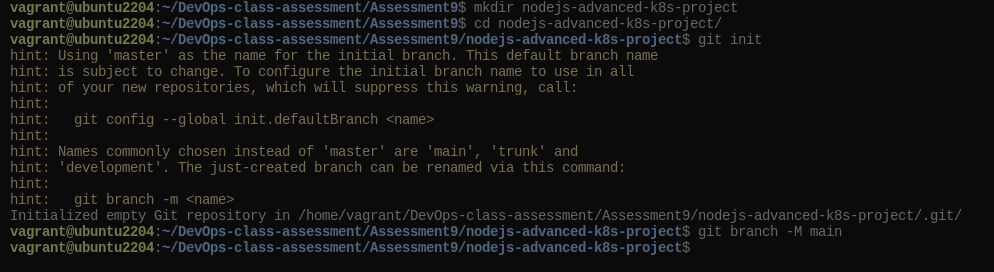
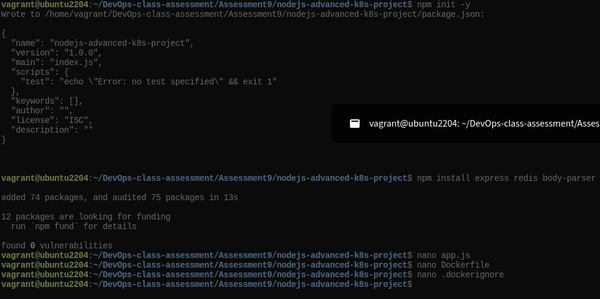
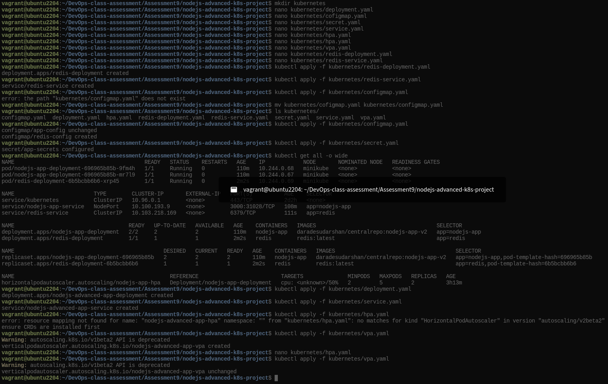
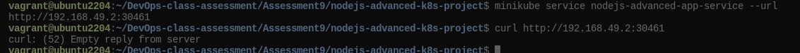
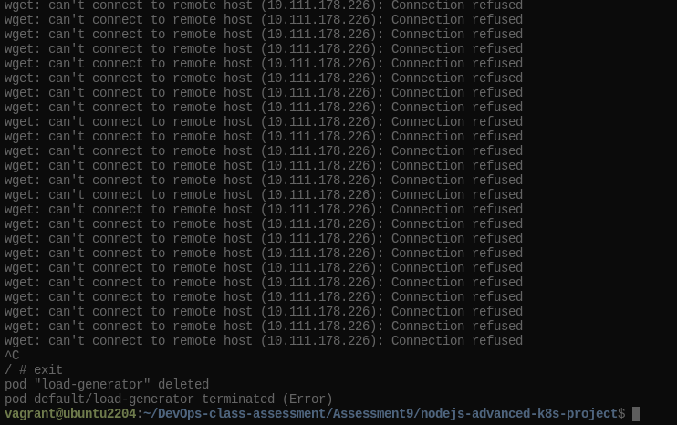
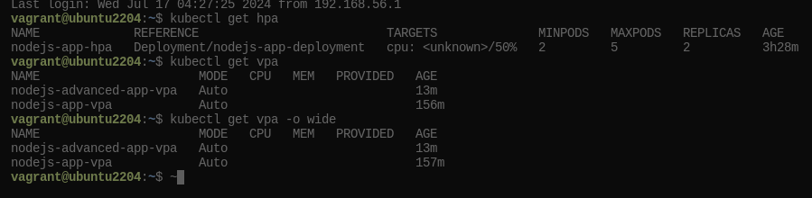

                            Project 02

Deploy a Node.js application to Kubernetes with advanced usage of ConfigMaps and Secrets. Implement Horizontal Pod Autoscaler (HPA) with both scale-up and scale-down policies. The project will include a multi-environment configuration strategy, integrating a Redis cache, and monitoring application metrics.

Project Setup

1.1 Initialize a Git Repository

Create a new directory for your project and initialize Git:
```bash
    mkdir nodejs-advanced-k8s-project
    cd nodejs-advanced-k8s-project
    git init
```


1.2 Create Initial Files

Create the initial Node.js application and Docker-related files:

    npm init -y
    npm install express redis body-parser



app.js
```js
const express = require('express');
const bodyParser = require('body-parser');
const redis = require('redis');
const app = express();
const PORT = process.env.PORT || 3000;

// Connect to Redis
const redisClient = redis.createClient({
  url: `redis://${process.env.REDIS_HOST}:${process.env.REDIS_PORT}`
});
redisClient.on('error', (err) => console.error('Redis Client Error', err));

app.use(bodyParser.json());

app.get('/', async (req, res) => {
  const visits = await redisClient.get('visits');
  if (visits) {
    await redisClient.set('visits', parseInt(visits) + 1);
  } else {
    await redisClient.set('visits', 1);
  }
  res.send(`Hello, World! You are visitor number ${visits || 1}`);
});

app.listen(PORT, () => {
  console.log(`Server is running on port ${PORT}`);
});
```
Dockerfile
```Dockerfile
FROM node:18

WORKDIR /usr/src/app

COPY package*.json ./

RUN npm install

COPY . .

EXPOSE 3000

CMD ["npm", "start"]
```
.dockerignore

        node_modules
        .npm


1. Build and push Docker image:
```bash
   docker build -t your-dockerhub-username/nodejs-advanced-app:latest .
   docker push your-dockerhub-username/nodejs-advanced-app:latest
```
Apply Kubernetes configurations:

    kubectl apply -f kubernetes/

Access the application:

    minikube service nodejs-advanced-app-service --url


2. Advanced Kubernetes Configuration

2.1 Deployment Configuration

Create `kubernetes/deployment.yaml` to deploy the Node.js application with Redis dependency:

```yaml
apiVersion: apps/v1
kind: Deployment
metadata:
  name: nodejs-advanced-app-deployment
spec:
  replicas: 2
  selector:
    matchLabels:
      app: nodejs-advanced-app
  template:
    metadata:
      labels:
        app: nodejs-advanced-app
    spec:
      containers:
      - name: nodejs-advanced-app
        image: your-dockerhub-username/nodejs-advanced-app:latest
        ports:
        - containerPort: 3000
        env:
        - name: PORT
          valueFrom:
            configMapKeyRef:
              name: app-config
              key: PORT
        - name: REDIS_HOST
          valueFrom:
            configMapKeyRef:
              name: redis-config
              key: REDIS_HOST
        - name: REDIS_PORT
          valueFrom:
            configMapKeyRef:
              name: redis-config
              key: REDIS_PORT
        - name: NODE_ENV
          valueFrom:
            secretKeyRef:
              name: app-secrets
              key: NODE_ENV
      - name: redis
        image: redis:latest
        ports:
        - containerPort: 6379
```
2.2 ConfigMap for Application and Redis

Create kubernetes/configmap.yaml to manage application and Redis configurations:
```yaml
apiVersion: v1
kind: ConfigMap
metadata:
  name: app-config
data:
  PORT: "3000"

---
apiVersion: v1
kind: ConfigMap
metadata:
  name: redis-config
data:
  REDIS_HOST: "redis"
  REDIS_PORT: "6379"
```
2.3 Secret for Sensitive Data

Create kubernetes/secret.yaml to manage sensitive environment variables:
```yaml
apiVersion: v1
kind: Secret
metadata:
  name: app-secrets
type: Opaque
data:
  NODE_ENV: cHJvZHVjdGlvbg== # Base64 encoded value for "production"
```
2.4 Service Configuration

Create kubernetes/service.yaml to expose the Node.js application:
```yaml
apiVersion: v1
kind: Service
metadata:
  name: nodejs-advanced-app-service
spec:
  selector:
    app: nodejs-advanced-app
  ports:
  - protocol: TCP
    port: 80
    targetPort: 3000
  type: LoadBalancer
```
2.5 Horizontal Pod Autoscaler with Scale-Up and Scale-Down Policies
Create kubernetes/hpa.yaml to manage autoscaling:
```yaml
apiVersion: autoscaling/v2beta2
kind: HorizontalPodAutoscaler
metadata:
  name: nodejs-advanced-app-hpa
spec:
  scaleTargetRef:
    apiVersion: apps/v1
    kind: Deployment
    name: nodejs-advanced-app-deployment
  minReplicas: 2
  maxReplicas: 5
  metrics:
  - type: Resource
    resource:
      name: cpu
      target:
        type: Utilization
        averageUtilization: 50
  - type: Resource
    resource:
      name: memory
      target:
        type: Utilization
        averageUtilization: 70
  behavior:
    scaleUp:
      stabilizationWindowSeconds: 30
      selectPolicy: Max
      policies:
      - type: Pods
        value: 2
        periodSeconds: 30
      - type: Resource
        resource: cpu
        value: 2
        periodSeconds: 30
    scaleDown:
      stabilizationWindowSeconds: 30
      selectPolicy: Min
      policies:
      - type: Pods
        value: 1
        periodSeconds: 30
      - type: Resource
        resource: memory
        value: 1
        periodSeconds: 30
```
2.6 Vertical Pod Autoscaler Configuration
Create kubernetes/vpa.yaml to manage vertical scaling:
```yaml
apiVersion: autoscaling.k8s.io/v1beta2
kind: VerticalPodAutoscaler
metadata:
  name: nodejs-advanced-app-vpa
spec:
  targetRef:
    apiVersion: apps/v1
    kind: Deployment
    name: nodejs-advanced-app-deployment
  updatePolicy:
    updateMode: "Auto"
```
2.7 Redis Deployment
Add a Redis deployment configuration to kubernetes/redis-deployment.yaml:
```yaml
apiVersion: apps/v1
kind: Deployment
metadata:
  name: redis-deployment
spec:
  replicas: 1
  selector:
    matchLabels:
      app: redis
  template:
    metadata:
      labels:
        app: redis
    spec:
      containers:
      - name: redis
        image: redis:latest
        ports:
        - containerPort: 6379
```
Add Redis service configuration to kubernetes/redis-service.yaml:
```yaml
apiVersion: v1
kind: Service
metadata:
  name: redis-service
spec:
  selector:
    app: redis
  ports:
  - protocol: TCP
    port: 6379
    targetPort: 6379
  type: ClusterIP
```
2.8 Apply Kubernetes Configurations

Apply all configurations to your Minikube cluster:

    kubectl apply -f kubernetes/redis-deployment.yaml
    kubectl apply -f kubernetes/redis-service.yaml
    kubectl apply -f kubernetes/configmap.yaml
    kubectl apply -f kubernetes/secret.yaml
    kubectl apply -f kubernetes/deployment.yaml
    kubectl apply -f kubernetes/service.yaml
    kubectl apply -f kubernetes/hpa.yaml
    kubectl apply -f kubernetes/vpa.yaml



2.9 Verify Deployments and Services

Check the status of your deployments and services:

    kubectl get all


Access the application via Minikube:

    minikube service nodejs-advanced-app-service --url



2.10 Testing Scaling

Simulate load on the application to test the HPA:

    kubectl run -i --tty --rm load-generator --image=busybox --restart=Never -- /bin/sh

 Inside the pod, run the following command to generate load

    while true; do wget -q -O- http://nodejs-advanced-app-service; done



2.11 Validate Autoscaling Behavior

Observe the HPA behavior:

    kubectl get hpa



Watch the scaling events and verify that the application scales up and down based on the policies you configured.

3. Project Wrap-Up

3.1 Review and Clean Up

After completing the project, review the configurations and clean up the Minikube environment if needed:

    minikube delete


